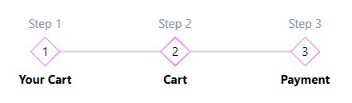

# Data Binding (MVVM)

The `RadStepProgressBar` control can be used in a data binding scenario. 

The component's `ItemsSource` property can be assigned to a collection of any objects. A `RadStepProgressBarItem` will be auto generated for each item in the ItemsSource. The following example shows how to setup the control in this scenario.

__Defining the models__
<snippet id='radstepprogressbar-data-binding-block_1-cs' />
<snippet id='radstepprogressbar-data-binding-block_2-vb' />

__Initializing the view model__
<snippet id='radstepprogressbar-data-binding-block_3-cs' />
<snippet id='radstepprogressbar-data-binding-block_4-vb' />

__Setting up the XAML__
<snippet id='radstepprogressbar-data-binding-block_5-xaml' />

__Data bound StepProgressBar control__  

The previous example shows how to data bind the ItemsSource and SelectedItem of the control. This will populate it with data. The SelectedItem binding can be used in a separate visual element if you need to connect the selected step with a separate view.

The visualization of the text at the bottom and top is customized via the `ItemTemplate` and `ItemAdditionalContentTemplate` properties. Alternative of the ItemTemplate setting is the `DisplayMemberPath` that can point to a property from the model of the step.

The `ItemContainerStyle` property is used to customize the RadStepProgressBarItem elements created for each object in the ItemsSource. 

## See Also
* [Getting Started]()
* [Visual Structure]()