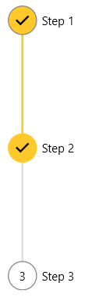
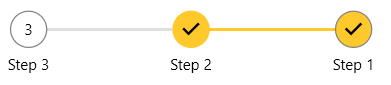
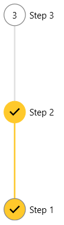
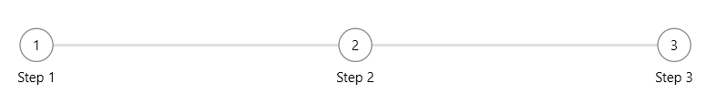

# Layout

The RadStepProgressBar control is arranged horizontally by default which means that the steps are ordered from left to right. Additionally, the control can be arranged vertically from top to bottom. The flow direction can also be reversed - right to left or bottom to top.

## Setting Orientation

To change the orientation of the control, set the __Orientation__ property. The orientation can be __Horizontal__ or __Vertical__.

#### __[XAML]__
{{region stepprogressbar-layout-0}}
	<telerik:RadStepProgressBar SelectedIndex="1" Orientation="Vertical">
		<telerik:RadStepProgressBarItem Content="Step 1" />
		<telerik:RadStepProgressBarItem Content="Step 2" />
		<telerik:RadStepProgressBarItem Content="Step 3" />
	</telerik:RadStepProgressBar>
{{endregion}}

__Vertically orientation RadStepProgressBar__  

To change the horizontal flow direction, set the __FlowDirection__ property. This property is applicable only in Horizontal orientation.

#### __[XAML]__
{{region stepprogressbar-layout-1}}
	<telerik:RadStepProgressBar SelectedIndex="1" FlowDirection="RightToLeft">
		<telerik:RadStepProgressBarItem Content="Step 1" />
		<telerik:RadStepProgressBarItem Content="Step 2" />
		<telerik:RadStepProgressBarItem Content="Step 3" />
	</telerik:RadStepProgressBar>
{{endregion}}

__Horizontally oriented RadStepProgressBar with changed flow direction__  

To change the vertical flow direction, set the __ReverseVerticalDirection__ property to True. This property is applicable only in Vertical orientation.

#### __[XAML]__
{{region stepprogressbar-layout-2}}
	<telerik:RadStepProgressBar SelectedIndex="1" ReverseVerticalDirection="True" Orientation="Vertical">
		<telerik:RadStepProgressBarItem Content="Step 1" />
		<telerik:RadStepProgressBarItem Content="Step 2" />
		<telerik:RadStepProgressBarItem Content="Step 3" />
	</telerik:RadStepProgressBar>
{{endregion}}

__Vertically oriented RadStepProgressBar with changed flow direction__  

## Setting Spacing Between Steps

The default spacing between two adjacent steps is 100px. To change this, set the __StepSpacing__ property of RadStepProgressBar.

#### __[XAML]__
{{region stepprogressbar-layout-3}}
	<telerik:RadStepProgressBar StepSpacing="250">
		<telerik:RadStepProgressBarItem Content="Step 1" />
		<telerik:RadStepProgressBarItem Content="Step 2" />
		<telerik:RadStepProgressBarItem Content="Step 3" />
	</telerik:RadStepProgressBar>
{{endregion}}

__Custom step spacing__  

## See Also 
* [Getting Started]()
* [Events]()
* [Data Binding]()