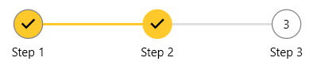
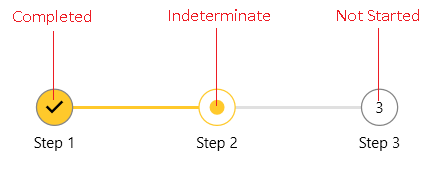
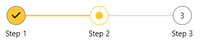
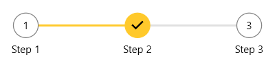

# Selection

The selection feature allows you to highlight a step based on the current progress.

The selection is changed when you click on a step in the UI, or set the __SelectedItem__ or __SelectedIndex__ properties of RadStepProgressBar. By default this will highlight also the steps that are previous to the selected step.

#### __[XAML]__
{{region stepprogressbar-selection-0}}
	<telerik:RadStepProgressBar SelectedIndex="1">
		<telerik:RadStepProgressBarItem Content="Step 1" />
		<telerik:RadStepProgressBarItem Content="Step 2" />
		<telerik:RadStepProgressBarItem Content="Step 3" />
	</telerik:RadStepProgressBar>
{{endregion}}  
		
__StepProgressBar selection__  

		

Selecting a step will update the __OverallProgress__ property of RadStepProgressBar which can be used to get the numeric progress value. The OverallProgress ranges between 0 and 100.

## Selected Item Status

The RadStepProgressBarItem has three states that can enter - __NotStarted__, __Indeterminate__ and __Completed__. When you click onto a step item to select it, its status changes to Completed. The same status is applied to the previous steps. The different states display a different indicator inside the step shape.

__Step item statuses__  

To change the status that is applied to the selected item from Complete to another value - like NotStarted or Indeterminate - set the __SelectedItemStatus__ property of RadStepProgressBar.

#### __[XAML]__
{{region stepprogressbar-selection-1}}
	<telerik:RadStepProgressBar SelectedItemStatus="Indeterminate" />
{{endregion}} 

__Selected item status set to Indeterminate__  

To prevent changing the status of the previous steps to Complete, set the __CompleteAllPreviousStepsOnSelection__ property of RadStepProgressBar to __False__.

#### __[XAML]__
{{region stepprogressbar-selection-2}}
	<telerik:RadStepProgressBar CompleteAllPreviousStepsOnSelection="False">
{{endregion}} 

__Disabled previous steps auto completion__  

The current state of a RadStepProgressBarItem can be got via its __Status__ property.

## Prevent User Selection

To prevent changing the selection whenever a step item is clicked, set the __CanUserSelect__ property of RadStepProgressBar to __False__.

#### __[XAML]__
{{region stepprogressbar-selection-3}}
	<telerik:RadStepProgressBar CanUserSelect="False" />
{{endregion}} 

## Progress Animation Duration

The step selection change reflects to the OverallProgress property of the control which fills the track visual with color. The color fill is done using an animation, that runs for 1 second by default. The animation duration can be changed with the __AnimationDuration__ property of RadStepProgressBar. The property value represents the duration in seconds.

#### __[XAML]__
{{region stepprogressbar-selection-4}}
	<telerik:RadStepProgressBar AnimationDuration="3">
{{endregion}} 

To disable the animation, you can set the AnimationDuration to 0.

## See Also  
 * [Getting Started]()
 * [Visual Structure]()
 * [Data Binding]()
