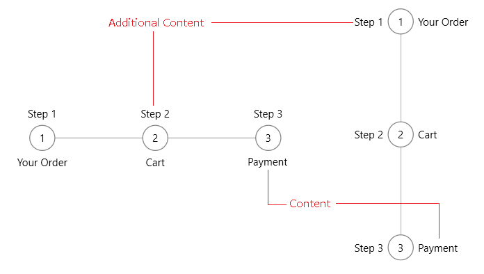
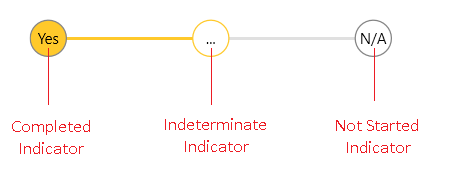

# Step Item Contents

The RadStepProgressBarItem elements allows you to add steps into the control. This renders a step visual for each RadStepProgressBarItem. Additionally, text or any other UI can be included for each step.

To set additional contents, use the __Content__ and __AdditionalContent__ properties of RadStepProgressBarItem. The Content renders a presenter on bottom of the step in horizontal orientation or on the right side in vertical orientation. The AdditionalContent renders a presenter on top of the step in horizontal and on the left in vertical orientation.


```XAML
	<telerik:RadStepProgressBar>
		<telerik:RadStepProgressBarItem AdditionalContent="Step 1" Content="Your Order" />
		<telerik:RadStepProgressBarItem AdditionalContent="Step 2" Content="Cart" />
		<telerik:RadStepProgressBarItem AdditionalContent="Step 3" Content="Payment" />
	</telerik:RadStepProgressBar>
```

__RadStepProgressBar in Horizontal and Vertical Orientations__  



Also, the content and the additional content templates can be determined using [DataTemplateSelectors](https://docs.microsoft.com/en-us/dotnet/api/system.windows.controls.datatemplateselector?view=windowsdesktop-6.0). To do so, use the __ContentTemplateSelector__ and __AdditionalContentTemplateSelector__ properties of RadStepProgressBarItem.

## Indicator Contents

The contents inside the step item shapes can be customized using the corresponding content properties - __NotStartedIndicatorContent__, __IndeterminateIndicatorContent__ and __CompletedIndicatorContent__. Additionally, each indicator content property has a associated template property -  __NotStartedIndicatorContentTemplate__, __IndeterminateIndicatorContentTemplate__ and __CompletedIndicatorContentTemplate__.

The different properties are used based on the current state of the step item - NotStarted, Indeterminate or Completed.

>In order to replace the indicator content when the step item is in Completed and Indeterminate state, you will need to set the the CompletedIndicatorContentTemplate and IndeterminateIndicatorContentTemplate properties.


```XAML
	<telerik:RadStepProgressBar Width="500" SelectedItemStatus="Indeterminate">
		<telerik:RadStepProgressBar.Resources>
			<DataTemplate x:Key="IndicatorContentTemplate">
				<TextBlock Text="{Binding}" />
			</DataTemplate>
		</telerik:RadStepProgressBar.Resources>
		<telerik:RadStepProgressBarItem NotStartedIndicatorContent="N/A"
										CompletedIndicatorContent="Yes"
										IndeterminateIndicatorContent="..."
										CompletedIndicatorContentTemplate="{StaticResource IndicatorContentTemplate}"
										IndeterminateIndicatorContentTemplate="{StaticResource IndicatorContentTemplate}" />
		<telerik:RadStepProgressBarItem NotStartedIndicatorContent="N/A"
										CompletedIndicatorContent="Yes"
										IndeterminateIndicatorContent="..."
										CompletedIndicatorContentTemplate="{StaticResource IndicatorContentTemplate}"
										IndeterminateIndicatorContentTemplate="{StaticResource IndicatorContentTemplate}"/>           
		<telerik:RadStepProgressBarItem NotStartedIndicatorContent="N/A"
										CompletedIndicatorContent="Yes"
										IndeterminateIndicatorContent="..."
										CompletedIndicatorContentTemplate="{StaticResource IndicatorContentTemplate}"
										IndeterminateIndicatorContentTemplate="{StaticResource IndicatorContentTemplate}"/>
	</telerik:RadStepProgressBar>
```

__RadStepProgressBar with customized state indicator contents__  



## See Also
* [Getting Started]()
* [Events]()
* [Data Binding]()
