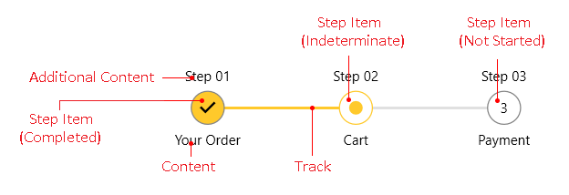

# Visual Structure

This article describes all the visual elements and terms used in __RadStepProgressBar__ control. 

* __Step Item__: Represents the steps (RadStepProgressBarItem) in the control. The steps are clickable which changes their states. The available states are __Not Started, Indeterminate__ and __Completed__.

* __Content__: Displays the element (text or other UI) positioned under the Step Item.

* __Additional Content__: Displays an additional element (text or other UI) positioned above the Step Item.

* __Track__: The line drawn between the steps. Selecting the next step will animate color change in the line.

## See Also 
* [Getting Started]()
* [Events]()
* [Data Binding]()