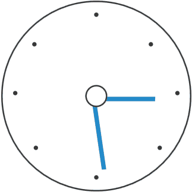

# Animations

The RadSvgImage control has a built-in support for animations.

## Applying Animations

To apply an animation to the displayed SVG image, you can utilize the `animate`, `animateMotion`, and `animateTransform` elements inside the SVG's XML.

>tip To learn more about the above-mentioned elements, check the [animate](https://developer.mozilla.org/en-US/docs/Web/SVG/Element/animate), [animateMotion](https://developer.mozilla.org/en-US/docs/Web/SVG/Element/animateMotion), and [animateTransform](https://developer.mozilla.org/en-US/docs/Web/SVG/Element/animateTransform) articles.

__Sample SVG file with animations__
```XML
    <svg xmlns="http://www.w3.org/2000/svg" width="256" height="256" viewBox="-128 -128 345 345" xmlns:xlink="http://www.w3.org/1999/xlink">
        <defs>
            <clipPath id="circle">
                <circle r="50" stroke-width="0"/>
            </clipPath>
            <clipPath id="circle2">
                <circle r="40" stroke-width="1"/>
            </clipPath>
            <g id="minuteHand" clip-path="url(#circle)">
                <path d="M0.5,0.5 L333.5,0.5 L333.5,3.5 L0.5,3.5 z" fill="#228BCB" />
            </g>
            <g id="hourHand" clip-path="url(#circle2)">
                <path d="M0.5,0.5 L333.5,0.5 L333.5,3.5 L0.5,3.5 z" fill="#228BCB"/>
            </g>
            <g id="dot" clip-path="url(#circle2)">
                <circle r="7" fill="white" stroke="#383838" />
            </g>
        </defs>
        <circle r="64" fill="white" stroke="#383838"/>
        <g transform="translate(-150, -150)">
            <circle fill="#383838" r="1.5" cy="95" cx="150"/>
            <circle fill="#383838" r="1.5" cy="115" cx="187"/>
            <circle fill="#383838" r="1.5" cy="148" cx="205"/>
            <circle fill="#383838" r="1.5" cy="185" cx="193"/>
            <circle fill="#383838" r="1.5" cy="205" cx="150"/>
            <circle fill="#383838" r="1.5" cy="185" cx="109"/>
            <circle fill="#383838" r="1.5" cy="148" cx="95"/>
            <circle fill="#383838" r="1.5" cy="115" cx="108"/>
        </g>

        <g fill="white" stroke-width="5">
            <path data="M0,22 L4,22 L4,26 L0,26 z M48,22 L52,22 L52,26 L48,26 z M23,0 L27,0 L27,4 L23,4 z M24,47 L28,47 L28,51 L24,51 z M9,8 L13,8 L13,12 L9,12 z M9,39 L13,39 L13,43 L9,43 z M41,8 L45,8 L45,12    L41,12 z M41,39 L45,39 L45,43 L41,43 z" fill="black" />
        </g>
        <g>
            <animateTransform attributeName="transform" attributeType="XML" type="rotate" from="0" to="360" begin="0s" dur="12s" repeatCount="indefinite"/>
            <use xlink:href="#minuteHand" />
        </g>
        <g>
            <use xlink:href="#hourHand" />
        </g>
        <g>
            <animateTransform attributeName="transform" attributeType="XML" type="rotate" from="0" to="360" begin="0s" dur="5s" />
            <use xlink:href="#dot" />
        </g>
    </svg>
```

__RadSvgImage instance using an SVG file with animations__
```XAML
    <telerik:RadSvgImage Width="256" Height="256" UriSource="MySvgWithAnimations.svg"/>
```

__RadSvgImage displaying an SVG file with animations__



## See Also
* [Clipping]()
* [Paint Servers]()