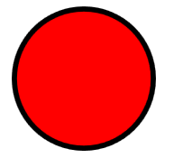

# Getting Started with {{ site.framework_name }} RadSvgImage

This tutorial will walk you through the creation of a sample application that contains a `RadSvgImage` control.

## Adding Telerik Assemblies Using NuGet

To use `RadSvgImage` when working with NuGet packages, install the `Telerik.Windows.Controls.for.Wpf.Xaml` package. The [package name may vary]() slightly based on the Telerik dlls set - [Xaml or NoXaml]()

Read more about NuGet installation in the [Installing UI for WPF from NuGet Package]() article.

>tip With the 2025 Q1 release, the Telerik UI for WPF has a new licensing mechanism. You can learn more about it [here]().

## Adding Assembly References Manually

If you are not using NuGet packages, you can add a reference to the following assemblies:

* __Telerik.Licensing.Runtime__
* __Telerik.Windows.Controls__

## Defining the RadSvgImage as a Stand-Alone Component

You can add `RadSvgImage` manually in XAML as demonstrated in the following example:

#### __[XAML] Adding RadSvgImage in XAML__
{{region radsvgimage-getting-started-0}}
    <telerik:RadSvgImage/>
{{endregion}}

## Displaying an SVG image

To display an SVG image in the `RadSvgImage` control, you can set the `UriSource` property.

#### __[XAML] Displaying an SVG image using the UriSource property__
{{region radsvgimage-getting-started-1}}
    <telerik:RadSvgImage UriSource="MySVGImage.svg"
                         Width="128"
                         Height="128"/>
{{endregion}}

__RadSvgImage with an SVG image__

>important Тhe `RadSVGImage` control does not have a specified size by default. When placed in a panel that measures it with `double.PositiveInfinity`, for example, in a `StackPanel`, it will need to have a set size in order to display the SVG image.

## Defining the RadSvgImage as a Markup Extension

The `RadSvgImage` control provides the ability to use it as a markup extension, instead of defining it as a stand-alone component.

#### __[XAML] RadSvgImage as a markup extension__
{{region radsvgimage-getting-started-2}}
    <Image Source="{telerik:RadSvgImageSource Source='MySVGImage.svg'}"
           Width="128"
           Height="128"/>
{{endregion}}

__RadSvgImage as a markup extension__

## Displaying an Xml-Based String

The `RadSvgImage` control provides the `XmlSource` property that allows you to set an xml-based string and display it.

#### __[C#] Setting the XmlSource property__
{{region radsvgimage-getting-started-3}}
    this.svgImage.XmlSource = "<?xml version=\"1.0\" encoding=\"UTF-8\" standalone=\"no\"?>\r\n<svg height=\"100\" width=\"100\">\r\n  <circle cx=\"50\" cy=\"50\" r=\"40\" stroke=\"black\" stroke-width=\"3\" fill=\"red\" />\r\n</svg>";
{{endregion}}

#### __[VB.NET] Setting the XmlSource property__
{{region radsvgimage-getting-started-4}}
    Me.svgImage.XmlSource = "<?xml version=""1.0"" encoding=""UTF-8"" standalone=""no""?>" & vbCrLf & "<svg height=""100"" width=""100"">" & vbCrLf & "  <circle cx=""50"" cy=""50"" r=""40"" stroke=""black"" stroke-width=""3"" fill=""red"" />" & vbCrLf & "</svg>"
{{endregion}}

__RadSvgImage displaying an xml-based string__

## Overriding Color

The `RadSVGImage` component allows you to replace the fill color of the geometry that displays the SVG image. To do so, set the `OverrideColor` property.

#### __[XAML] Setting the OverrideColor property__
{{region radsvgimage-getting-started-5}}
    <telerik:RadSvgImage UriSource="MySVGImage.svg"
                         OverrideColor="Red"
                         Width="128"
                         Height="128"/>
{{endregion}}

__RadSvgImage with set OverrideColor__

## Not Supported SVG File Format Properties

The `RadSvgImage` control does not support the following SVG file format properties:

* &lt;audio/&gt;
* &lt;mask/&gt;
* &lt;mpath/&gt;
* &lt;canvas/&gt;
* &lt;video/&gt;


## Telerik UI for WPF Learning Resources

* [Telerik UI for WPF SvgImage Component](https://www.telerik.com/products/wpf/svgimage.aspx)
* [Getting Started with Telerik UI for WPF Components]()
* [Telerik UI for WPF Installation]()
* [Telerik UI for WPF and WinForms Integration]()
* [Telerik UI for WPF Visual Studio Templates]()
* [Setting a Theme with Telerik UI for WPF]()
* [Telerik UI for WPF Virtual Classroom (Training Courses for Registered Users)](https://learn.telerik.com/learn/course/external/view/elearning/16/telerik-ui-for-wpf) 
* [Telerik UI for WPF License Agreement](https://www.telerik.com/purchase/license-agreement/wpf-dlw-s)


## See Also
* [Animations]()
* [Clipping]()
* [Paint Servers]()
