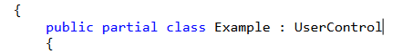
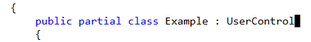
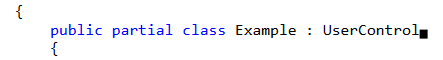
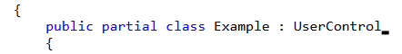
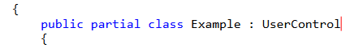
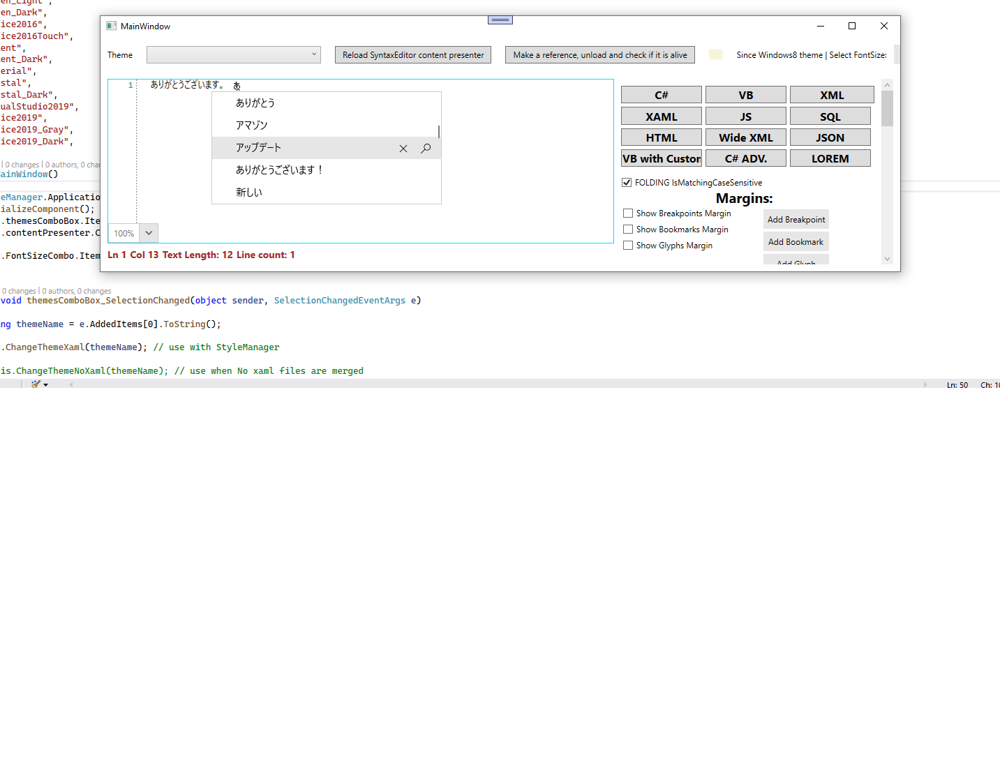

# Caret

The caret of the RadSyntaxEditor is the vertical "blinking" line that represents the current cursor position of a control that accepts text input. The appearance of the caret can be controlled by the `CaretDisplayMode` property. Its possible values as well as the resulting appearance can be observed in the following list:

* __Normal__: 

* __Block__: 

* __HalfBlock__: 

* __QuarterBlock__: 

__Setting the caret's display mode__
```XAML
    <telerik:RadSyntaxEditor CaretDisplayMode="QuarterBlock" />
```

## Hide the Caret

If you wish to hide the caret, you can do so by setting the `IsCaretVisible` property to __False__. This setting can be used along with the `IsReadOnly` property which disallows users from making changes in the editor.

__Setting the caret's display mode__
```XAML
    <telerik:RadSyntaxEditor IsReadOnly="True" IsCaretVisible="False" />
```

## Caret Brush

Through the `CaretBrush` property, you can change the caret's color to a color of your liking. The default value is __Black__.

__Setting the caret's color__
```XAML
    <telerik:RadSyntaxEditor CaretBrush="Red" />
```

__RadSyntaxEditor caret with red color__



## Auto-Scroll to Caret on Text Change

The RadSyntaxEditor exposes the `AutoScrollToCaretOnTextChange` property which controls whether the document is automatically scrolled to the __CaretPosition__ when the text inside the document is changed.

Its default value is __True__, meaning that if the caret is placed in the end of the document, for example, and new text is added, the control will auto-scroll to the new position of the caret when the content changes.

To disable this behavior, you can set the AutoScrollToCaretOnTextChange property to __False__.

__Setting the AutoScrollToCaretOnTextChange property__
```XAML
    <telerik:RadSyntaxEditor AutoScrollToCaretOnTextChange="False" />
```

## IME Support

The `RadSyntaxEditor` control provides built-in support for the most commonly used Microsoft IMEs like Chinese IME, Japanese IME, Korean IME and etc. which are shipped with the Windows OS.

To use this feature, set the `UseMonospacedOptimization` property of `RadSyntaxEditor` to `false`.

__RadSyntaxEditor displaying Japanese IME__



## See Also

* [IntelliPrompts]()
