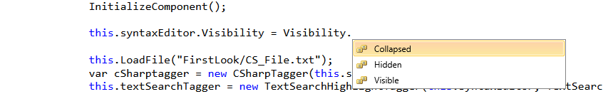
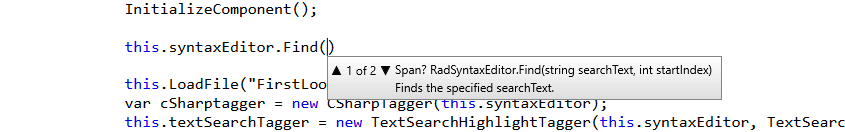

# IntelliPrompts

The RadSyntaxEditor has support for intelliprompts which aim to speed up coding by reducing typos and other common mistakes.

## Code Completion

Through the **CompletionListWindow** you can show a collection of items when the user inputs a given string. To do so, you need to first populate its presenter's **CompletionListItems** collection.

#### [C#] Example 1: Populate and display the completion list window
```C#

    var completionListItems = new CompletionInfoCollection()
    {
        new CompletionInfo("Collapsed", new BitmapImage(new Uri("../../Icons/Entity-Enum.png", UriKind.RelativeOrAbsolute))),
        new CompletionInfo("Hidden", new BitmapImage(new Uri("../../Icons/Entity-Enum.png", UriKind.RelativeOrAbsolute))),
        new CompletionInfo("Visible", new BitmapImage(new Uri("../../Icons/Entity-Enum.png", UriKind.RelativeOrAbsolute))),
    };

    this.syntaxEditor.IntelliPrompts.CompletionListWindow.Presenter.CompletionListItems = completionListItems;
    this.syntaxEditor.CompleteCode(); // or this.syntaxEditor.IntelliPrompts.CompletionListWindow.Show();
```

#### Figure 1: Code completion


>The code completion popup can also be shown using the **Ctrl + Space** key combination.

## Overload List

Through the **OverloadListWindow** you can show a collection of overloads when the user tries to invoke a certain method. To do so, you need to first populate its presenter's **OverloadListItems** collection.

#### [C#] Example 2: Populate and display the completion list window
```C#

    var overloadList = new OverloadInfoCollection
    {
        new OverloadInfo("Span? RadSyntaxEditor.Find(string searchText, int startIndex)", "Finds the specified searchText."),
        new OverloadInfo("Span? RadSyntaxEditor.Find(string searchText, int startIndex, bool useRegularExpression)", "Finds the specified searchText.")
    };

    this.syntaxEditor.IntelliPrompts.OverloadListWindow.Presenter.OverloadListItems = overloadList;
    this.syntaxEditor.IntelliPrompts.OverloadListWindow.Show();
```

#### Figure 2: Overload list


## See Also

* [Caret]()
* [Selection]()
* [Events]()