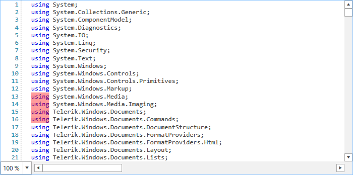

# Layers

The RadSyntaxEditor control renders its elements on different layers based on the types of tags that are used. It does so with the help of a **UILayersBuilder** class. The default builder renders the following stack of layers:

* **TextHighlightUILayer**
* **TextBorderUILayer**
* **TextUnderlineUILayer**
* **TextUILayer**
* **TextToolTipUILayer**
* **SelectionUILayer**
* **FoldingUILayer**

These layers are responsible for drawing different elements on the canvas of the RadSyntaxEditor control. For example, the **FoldingUILayer** generates a **FoldedRegionButton** with a tooltip, containing the folded text.

## Custom Layer and UILayersBuilder

We will now create a custom layer which will be responsible for highlighting any keywords when they are hovered with the mouse. For the purpose, we need to override the **GetLinePartUIElement** method and return a **FrameworkElement** to be drawn on the layer - a semi-transparent rectangle in this case. 

__Example 1: Creating a custom layer__
```C#
    
	public class HighlightOnMouseOverUILayer : LineBasedUILayer<ClassificationTag>
	{
        public override string Name
        {
            get
            {
                return "UnderlineOnMouseOver";
            }
        }

		public HighlightOnMouseOverUILayer()
        {
        }

		protected override FrameworkElement GetLinePartUIElement(ClassificationTag tag, Telerik.Windows.SyntaxEditor.Core.Text.Span span, UIUpdateContext updateContext)
        {
			if (tag.ClassificationType != ClassificationTypes.Keyword)
			{
				return null;
			}

            Rect rect = updateContext.Editor.GetLinePartBoundingRectangle(span);
            Rectangle rectangle = this.GetElementFromPool<Rectangle>();
          
            rectangle.Width = rect.Width;
            rectangle.Height = rect.Height;
            rectangle.Fill = new SolidColorBrush(Colors.Transparent);

			rectangle.MouseMove += this.Rectangle_MouseMove;
            return rectangle;
        }

		private void Rectangle_MouseMove(object sender, System.Windows.Input.MouseEventArgs e)
		{
			Rectangle rectangle = (Rectangle)sender;
			rectangle.Fill = new SolidColorBrush(Color.FromArgb(100, 255, 0 , 0));
		}

        protected override void ResetPooledElementProperties(object element)
        {
            Rectangle rectangle = (Rectangle)element;
            rectangle.ClearValue(Rectangle.FillProperty);
			rectangle.MouseMove -= this.Rectangle_MouseMove;
        }
	}
```

For our custom layer to be recognized by the RadSyntaxEditor we need to add it to the **UILayerStack**. We can do so by creating a custom **UILayersBuilder** and overriding its **BuildUILayers** method.

__Example 2: Using the custom layer in a custom layers builder__
```C#

    public class CustomUILayersBuilder : UILayersBuilder
	{
        private HighlightOnMouseOverUILayer customLayer;
        public override void BuildUILayers(UILayerStack uiLayers)
		{
			base.BuildUILayers(uiLayers);

            customLayer = new HighlightOnMouseOverUILayer();
            uiLayers.AddLast(customLayer);
        }

        public void ClearCustomLayer()
        {
            foreach (Rectangle item in this.customLayer.Container.Children.OfType<Rectangle>())
            {
                item.Fill = Brushes.Transparent;
           } 
        }
    }
```

Finally, we need to set the **UILayersBuilder** to an instance of the custom layers builder class.

__Example 3: Using the custom layers builder__
```C#

    this.syntaxEditor.UILayersBuilder = new CustomUILayersBuilder();
```

Now, when users mouse over any of the keywords, they will be highlighted with a semi-transparent red rectangle.

#### Figure 1: The result from using the custom layer



## See Also

* [Taggers]()
* [Selection]()
