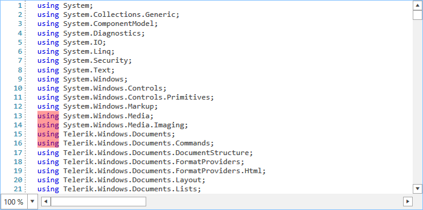

# Layers

The RadSyntaxEditor control renders its elements on different layers based on the types of tags that are used. It does so with the help of a **UILayersBuilder** class. The default builder renders the following stack of layers:

* **TextHighlightUILayer**
* **TextBorderUILayer**
* **TextUnderlineUILayer**
* **TextUILayer**
* **TextToolTipUILayer**
* **SelectionUILayer**
* **FoldingUILayer**

These layers are responsible for drawing different elements on the canvas of the RadSyntaxEditor control. For example, the **FoldingUILayer** generates a **FoldedRegionButton** with a tooltip, containing the folded text.

## Custom Layer and UILayersBuilder

We will now create a custom layer which will be responsible for highlighting any keywords when they are hovered with the mouse. For the purpose, we need to override the **GetLinePartUIElement** method and return a **FrameworkElement** to be drawn on the layer - a semi-transparent rectangle in this case. 

__Example 1: Creating a custom layer__
<snippet id='radsyntaxeditor-features-layers-block_1-cs' />

For our custom layer to be recognized by the RadSyntaxEditor we need to add it to the **UILayerStack**. We can do so by creating a custom **UILayersBuilder** and overriding its **BuildUILayers** method.

__Example 2: Using the custom layer in a custom layers builder__
<snippet id='radsyntaxeditor-features-layers-block_2-cs' />

Finally, we need to set the **UILayersBuilder** to an instance of the custom layers builder class.

__Example 3: Using the custom layers builder__
<snippet id='radsyntaxeditor-features-layers-block_3-cs' />

Now, when users mouse over any of the keywords, they will be highlighted with a semi-transparent red rectangle.

#### Figure 1: The result from using the custom layer

## See Also

* [Taggers]()
* [Selection]()