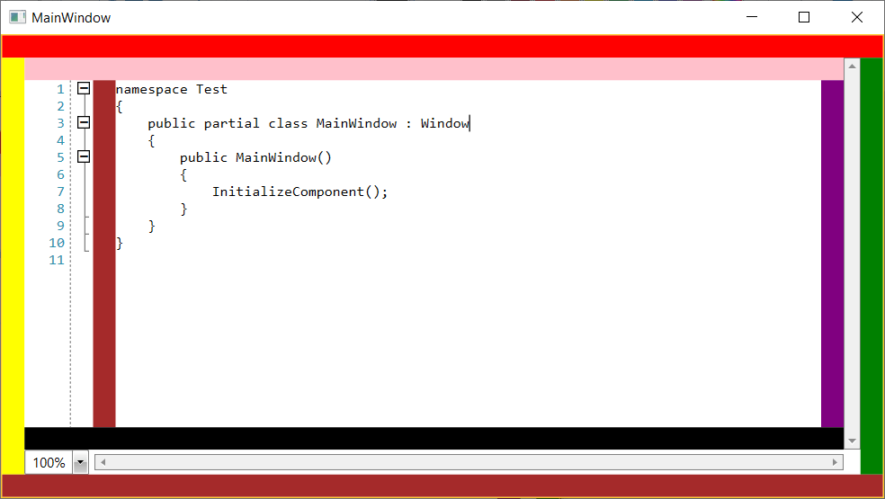
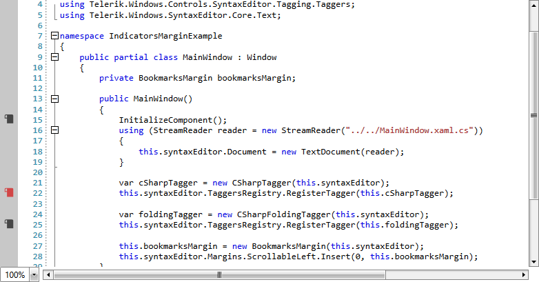

# Margins

The RadSyntaxEditor control contains several panels inside its ControlTemplate, which allow for customizing its look and/or extending its functionality. In order to customize them you can use the **Margins** property, which is of type [SyntaxEditorMargins](https://docs.telerik.com/devtools/wpf/api/telerik.windows.controls.syntaxeditor.ui.margins.syntaxeditormargins).

## Margin Panels

__Example 1__ demonstrates how you can add some custom elements around the RadSyntaxEditor and provides a visualization of the default locations for all panels. It also demonstrates the line numbers and [folding tagger]() features, which are implemented with the help of the left scrollable margin.

__Example 1: Defining the RadSyntaxEditor__
```XAML

	<Grid xmlns:telerik="http://schemas.telerik.com/2008/xaml/presentation">
        <telerik:RadSyntaxEditor x:Name="syntaxEditor" />
    </Grid>
```

__Example 1: Defining the RadSyntaxEditor__
```C#

	public partial class MainWindow : Window
    {
        public MainWindow()
        {
            InitializeComponent();

            using (StreamReader reader = new StreamReader("../../Files/MainWindow.xaml.cs"))
            {
                this.syntaxEditor.Document = new TextDocument(reader);
            }

            var foldingTagger = new CSharpFoldingTagger(this.syntaxEditor);
            this.syntaxEditor.TaggersRegistry.RegisterTagger(foldingTagger);

            this.syntaxEditor.Margins.Left.Add(new Rectangle() { Fill = Brushes.Yellow, Width = 20 });
            this.syntaxEditor.Margins.Right.Add(new Rectangle() { Fill = Brushes.Green, Width = 20 });
            this.syntaxEditor.Margins.Top.Add(new Rectangle() { Fill = Brushes.Red, Height = 20 });
            this.syntaxEditor.Margins.Bottom.Add(new Rectangle() { Fill = Brushes.Brown, Height = 20 });
            this.syntaxEditor.Margins.ScrollableLeft.Add(new Rectangle() { Fill = Brushes.Brown, Width = 20 });
            this.syntaxEditor.Margins.ScrollableRight.Add(new Rectangle() { Fill = Brushes.Purple, Width = 20 });
            this.syntaxEditor.Margins.ScrollableTop.Add(new Rectangle() { Fill = Brushes.Pink, Height = 20 });
            this.syntaxEditor.Margins.ScrollableBottom.Add(new Rectangle() { Fill = Brushes.Black, Height = 20 });
        }
    }
```

#### __Figure 1: RadSyntaxEditor Margins__


## Indicators Margin

You can add **indicators** to particular lines of the RadSyntaxEditor control by using the new **IndicatorsMargin&lt;T&gt;** class.

The generic type parameter **T** determines the type of the created object which must be a **FrameworkElement**. The class also exposes a **UpdateIndicator** method in which you can set the properties of the created indicator element. You can also conditionally style the element as the method also provides the **line number** corresponding to the line that the indicator is drawn on.

The class inherits from the abstract **IndicatorsMarginBase** class which defines the **IndicatorBrush** property used to control the background of the margin and the **Indicators** property which holds a **collection of integers** corresponding to the lines which include an indicator element.

**Example 2** demonstrates how to create a margin which holds a collection of bookmarks and alternate the colors of these bookmarks.

#### [C#] Example 2: Creating a bookmarks margin

```C#
    /// <summary>
    /// A margin holding a collection of bookmarks to highlight lines of the RadSyntaxEditor control.
    /// </summary>
    public class BookmarksMargin : IndicatorsMargin<Path>
    {
        private TypeConverter stringToGeometryConverter;
        private Geometry bookmarkGeometry;

        static BookmarksMargin()
        {
            BookmarksMargin.BackgroundProperty.OverrideMetadata(typeof(BookmarksMargin), new FrameworkPropertyMetadata(new SolidColorBrush(Color.FromArgb(255, 200, 200, 200))));
        }

        /// <summary>
        /// Initializes a new instance of the <see cref="BookmarksMargin"/> class.
        /// </summary>
        /// <param name="syntaxEditor">The RadSyntaxEditor instance.</param>
        public BookmarksMargin(RadSyntaxEditor syntaxEditor)
            : base(syntaxEditor)
        {
            this.IndicatorBrush = new SolidColorBrush(Color.FromArgb(255, 70, 70, 70));
            this.stringToGeometryConverter = TypeDescriptor.GetConverter(typeof(Geometry));
            string data = "M15,5H8C6.9,5,6,5.9,6,7v3h3v11l4-3l4,3V7C17,5.9,16.1,5,15,5z M9,9H7V7c0-0.6,0.4-1,1-1h1V9z";
            this.bookmarkGeometry = (Geometry)this.stringToGeometryConverter.ConvertFrom(data);
        }

        /// <summary>
        /// Called when an indicator needs to be updated. This can happen when the indicator is
        /// first created, when it is brought inside or outside of the viewport or when
        /// the EditorFontSize property of the RadSyntaxEditor or the IndicatorBrush property
        /// of the margin change.
        /// </summary>
        /// <param name="path">The Path to update.</param>
        /// <param name="lineNumber">The line number the indicator is placed on.</param>
        protected override void UpdateIndicator(Path path, int lineNumber)
        {
            if (path.Data != this.bookmarkGeometry)
            {
                path.Data = this.bookmarkGeometry;
            }

            if (path.Stretch != Stretch.UniformToFill)
            {
                path.Stretch = Stretch.UniformToFill;
            }

            if (path.Width != this.Editor.EditorFontSize)
            {
                path.Width = this.Editor.EditorFontSize;
            }

            if (path.Height != this.Editor.EditorFontSize)
            {
                path.Height = this.Editor.EditorFontSize;
            }

            if (path.Fill != this.IndicatorBrush)
            {
                path.Fill = this.IndicatorBrush;
            }
        }
    }
```

You can then add the margin to the RadSyntaxEditor as shown in **Example 3**.

#### [C#] Example 3: Adding the BookmarksMargin

```C#
    this.bookmarksMargin = new BookmarksMargin(this.syntaxEditor);
    this.syntaxEditor.Margins.ScrollableLeft.Insert(0, this.bookmarksMargin);
```

**Figure 2** shows the final result after some bookmarks have been added.

#### __Figure 2: The bookmarks margin__


>You can add new bookmarks both by clicking on the margin in the UI and by programmatically adding integers to its Indicators collection.

## Removing the Line Numbers Panel

To remove the line numbers panel, you can clear the `ScrollableLeft` margins collection.

#### [C#] Removing the line numbers
```C#
	public MainWindow()
	{
		InitializeComponent();
	      	this.syntaxEditor.Document = new Telerik.Windows.SyntaxEditor.Core.Text.TextDocument();
	      	this.syntaxEditor.Margins.ScrollableLeft.Clear();
	}
```

## See Also

* [Taggers]()
* [Selection]()
