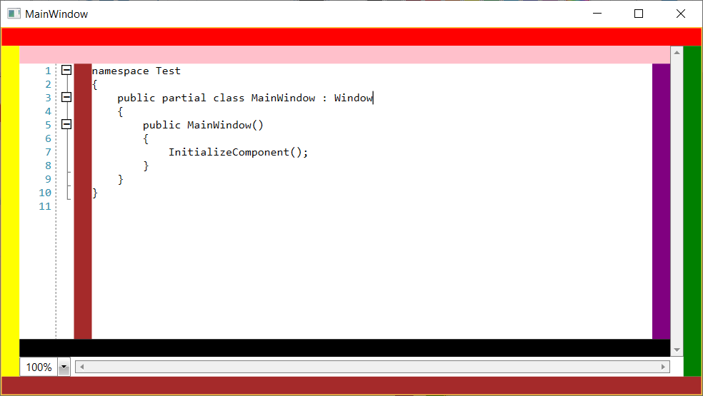
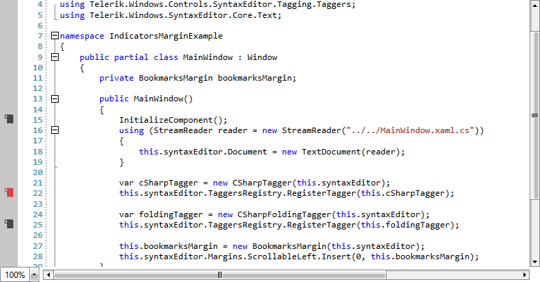

# Margins

The RadSyntaxEditor control contains several panels inside its ControlTemplate, which allow for customizing its look and/or extending its functionality. In order to customize them you can use the **Margins** property, which is of type [SyntaxEditorMargins](https://docs.telerik.com/devtools/wpf/api/telerik.windows.controls.syntaxeditor.ui.margins.syntaxeditormargins).

## Margin Panels

__Example 1__ demonstrates how you can add some custom elements around the RadSyntaxEditor and provides a visualization of the default locations for all panels. It also demonstrates the line numbers and [folding tagger]() features, which are implemented with the help of the left scrollable margin.

__Example 1: Defining the RadSyntaxEditor__
<snippet id='radsyntaxeditor-features-margins-block_1-xaml' />

__Example 1: Defining the RadSyntaxEditor__
<snippet id='radsyntaxeditor-features-margins-block_2-cs' />

#### __Figure 1: RadSyntaxEditor Margins__

## Indicators Margin

You can add **indicators** to particular lines of the RadSyntaxEditor control by using the new **IndicatorsMargin&lt;T&gt;** class.

The generic type parameter **T** determines the type of the created object which must be a **FrameworkElement**. The class also exposes a **UpdateIndicator** method in which you can set the properties of the created indicator element. You can also conditionally style the element as the method also provides the **line number** corresponding to the line that the indicator is drawn on.

The class inherits from the abstract **IndicatorsMarginBase** class which defines the **IndicatorBrush** property used to control the background of the margin and the **Indicators** property which holds a **collection of integers** corresponding to the lines which include an indicator element.

**Example 2** demonstrates how to create a margin which holds a collection of bookmarks and alternate the colors of these bookmarks.

#### [C#] Example 2: Creating a bookmarks margin

<snippet id='radsyntaxeditor-features-margins-block_3-cs' />

You can then add the margin to the RadSyntaxEditor as shown in **Example 3**.

#### [C#] Example 3: Adding the BookmarksMargin

<snippet id='radsyntaxeditor-features-margins-block_4-cs' />

**Figure 2** shows the final result after some bookmarks have been added.

#### __Figure 2: The bookmarks margin__

>You can add new bookmarks both by clicking on the margin in the UI and by programmatically adding integers to its Indicators collection.

## Removing the Line Numbers Panel

To remove the line numbers panel, you can clear the `ScrollableLeft` margins collection.

#### [C#] Removing the line numbers
<snippet id='radsyntaxeditor-features-margins-block_5-cs' />

## See Also

* [Taggers]()
* [Selection]()