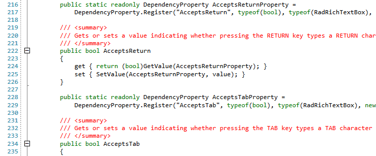
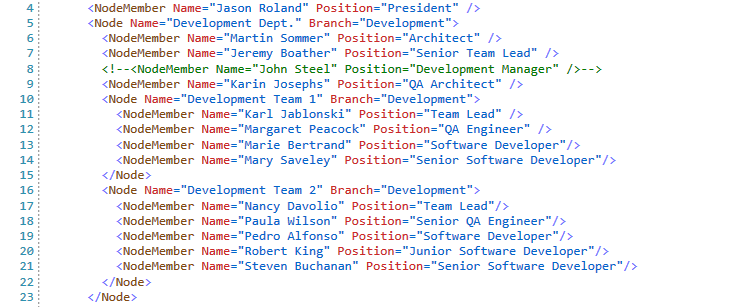

# Palettes

<style>
.palette-color {
	width:20px;
	height:20px;
	margin: auto;
	border: 1px solid black;
}

/* KeywordColor */
.keywordColor-light{
	background: #0000E6;
}
.keywordColor-dark{
	background: #89C4FF;
}
.keywordColor-neutral{
	background: #004F9D;
}
.keywordColor-neutral-dark{
	background: #89C4FF;
}
/* PreprocessorKeywordColor */
.preprocessorKeywordColor-light{
	background: #666666;
}
.preprocessorKeywordColor-dark{
	background: #A6A6A6;
}
.preprocessorKeywordColor-neutral{
	background: #A2A2A2;
}
.preprocessorKeywordColor-neutral-dark{
	background: #A2A2A2;
}
/* CommentColor */
.commentColor-light{
	background: #008040;
}
.commentColor-dark{
	background: #4AA66B;
}
.commentColor-neutral{
	background: #00CD66;
}
.commentColor-neutral-dark{
	background: #00CD66;
}
/* IdentifierColor */
.identifierColor-light{
	background: #000000;
}
.identifierColor-dark{
	background: #D7D7D7;
}
.identifierColor-neutral{
	background: #FFFFFF;
}
.identifierColor-neutral-dark{
	background: #FFFFFF;
}
/* OperatorColor */
.operatorColor-light{
	background: #1C1C1C;
}
.operatorColor-dark{
	background: #BCBCBC;
}
.operatorColor-neutral{
	background: #A8A8A8;
}
.operatorColor-neutral-dark{
	background: #A8A8A8;
}
/* StringColor */
.stringColor-light{
	background: #CB3300;
}
.stringColor-dark{
	background: #FF9292;
}
.stringColor-neutral{
	background: #C33100;
}
.stringColor-neutral-dark{ 
	background: #FF9292;
}
/* XmlAttributeColor */
.xmlAttributeColor-light{
	background: #FF3333;
}
.xmlAttributeColor-dark{
	background: #92E3F4;
}
.xmlAttributeColor-neutral{
	background: #FF0080;
}
.xmlAttributeColor-neutral-dark{
	background: #FF0080;
}
/* XmlElementColor */
.xmlElementColor-light{
	background: #A35C15;
}
.xmlElementColor-dark{
	background: #569CD6;
}
.xmlElementColor-neutral{
	background: #C91919;
}
.xmlElementColor-neutral-dark{
	background: #B5B543;
}
/* XmlCommentColor */
.xmlCommentColor-light{
	background: #009A00;
}
.xmlCommentColor-dark{
	background: #85A64A;
}
.xmlCommentColor-neutral{
	background: #00A451;
}
.xmlCommentColor-neutral-dark{
	background: #00A451;
}
/* XmlContentColor */
.xmlContentColor-light{
	background: #333333;
}
.xmlContentColor-dark{
	background: #E2E2E2;
}
.xmlContentColor-neutral{
	background: #292929;
}
.xmlContentColor-neutral-dark{
	background: #E2E2E2;
}
/* XmlStringColor */
.xmlStringColor-light{
	background: #0073E5;
}
.xmlStringColor-dark{
	background: #DCDCDC;
}
.xmlStringColor-neutral{
	background: #8000FF;
}
.xmlStringColor-neutral-dark{
	background: #B266FF;
}
/* XmlCharacterColor */
.xmlCharacterColor-light{
	background: #0073E5;
}
.xmlCharacterColor-dark{
	background: #8F9CFF;
}
.xmlCharacterColor-neutral{
	background: #8000FF;
}
.xmlCharacterColor-neutral-dark{
	background: #B266FF;
}
/* XmlTagColor */
.xmlTagColor-light{
	background: #3333FF;
}
.xmlTagColor-dark{
	background: #B1B1B1;
}
.xmlTagColor-neutral{
	background: #0F9998;
}
.xmlTagColor-neutral-dark{
	background: #14CCCB;
}
/* TrueFalseNullColor */
.trueFalseNullColor-light{
	background: #6D33A8;
}
.trueFalseNullColor-dark{
	background: #C79FEF;
}
.trueFalseNullColor-neutral{
	background: #6D33A8;
}
.trueFalseNullColor-neutral-dark{
	background: #C68CFF;
}
/* ArrayColor */
.arrayColor-light{
	background: #005961;
}
.arrayColor-dark{
	background: #CDDEE4;
}
.arrayColor-neutral{
	background: #005961;
}
.arrayColor-neutral-dark{
	background: #CDDEE4;
}
article table
{
    table-layout: auto;
}
/* NumberColor */
.numberColor-light{
	background: #621800;
}
.numberColor-dark{
	background: #FFA800;
}
.numberColor-neutral{
	background: #6C4800;
}
.numberColor-neutral-dark{
	background: #FFA800;
}
article table
{
    table-layout: auto;
}
</style>

The RadSyntaxEditor comes with 4 different **palettes** which you can choose from - **Light**, **Dark**, **Neutral** and **Neutral Dark**. They are responsible for applying different colors to the syntax-related words of the control.

## Palette List

Here is a list of all the colors in the palettes and their default values for each palette.

|Property|Light|Dark|Neutral|Neutral Dark|
|---|:---:|:---:|:---:|:---:|
|**KeywordColor**|<div class="palette-color keywordColor-light"></div>|<div class="palette-color keywordColor-dark"></div>|<div class="palette-color keywordColor-neutral"></div>|<div class="palette-color keywordColor-neutral-dark"></div>|
|**PreprocessorKeywordColor**|<div class="palette-color preprocessorKeywordColor-light"></div>|<div class="palette-color preprocessorKeywordColor-dark"></div>|<div class="palette-color preprocessorKeywordColor-neutral"></div>|<div class="palette-color preprocessorKeywordColor-neutral-dark"></div>|
|**CommentColor**|<div class="palette-color commentColor-light"></div>|<div class="palette-color commentColor-dark"></div>|<div class="palette-color commentColor-neutral"></div>|<div class="palette-color commentColor-neutral-dark"></div>|
|**IdentifierColor**|<div class="palette-color identifierColor-light"></div>|<div class="palette-color identifierColor-dark"></div>|<div class="palette-color identifierColor-neutral"></div>|<div class="palette-color identifierColor-neutral-dark"></div>|
|**OperatorColor**|<div class="palette-color operatorColor-light"></div>|<div class="palette-color operatorColor-dark"></div>|<div class="palette-color operatorColor-neutral"></div>|<div class="palette-color operatorColor-neutral-dark"></div>|
|**StringColor**|<div class="palette-color stringColor-light"></div>|<div class="palette-color stringColor-dark"></div>|<div class="palette-color stringColor-neutral"></div>|<div class="palette-color stringColor-neutral-dark"></div>|
|**XmlAttributeColor**|<div class="palette-color xmlAttributeColor-light"></div>|<div class="palette-color xmlAttributeColor-dark"></div>|<div class="palette-color xmlAttributeColor-neutral"></div>|<div class="palette-color xmlAttributeColor-neutral-dark"></div>|
|**XmlElementColor**|<div class="palette-color xmlElementColor-light"></div>|<div class="palette-color xmlElementColor-dark"></div>|<div class="palette-color xmlElementColor-neutral"></div>|<div class="palette-color xmlElementColor-neutral-dark"></div>|
|**XmlCommentColor**|<div class="palette-color xmlCommentColor-light"></div>|<div class="palette-color xmlCommentColor-dark"></div>|<div class="palette-color xmlCommentColor-neutral"></div>|<div class="palette-color xmlCommentColor-neutral-dark"></div>|
|**XmlContentColor**|<div class="palette-color xmlContentColor-light"></div>|<div class="palette-color xmlContentColor-dark"></div>|<div class="palette-color xmlContentColor-neutral"></div>|<div class="palette-color xmlContentColor-neutral-dark"></div>|
|**XmlStringColor**|<div class="palette-color xmlStringColor-light"></div>|<div class="palette-color xmlStringColor-dark"></div>|<div class="palette-color xmlStringColor-neutral"></div>|<div class="palette-color xmlStringColor-neutral-dark"></div>|
|**XmlCharacterDataColor**|<div class="palette-color xmlCharacterColor-light"></div>|<div class="palette-color xmlCharacterColor-dark"></div>|<div class="palette-color xmlCharacterColor-neutral"></div>|<div class="palette-color xmlCharacterColor-neutral-dark"></div>|
|**XmlTagColor**|<div class="palette-color xmlTagColor-light"></div>|<div class="palette-color xmlTagColor-dark"></div>|<div class="palette-color xmlTagColor-neutral"></div>|<div class="palette-color xmlTagColor-neutral-dark"></div>|
|**TrueFalseNullColor**|<div class="palette-color trueFalseNullColor-light"></div>|<div class="palette-color trueFalseNullColor-dark"></div>|<div class="palette-color trueFalseNullColor-neutral"></div>|<div class="palette-color trueFalseNullColor-neutral-dark"></div>|
|**ArrayColor**|<div class="palette-color arrayColor-light"></div>|<div class="palette-color arrayColor-dark"></div>|<div class="palette-color arrayColor-neutral"></div>|<div class="palette-color arrayColor-neutral-dark"></div>|
|**NumberColor**|<div class="palette-color numberColor-light"></div>|<div class="palette-color numberColor-dark"></div>|<div class="palette-color numberColor-neutral"></div>|<div class="palette-color numberColor-neutral-dark"></div>|

## Palette Recommendations

The table below lists the recommended palettes for each of the [available themes]() in the UI for WPF suite. If you're using any of the theme-variation combinations marked with an asterisk (__*__), you need to explicitly set the RadSyntaxEditor's Palette as they will not be updated when the theme variation is changed.

|Theme|Palette|
|---|---|
|Office2019 Dark __*__|Dark|
|Office2019 Gray|Light|
|Office2019 Light|Light|
|VisualStudio2019|Light|
|Crystal Light|Light|
|Crystal Dark __*__|Dark|
|Fluent Light|Light|
|Fluent Dark __*__|Dark|
|Material|Light|
|Office2016(Touch)|Light|
|Green Dark|Neutral Dark|
|Green Light __*__|Neutral|
|VisualStidio2013|Light|
|VisualStidio2013 Blue|Light|
|VisualStidio2013 Dark __*__|Dark|
|Office2013|Light|
|Office2013 LightGray|Light|
|Office2013 DarkGray|Light|
|Windows8(Touch)|Light|
|Expression_Dark|Neutral Dark|
|Windows7|Light|
|Transparent|Neutral|
|Vista|Light|
|Summer|Light|
|Office_Black|Light|
|Office_Silver|Light|
|Office_Blue|Light|

__Example 1: Change the palette when using a specific theme__
```C#
    
    switch (theme)
    {
       case "Crystal_Dark":
			this.syntaxEditor.Palette = SyntaxPalettes.Dark;
			break;
		case "Fluent_Dark":
			this.syntaxEditor.Palette = SyntaxPalettes.Dark;
			break;
		case "Green_Light":
			this.syntaxEditor.Palette = SyntaxPalettes.Neutral;
			break;
		case "Green_Dark":
			this.syntaxEditor.Palette = SyntaxPalettes.NeutralDark;
			break;
		case "VisualStudio2013_Dark":
			this.syntaxEditor.Palette = SyntaxPalettes.Dark;
			break;
		case "Expression_Dark":
			this.syntaxEditor.Palette = SyntaxPalettes.NeutralDark;
			break;
		case "Transparent":
			this.syntaxEditor.Palette = SyntaxPalettes.Neutral;
			break;
		default:
			this.syntaxEditor.Palette = SyntaxPalettes.Light;
			break;
    }
```

## Custom Palettes

If you want to customize the colors shown in your RadSyntaxEditor control, you can do so by either modifying one of the default palettes or by creating a new instance of the **SyntaxEditorPalette** class and setting all of its colors.

>important It is not possible to edit the colors of the default palettes during runtime.

### Modify a Default Palette

__Example 2: Modifying a default palette in XAML__
```XAML
    
    <Grid xmlns:palettes="clr-namespace:Telerik.Windows.Controls.SyntaxEditor.Palettes;assembly=Telerik.Windows.Controls.SyntaxEditor">
        <Grid.Resources>
            <palettes:LightPalette x:Key="ModifiedLightPalette" KeywordColor="Green" CommentColor="Red" />
        </Grid.Resources>
        <telerik:RadSyntaxEditor x:Name="syntaxEditor" Palette="{StaticResource ModifiedLightPalette}"/>
    </Grid>
```

#### Figure 2: RadSyntaxEditor with a modified Light palette


### Create a Custom Palette

__Example 3: Creating a custom SyntaxEditorPalette in code-behind__
```C#
    
    var customPalette = new SyntaxEditorPalette();
    customPalette.KeywordColor = (Color)ColorConverter.ConvertFromString("#3232eb");
    customPalette.PreprocessorKeywordColor = (Color)ColorConverter.ConvertFromString("#848484");
    customPalette.CommentColor = (Color)ColorConverter.ConvertFromString("#006633");
    customPalette.IdentifierColor = (Color)ColorConverter.ConvertFromString("#000000");
    customPalette.OperatorColor = (Color)ColorConverter.ConvertFromString("#323232");
    customPalette.XmlAttributeColor = (Color)ColorConverter.ConvertFromString("#cc2828");
    customPalette.XmlElementColor = (Color)ColorConverter.ConvertFromString("#824910");
    customPalette.XmlCommentColor = (Color)ColorConverter.ConvertFromString("#007b00");
    customPalette.XmlContentColor = (Color)ColorConverter.ConvertFromString("#474747");
    customPalette.XmlStringColor = (Color)ColorConverter.ConvertFromString("#0066cc");
    customPalette.XmlCharacterDataColor = (Color)ColorConverter.ConvertFromString("#0066cc");
    customPalette.XmlTagColor = (Color)ColorConverter.ConvertFromString("#7070ff");
    this.syntaxEditor.Palette = customPalette;
```

#### Figure 2: RadSyntaxEditor with a custom palette


## See Also

* [Visual Structure]()
* [Available Themes]()
