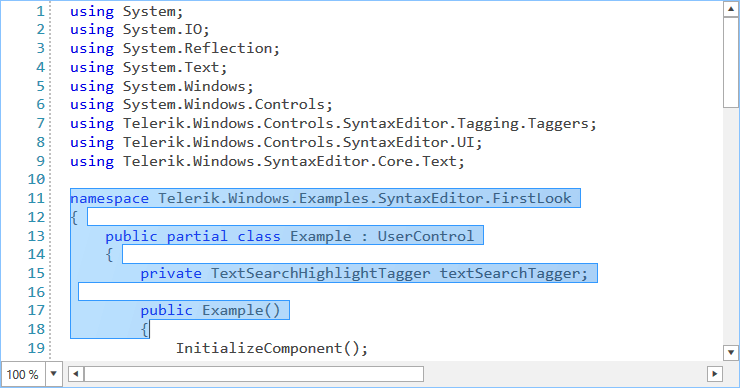
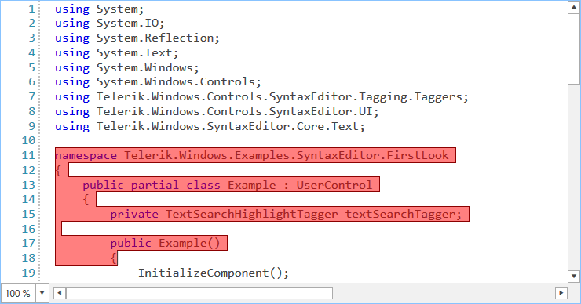

# Selection

The RadSyntaxEditor supports not only selection via the UI but also exposes API to work with the selection programmatically. In addition, the selection can be controlled via the keyboard by a number of key combinations. You can also disable selection in the control if your business scenario demands it.

## UI Selection

The user is able to select the content inside **RadSyntaxEditor** in the same way as in Visual Studio. This is done by clicking on the desired position and dragging to the desired end of the selection.

#### Figure 1: RadSyntaxEditor with selected text



## Keyboard Combinations

Users can also select text by using their keyboard. Here's a list of the supported key combinations.

#### Table 1: Hotkeys supported by the RadSyntaxEditor and their actions

|Hotkeys|Action|
|---|---|
|Shift + Right arrow|Extends selection one position forward.|
|Shift + Left arrow|Extends selection one position backward.|
|Shift + Up arrow|Extends selection to the same position on the previous line.|
|Shift + Down arrow|Extends selection to the same position on the next line.|
|Shift + Home|Extends selection to the start of the current line.|
|Shift + End|Extends selection to the end of the current line.|
|Ctrl + Shift + Home|Extends selection to the document start position.|
|Ctrl + Shift + End|Extends selection to the document end position.|
|Ctrl + Shift + Left arrow|Extends selection to the current word start position.|
|Ctrl + Shift + Right arrow|Extends selection to the current word end position.|
|Ctrl + A|Selects the entire document.|

## Customize the Selection Adorner

You can modify the appearance of the selection in the control through the **SelectionFill** and **SelectionStroke** properties of RadSyntaxEditor.

#### [XAML] Example 1: Customize the appearance of the selection
```XAML

    <telerik:RadSyntaxEditor x:Name="syntaxEditor" SelectionStroke="DarkRed">
        <telerik:RadSyntaxEditor.SelectionFill>
            <SolidColorBrush Color="Red" Opacity="0.5" />
        </telerik:RadSyntaxEditor.SelectionFill>
    </telerik:RadSyntaxEditor>
```


#### [C#] Example 1: Customize the appearance of the selection
```C#

	this.syntaxEditor.SelectionFill = new System.Windows.Media.SolidColorBrush(Colors.Red); 
	this.syntaxEditor.SelectionFill.Opacity = 0.2;
	this.syntaxEditor.SelectionStroke = System.Windows.Media.Brushes.DarkRed;
```


#### [VB.NET] Example 1: Customize the appearance of the selection
```VB.NET
	
	Me.syntaxEditor.SelectionFill = New SolidColorBrush(Colors.Red)
	Ме.syntaxEditor.SelectionFill.Opacity = 0.2
	Ме.syntaxEditor.SelectionStroke = Brushes.DarkRed
```

#### Figure 2: RadSyntaxEditor with custom selection colors



## Programmatic Selection

Through the control's **Selection** property, you can programmatically manipulate the selection and get additional details for the selected span(s). **Example 2** demonstrates how you can get the entire selection as a string through the **GetSelectedText** method.

#### [C#] Example 2: Customize the appearance of the selection
```C#

    var selectedText = this.syntaxEditor.Selection.GetSelectedText(); 
```

## IsSelectionEnabled

If you want to disable selection for your users, you can set the **IsSelectionEnabled** property of the control to **False**.

#### [XAML] Example 3: Customize the appearance of the selection
```XAML

    <telerik:RadSyntaxEditor x:Name="syntaxEditor" IsSelectionEnabled="False" />
```

#### [C#] Example 3: Customize the appearance of the selection
```C#

	this.syntaxEditor.IsSelectionEnabled = false;
```

#### [VB.NET] Example 3: Customize the appearance of the selection
```VB.NET
	
	Me.syntaxEditor.IsSelectionEnabled = false
```

## See Also

* [Find and Replace]()
* [IntelliPrompts]()