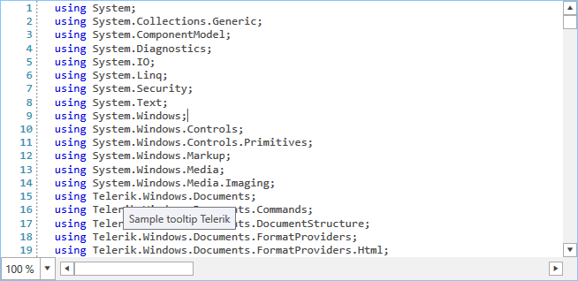

# Taggers

The RadSyntaxEditor control works with the underlying document with the help of **taggers**. Taggers are used to identify spans of text and assign them a specific tag if they match a specific condition. The matched tags are then processed by the [UI layers]() which color the text or draw additional elements on screen.

## Predefined Taggers

The RadSyntaxEditor comes with a number of predefined taggers:

* **CSharpTagger**: A tagger responsible for the syntax-highlighting in the **C#** programming language.
* **VisualBasicTagger**: A tagger responsible for the syntax-highlighting in the **Visual Basic** programming language.
* **JavaScriptTagger**: A tagger responsible for the syntax-highlighting in the **JavaScript** programming language.
* **XmlTagger**: A tagger responsible for the syntax-highlighting in the **XML** programming language.
* **SqlTagger**: A tagger responsible for the syntax-highlighting in the **T-SQL (Transact-SQL)** programming language.
* **FoldingTagger**: A tagger responsible for creating **folding regions** in code.
* **TextSearchHighlightTagger**: A tagger which prepares collection of **TextHighlightTag** for all occurrences of a given search word.
* **TextSearchUnderlineTagger**: A tagger which prepares collection of **UnderlineTag** for all occurrences of a given search word.

## Register a Tagger

To be able to use these taggers in the RadSyntaxEditor control, you first need to register them in its **TaggersRegistry**.

#### __[C#] Example 1: Registering taggers__
{{region cs-radsyntaxeditor-features-taggers-1}}
    
    var cSharpTagger = new CSharpTagger(this.syntaxEditor);
    this.syntaxEditor.TaggersRegistry.RegisterTagger(cSharpTagger);

    var textSearchTagger = new TextSearchHighlightTagger(this.syntaxEditor, TextSearchHighlightTagger.SearchFormatDefinition);
    this.syntaxEditor.TaggersRegistry.RegisterTagger(textSearchTagger);
{{endregion}}

## Custom Tagger

To create a custom tagger, you can inherit from the **abstract generic TaggerBase** class. You then need to implement the abstract **GetTags** class which is responsible for acquiring all spans of tags which meet a specific condition.

To demonstrate this we will create the following class which shows a tooltip on all occurrences of a specified search word.

#### __[C#] Example 2: Registering taggers__
{{region cs-radsyntaxeditor-features-taggers-2}}

    public class SimpleToolTipTagger : TaggerBase<ToolTipTag>
    {
        private string searchWord;

        public SimpleToolTipTagger(ITextDocumentEditor editor)
            : base(editor)
        {
        }

        public override IEnumerable<TagSpan<ToolTipTag>> GetTags(NormalizedSnapshotSpanCollection spans)
        {
            if (string.IsNullOrEmpty(this.searchWord))
            {
                yield break;
            }

            TextSnapshot snapshot = this.Document.CurrentSnapshot;
            foreach (TextSnapshotSpan snapshotSpan in spans)
            {
                string lineString = snapshotSpan.GetText();
                int index = lineString.IndexOf(this.searchWord);
                while (index != -1)
                {
                    TextSnapshotSpan tempSnapshotSpan = new TextSnapshotSpan(snapshot,
                        new Span(snapshotSpan.Start + index, searchWord.Length));

                    yield return new TagSpan<ToolTipTag>(tempSnapshotSpan, new ToolTipTag("Sample tooltip " + searchWord));

                    index = lineString.IndexOf(this.searchWord, index + this.searchWord.Length);
                }
            }
        }

        public void UpdateSearchWord(string newSearchWord)
        {
            this.searchWord = newSearchWord;
            this.CallOnTagsChanged(this.Document.CurrentSnapshot.Span);
        }
    }
{{endregion}}

To use the tagger you need to register it in the TaggersRegistry as you would do with any other tagger. You can then call the **UpdateSearchWord** method to apply the tagger to any spans containing a specific word.

#### __[C#] Example 3: Using the custom tagger__
{{region cs-radsyntaxeditor-features-taggers-3}}

    var simpleToolTipTagger = new SimpleToolTipTagger(this.syntaxEditor);
    this.syntaxEditor.TaggersRegistry.RegisterTagger(simpleToolTipTagger);
    simpleToolTipTagger.UpdateSearchWord("Telerik");
{{endregion}}

#### Figure 1: The custom tooltip tagger

## See Also

* [UI Layers]()
* [Selection]()
* [IntelliSense]()