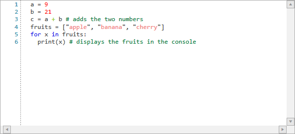

# Custom Language

By using the **WordTaggerBase** as a base, you can create custom syntax highlighting for any custom language. In this article we will create basic highlighting for the **Python** programming language.

Let's define the following class which will be responsible for classifying the words of the opened document.

__Example 1: The custom tagger__
```C#
    public class PythonTagger : WordTaggerBase
    {
        private static readonly string[] Keywords = new string[]
        {
            "False", "None", "True", "and", "as", "assert","break", "class", 
            "continue", "def", "del", "elif", "else", "except", "for", "from",
            "global", "if", "import", "in", "is", "lambda", "nonlocal", "not", 
            "or", "pass", "raise", "finally", "return", "try", "while", "with", "yield"
        };

        private static readonly string[] Comments = new string[]
        {
            "#"
        };

        private static readonly string[] Operators = new string[]
        {
            "+", "-",  "\*", "/"
        };

        public static readonly ClassificationType FruitsClassificationType = new ClassificationType("Fruits");

        private static readonly string[] Fruits = new string[]
        {
            "apple", "banana", "blue_berry", "cherry"
        };

        private static readonly Dictionary<string, ClassificationType> WordsToClassificationType = new Dictionary<string, ClassificationType>();

        static PythonTagger()
        {
            WordsToClassificationType = new Dictionary<string, ClassificationType>();

            foreach (var keyword in Keywords)
            {
                WordsToClassificationType.Add(keyword, ClassificationTypes.Keyword);
            }

            foreach (var preprocessor in Operators)
            {
                WordsToClassificationType.Add(preprocessor, ClassificationTypes.Operator);
            }

            foreach (var comment in Comments)
            {
                WordsToClassificationType.Add(comment, ClassificationTypes.Comment);
            }

            foreach (var comment in Fruits)
            {
                WordsToClassificationType.Add(comment, FruitsClassificationType);
            }
        }

        public PythonTagger(Telerik.Windows.Controls.RadSyntaxEditor editor)
          : base(editor)
        {
        }

        protected override Dictionary<string, ClassificationType> GetWordsToClassificationTypes()
        {
            return PythonTagger.WordsToClassificationType;
        }

        protected override bool TryGetClassificationType(string word, out ClassificationType classificationType)
        {
            int number;

            if (int.TryParse(word, out number))
            {
                classificationType = ClassificationTypes.NumberLiteral;
                return true;
            }

            return base.TryGetClassificationType(word, out classificationType);
        }

        protected override void OnWordSplit(int wordCharType, string word)
        {
            if (wordCharType == 3 && word.Length > 1)
            {
                this.AddWord(word, ClassificationTypes.Comment);
            }
        }

        protected override int GetCharType(char c)
        {
            if (c == '#')
            {
                return 3;
            }

            if (c == '_')
            {
                return 0;
            }

            if (char.IsWhiteSpace(c))
            {
                return 1;
            }

            if (char.IsPunctuation(c) || char.IsSymbol(c))
            {
                return 2;
            }

            return 0;
        }
    }
```

The code above defines custom arrays of words which are then assigned a `Keyword`, `Comment`, `Operator` or the custom `Fruits` classification type.

In addition, in the `TryGetClassificationType` method override we assign the `NumberLiteral` classification type to any word that can be parsed to an integer.

We also override the `OnWordSplit` method to ensure that comments are highlighted correctly even if multiple **comment (#)** symbols are placed one next to the other.

Lastly, we override the `GetCharType` method to correctly highlight `blue_berry` as by default it will be split by the **underscore (_)** character and not be matched as a classification type.

We can then register the custom tagger in RadSyntaxEditor's `TaggersRegistry` just as we would with any other tagger. We also add custom `TextFormatDefinitions` with specific foregrounds for the `NumberLiteral`, `Operator` and the custom `FruitsClassificationType` which we created earlier.

__Example 2: Registering the custom tagger__
```C#
    var pythonTagger = new PythonTagger(this.syntaxEditor);
    if (!this.syntaxEditor.TaggersRegistry.IsTaggerRegistered(pythonTagger))
    {
        this.syntaxEditor.TaggersRegistry.RegisterTagger(pythonTagger);
    }

    this.syntaxEditor.TextFormatDefinitions.AddLast(ClassificationTypes.NumberLiteral, new TextFormatDefinition(new SolidColorBrush(Colors.Red)));
    this.syntaxEditor.TextFormatDefinitions.AddLast(ClassificationTypes.Operator, new TextFormatDefinition(new SolidColorBrush(Colors.YellowGreen)));
    this.syntaxEditor.TextFormatDefinitions.AddLast(PythonTagger.FruitsClassificationType, new TextFormatDefinition(new SolidColorBrush(Colors.LightCoral)));
```

Upon loading some Python code in the editor you will observe a result similar to the one illustrated in **Figure 1**.

#### Figure 1: The custom Python tagger


## See Also

* [UI Layers]()
* [Selection]()
* [Word Taggers]()
