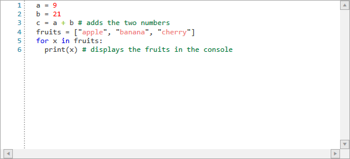

# Custom Language

By using the **WordTaggerBase** as a base, you can create custom syntax highlighting for any custom language. In this article we will create basic highlighting for the **Python** programming language.

Let's define the following class which will be responsible for classifying the words of the opened document.

__Example 1: The custom tagger__
<snippet id='radsyntaxeditor-features-taggers-custom-language-block_1-cs' />

The code above defines custom arrays of words which are then assigned a `Keyword`, `Comment`, `Operator` or the custom `Fruits` classification type.

In addition, in the `TryGetClassificationType` method override we assign the `NumberLiteral` classification type to any word that can be parsed to an integer.

We also override the `OnWordSplit` method to ensure that comments are highlighted correctly even if multiple **comment (#)** symbols are placed one next to the other.

Lastly, we override the `GetCharType` method to correctly highlight `blue_berry` as by default it will be split by the **underscore (_)** character and not be matched as a classification type.

We can then register the custom tagger in RadSyntaxEditor's `TaggersRegistry` just as we would with any other tagger. We also add custom `TextFormatDefinitions` with specific foregrounds for the `NumberLiteral`, `Operator` and the custom `FruitsClassificationType` which we created earlier.

__Example 2: Registering the custom tagger__
<snippet id='radsyntaxeditor-features-taggers-custom-language-block_2-cs' />

Upon loading some Python code in the editor you will observe a result similar to the one illustrated in **Figure 1**.

#### Figure 1: The custom Python tagger

## See Also

* [UI Layers]()
* [Selection]()
* [Word Taggers]()