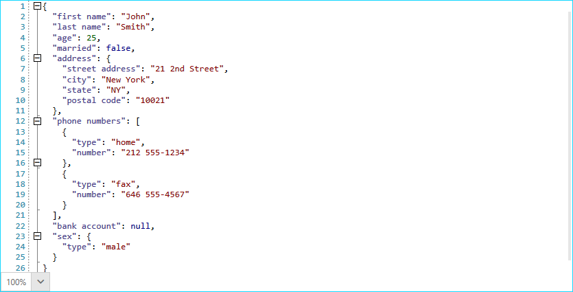

# Custom Regex Language

It is relatively easy to hardcode a collection of strings (such as the keywords in Python) and only highlight these specific words. Some languages, however, require regular expressions to be used so that highlighting can be applied as expected.

In this article you will learn how to setup a custom tagger which handles the text by using regular expressions. We will use JSON for the purposes of this example, but a similar approach can be applied to text in other formats as well.

We will first define the types of words the tagger will recognize.

__Example 1: Recognized JSON types__
```C#
    public static class JsonTypes
    {
        static JsonTypes()
        {
            Key = new ClassificationType("Key");
            Number = new ClassificationType("Number");
            TrueFalseNull = new ClassificationType("TrueFalseNull");
            StringLiteral = new ClassificationType("StringLiteral");
        }

        public static ClassificationType Key
        {
            get;
            private set;
        }

        public static ClassificationType Number
        {
            get;
            private set;
        }

        public static ClassificationType TrueFalseNull
        {
            get;
            private set;
        }

        public static ClassificationType StringLiteral
        {
            get;
            private set;
        }
    }
```

As you can observe, the custom tagger we will define will recognize the **keys** of the JSON objects, **numbers**, **strings** and the **true**, **false** and **null** keywords.

Let's us now define the actual tagger class which will be responsible for classifying the words of the opened document.

__Example 2: The custom tagger__
```C#
    public class JsonTagger : TaggerBase<ClassificationTag>
    {
        public JsonTagger(ITextDocumentEditor editor)
            : base(editor)
        {
        }

        public override IEnumerable<TagSpan<ClassificationTag>> GetTags(NormalizedSnapshotSpanCollection spans)
        {
            string[] regexGroups = new string[] { "key", "stringLiteral", "number", "TFN"};

            foreach (var span in spans)
            {
                string spanText = span.GetText();
                string stringToMatch = PrepareRegexString();

                Regex regularExpression = new Regex(stringToMatch, RegexOptions.IgnoreCase | RegexOptions.ExplicitCapture);
                MatchCollection matches = regularExpression.Matches(spanText);

                foreach (Match match in matches)
                {
                    foreach (var groupName in regexGroups)
                    {
                        if (match.Groups[groupName].Success)
                        {
                            int start = span.Start + match.Index;
                            TagSpan<ClassificationTag> tagSpan = CreateTagSpan(this.Document.CurrentSnapshot, start, match.Length, groupName);

                            yield return tagSpan;
                        }
                    }
                }
            }

            yield break;
        }

        private static string PrepareRegexString()
        {
            string keys = @"(?<key>\s\*""([^\\""\n]|\\.)\*""?\s\*)(?=:)";
            string stringLiterals = @"(?<stringLiteral>(?<=:)\s\*""([^\\""\n]|\\.)\*""?\s\*)";
            string numbers = @"(?<number>(-?)(0|([1-9][0-9]\*))(\\.[0-9]+)?)";
            string trueFalseNulls = @"(?<TFN>(true|false|null))";

            string[] xamlClassifications = new string[] { numbers, trueFalseNulls, stringLiterals, keys };

            StringBuilder builder = new StringBuilder();

            builder.Append(@"\s\*");
            for (int i = 0; i < xamlClassifications.Count() - 1; i++)
            {
                builder.AppendFormat("{0}|", xamlClassifications[i]);
            }
            builder.AppendFormat("{0}", xamlClassifications[xamlClassifications.Count() - 1]);
            builder.Append(@"\s\*");

            return builder.ToString();
        }

        private static TagSpan<ClassificationTag> CreateTagSpan(TextSnapshot snapshot, int start, int len, string groupName)
        {
            var textSnapshotSpan = new TextSnapshotSpan(snapshot, new Span(start, len));
            var classificationType = GetJsonClassificationType(groupName);
            var classificationTag = new ClassificationTag(classificationType);
            var tagSpan = new TagSpan<ClassificationTag>(textSnapshotSpan, classificationTag);

            return tagSpan;
        }

        private static ClassificationType GetJsonClassificationType(string typestring)
        {
            if (typestring == "key")
            {
                return JsonTypes.Key;
            }
            else if (typestring == "stringLiteral")
            {
                return JsonTypes.StringLiteral;
            }
            else if (typestring == "number")
            {
                return JsonTypes.Number;
            }
            else if (typestring == "TFN")
            {
                return JsonTypes.TrueFalseNull;
            }

            return null;
        }
    }
```

The most important piece of code in **Example 2** is the **GetTags** method. In it, we iterate the collection of spans passed by the RadSyntaxEditor control and check whether each span contains a match with one of the regular expressions defined in the **PrepareRegexString** method. If there are any matches, we check the group of that match and based on it we create the appropriate tag span with the respective **ClassificationTag**.

Generally speaking, the same approach can be used for any language by creating the proper regular expressions.

Finally, we can register the custom tagger in RadSyntaxEditor's **TaggersRegistry** just as we would with any other tagger. We also add custom **TextFormatDefinitions** with specific foregrounds for the **Key**, **StringLiteral**, **Number** and the **TrueFalseNull** classification types which we created in **Example 1**. In addition, we can create a **BracketFoldingTagger** to handle the folding regions.

__Example 3: Registering the custom tagger__
```C#
    JsonTagger jsonTagger = new JsonTagger(this.syntaxEditor);
    this.syntaxEditor.TaggersRegistry.RegisterTagger(jsonTagger);

    this.syntaxEditor.TextFormatDefinitions.AddLast(JsonTypes.Key, 
            new TextFormatDefinition(new SolidColorBrush(Colors.DarkSlateBlue)));

    this.syntaxEditor.TextFormatDefinitions.AddLast(JsonTypes.StringLiteral,
            new TextFormatDefinition(new SolidColorBrush(Colors.DarkRed)));

    this.syntaxEditor.TextFormatDefinitions.AddLast(JsonTypes.Number,
            new TextFormatDefinition(new SolidColorBrush(Colors.DarkGreen)));

    this.syntaxEditor.TextFormatDefinitions.AddLast(JsonTypes.TrueFalseNull,
            new TextFormatDefinition(new SolidColorBrush(Colors.DarkBlue)));
            
    this.foldingTagger = new BracketFoldingTagger(this.syntaxEditor);
    this.syntaxEditor.TaggersRegistry.RegisterTagger(this.foldingTagger);
```

Upon loading a JSON object in the editor you will observe a result similar to the one illustrated in **Figure 1**.

#### Figure 1: The custom JSON tagger


## See Also

* [Custom Language]()
* [UI Layers]()
* [Selection]()
* [Word Taggers]()
