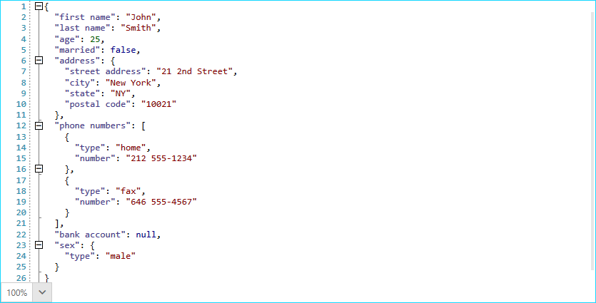

# Custom Regex Language

It is relatively easy to hardcode a collection of strings (such as the keywords in Python) and only highlight these specific words. Some languages, however, require regular expressions to be used so that highlighting can be applied as expected.

In this article you will learn how to setup a custom tagger which handles the text by using regular expressions. We will use JSON for the purposes of this example, but a similar approach can be applied to text in other formats as well.

We will first define the types of words the tagger will recognize.

__Example 1: Recognized JSON types__
<snippet id='radsyntaxeditor-features-taggers-custom-regex-language-block_1-cs' />

As you can observe, the custom tagger we will define will recognize the **keys** of the JSON objects, **numbers**, **strings** and the **true**, **false** and **null** keywords.

Let's us now define the actual tagger class which will be responsible for classifying the words of the opened document.

__Example 2: The custom tagger__
<snippet id='radsyntaxeditor-features-taggers-custom-regex-language-block_2-cs' />

The most important piece of code in **Example 2** is the **GetTags** method. In it, we iterate the collection of spans passed by the RadSyntaxEditor control and check whether each span contains a match with one of the regular expressions defined in the **PrepareRegexString** method. If there are any matches, we check the group of that match and based on it we create the appropriate tag span with the respective **ClassificationTag**.

Generally speaking, the same approach can be used for any language by creating the proper regular expressions.

Finally, we can register the custom tagger in RadSyntaxEditor's **TaggersRegistry** just as we would with any other tagger. We also add custom **TextFormatDefinitions** with specific foregrounds for the **Key**, **StringLiteral**, **Number** and the **TrueFalseNull** classification types which we created in **Example 1**. In addition, we can create a **BracketFoldingTagger** to handle the folding regions.

__Example 3: Registering the custom tagger__
<snippet id='radsyntaxeditor-features-taggers-custom-regex-language-block_3-cs' />

Upon loading a JSON object in the editor you will observe a result similar to the one illustrated in **Figure 1**.

#### Figure 1: The custom JSON tagger

## See Also

* [Custom Language]()
* [UI Layers]()
* [Selection]()
* [Word Taggers]()