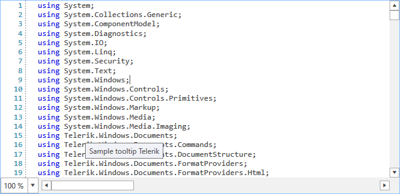

# Custom Tagger

To create a custom tagger, you can inherit from the **abstract generic TaggerBase** class. You then need to implement the abstract **GetTags** method which is responsible for acquiring all spans of tags which meet a specific condition.

To demonstrate this we will create the following class which shows a tooltip on all occurrences of a specified search word.

__Example 1: Registering taggers__
```C#

    public class SimpleToolTipTagger : TaggerBase<ToolTipTag>
    {
        private string searchWord;

        public SimpleToolTipTagger(ITextDocumentEditor editor)
            : base(editor)
        {
        }

        public override IEnumerable<TagSpan<ToolTipTag>> GetTags(NormalizedSnapshotSpanCollection spans)
        {
            if (string.IsNullOrEmpty(this.searchWord))
            {
                yield break;
            }

            TextSnapshot snapshot = this.Document.CurrentSnapshot;
            foreach (TextSnapshotSpan snapshotSpan in spans)
            {
                string lineString = snapshotSpan.GetText();
                int index = lineString.IndexOf(this.searchWord);
                while (index != -1)
                {
                    TextSnapshotSpan tempSnapshotSpan = new TextSnapshotSpan(snapshot,
                        new Span(snapshotSpan.Start + index, searchWord.Length));

                    yield return new TagSpan<ToolTipTag>(tempSnapshotSpan, new ToolTipTag("Sample tooltip " + searchWord));

                    index = lineString.IndexOf(this.searchWord, index + this.searchWord.Length);
                }
            }
        }

        public void UpdateSearchWord(string newSearchWord)
        {
            this.searchWord = newSearchWord;
            this.CallOnTagsChanged(this.Document.CurrentSnapshot.Span);
        }
    }
```

To use the tagger you need to register it in the **TaggersRegistry** as you would do with any other tagger. You can then call the **UpdateSearchWord** method to apply the tagger to any spans containing a specific word.

__Example 2: Using the custom tagger__
```C#

    var simpleToolTipTagger = new SimpleToolTipTagger(this.syntaxEditor);
    if (!this.syntaxEditor.TaggersRegistry.IsTaggerRegistered(simpleToolTipTagger))
    {
        this.syntaxEditor.TaggersRegistry.RegisterTagger(this.simpleToolTipTagger);
    }
    simpleToolTipTagger.UpdateSearchWord("Telerik");
```

#### Figure 1: The custom tooltip tagger


## See Also

* [Word Taggers]()
* [Folding Taggers]()