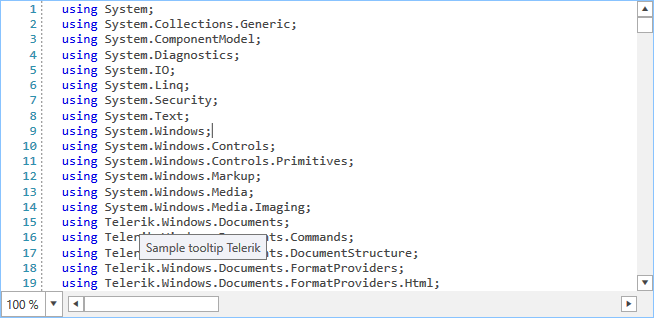

# Custom Tagger

To create a custom tagger, you can inherit from the **abstract generic TaggerBase** class. You then need to implement the abstract **GetTags** method which is responsible for acquiring all spans of tags which meet a specific condition.

To demonstrate this we will create the following class which shows a tooltip on all occurrences of a specified search word.

__Example 1: Registering taggers__
<snippet id='radsyntaxeditor-features-taggers-custom-tagger-block_1-cs' />

To use the tagger you need to register it in the **TaggersRegistry** as you would do with any other tagger. You can then call the **UpdateSearchWord** method to apply the tagger to any spans containing a specific word.

__Example 2: Using the custom tagger__
<snippet id='radsyntaxeditor-features-taggers-custom-tagger-block_2-cs' />

#### Figure 1: The custom tooltip tagger

## See Also

* [Word Taggers]()
* [Folding Taggers]()