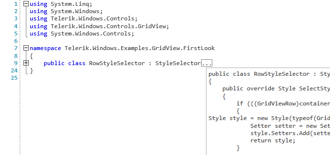

# Folding Taggers

The folding taggers are used when you want to create collapsible (foldable) sections of code in a document. The base class responsible for this functionality is the **FoldingTaggerBase** class with concrete implementations provided out of the box being the **BracketFoldingTagger**, **CSharpFoldingTagger**, **VisualBasicFoldingTagger** and **XMLFoldingTagger**.

__Example 1: Registering a folding tagger__
```C#
    this.foldingTagger = new CSharpFoldingTagger(this.syntaxEditor);
    this.syntaxEditor.TaggersRegistry.RegisterTagger(this.foldingTagger);
```

#### Figure 1: RadSyntaxEditor with a registered CSharpFoldingTagger



## FoldingTaggerBase

**FoldingTaggerBase** is the class responsible for generating the collapsible code regions. You can inherit this class and add **FoldingRegionDefinitions** to define the start and end matching rules of a collapsible section.

### Key Properties

* __FoldingRegionDefinitions__: An __IList__ collection property of __FoldingRegionDefinition__ that gets the definitions that this tagger will use for matching the collapsible regions in the document.

* __IsMatchingCaseSensitive__: A __boolean__ property that gets or sets whether the matching between the start and end folding tags is case sensitive.

__Example 2: Adding FoldingRegionDefinitions__
```C#
    public CustomFoldingTagger(ITextDocumentEditor editor) : base(editor)
    {
        this.FoldingRegionDefinitions.Add(new FoldingRegionDefinition("FUNCTION", "END"));
        this.FoldingRegionDefinitions.Add(new FoldingRegionDefinition("IF", "END IF"));
    }
```

In addition, you may also want to override the **BuildStartRegionBlockPattern** and **BuildEndRegionBlockPattern** and return a custom regular expression to match the start and end.

__Example 3: Default implementation of the BuildStartRegionBlockPattern and BuildEndRegionBlockPattern methods__
```C#
    protected override string BuildStartRegionBlockPattern(Dictionary<string, string> startToEndMap)
    {
        // returns \bFUNCTION\b|\bIF\b
        return string.Join("|", startToEndMap.Keys.Select(x => string.Format("\\b{0}\\b", x)));
    }

    protected override string BuildEndRegionBlockPattern(Dictionary<string, string> startToEndMap)
    {
        // returns \bEND\b|\bEND IF\b
        return string.Join("|", startToEndMap.Values.Select(x => string.Format("\\b{0}\\b", x)));
    }
```

Here's a full list of the overridable methods which you can use in order to create your own custom folding taggers. You can check their default implementations in the various out of the box folding taggers to get a general understanding of how to use them by [downloading the source code]()[downloading the source code]() of the UI for {{ site.framework_name }} suite.

* **string BuildStartRegionBlockPattern(Dictionary&lt;string, string> startToEndMap)**: Prepares patters for matching start of collapsible folding section. Default implementation is to join all start strings of provided collapsible sections.
* **string BuildEndRegionBlockPattern(Dictionary&lt;string, string> startToEndMap)**: Prepares patters for matching end of collapsible folding section. Default implementation is to join all end strings of provided collapsible sections.
* **string GetFoldingRegionTitle(Span foldingSpan)**: Gets the text displayed in the collapsed folding section. (**...** by default)
* **string GetFoldingRegionToolTipContent(Span foldingSpan)**: Gets the folding region's tooltip content.
* **string Span CoerceFoldingSpan(Span defaultFoldingSpan)**: Coerces the default provided folding span - span starting from the start of the region's start text and ending in the end of the region's end text.
* **string void RebuildFoldingRegions**: Rebuilds the list of all collapsible (folding) regions.
* **void ProcessNotMatchedTags(IEnumerable&lt;FoldingRegionMatch> startTags, IEnumerable&lt;FoldingRegionMatch> endTags)**: Tries to match the not matched start and end tags left from the standard stack matching algorithm. The two arguments contain collections of **FoldingRegionMatch** instances with each match holding the following information:
    * **Index**: An **integer** corresponding to the index of the folding match.
    * **Tag**: The tag (keyword) of the folding match represented as a **string**.
    * **IsStart**: A **boolean** indicating whether the folding match is the start or the end of a folding region.
    * **IsUsed**: A **boolean** indicating whether the folding match is already used in a folding region.
* **void RefreshStartEndMap**: Prepares the start/end matches for use as key-value pairs.
* **void InvalidateFoldingRegions**: Clears all collapsible (folding) regions and rebuilds them.

## Styling the Folding Button

If you want to change the appearance of the folding buttons which appear next to each folding region, you can create an appropriate style targeting the **FoldingToggleButton** element.

__Example 1: Styling the FoldingToggleButton__
```XAML
    <!-- If you are using the NoXaml binaries, you will have to base the style on the default one for the theme like so: 
    <Style TargetType="syntaxEditor:FoldingToggleButton" BasedOn="{StaticResource FoldingToggleButtonStyle}">--> 
    <Style xmlns:syntaxEditor="clr-namespace:Telerik.Windows.Controls.SyntaxEditor.UI;assembly=Telerik.Windows.Controls.SyntaxEditor" TargetType="syntaxEditor:FoldingToggleButton">
        <Setter Property="Foreground" Value="Red" />
    </Style>
```

## See Also

* [UI Layers]()
* [Custom Tagger]()
