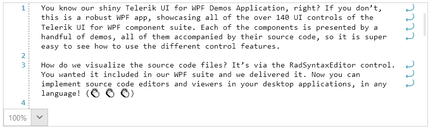

# {{ site.framework_name }} RadSyntaxEditor Word Wrap

As of **R3 2022**, the RadSyntaxEditor control supports word wrapping which enables users to view all text for a line that normally would have gone outside the viewport horizontally.

The functionality can be enabled by setting the `IsWordWrapEnabled` property to `True`.

#### [XAML] Enable word-wrap in XAML
{{region xaml-radsyntaxeditor-features-wordwrap_2}}
    <telerik:RadSyntaxEditor x:Name="syntaxEditor" IsWordWrapEnabled="True" />
{{endregion}}

#### [C#] Enable word-wrap in code-behind
{{region cs-radsyntaxeditor-features-wordwrap_2}}
    this.syntaxEditor.IsWordWrapEnabled = true;
{{endregion}}

#### [VB.NET] Enable word-wrap in code-behind
{{region vb-radsyntaxeditor-features-wordwrap_2}}
    Me.syntaxEditor.IsWordWrapEnabled = True
{{endregion}}

#### RadSyntaxEditor with word wrapping

## See Also

* [Taggers]()
* [Selection]()