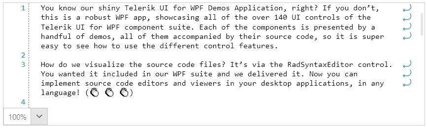

# Word Wrap

As of **R3 2022**, the RadSyntaxEditor control supports word wrapping which enables users to view all text for a line that normally would have gone outside the viewport horizontally.

The functionality can be enabled by setting the `IsWordWrapEnabled` property to `True`.

#### [XAML] Enable word-wrap in XAML
<snippet id='radsyntaxeditor-features-wordwrap-block_1-xaml' />

#### [C#] Enable word-wrap in code-behind
<snippet id='radsyntaxeditor-features-wordwrap-block_2-cs' />

#### [VB.NET] Enable word-wrap in code-behind
<snippet id='radsyntaxeditor-features-wordwrap-block_3-vb' />

#### RadSyntaxEditor with word wrapping

## See Also

* [Taggers]()
* [Selection]()