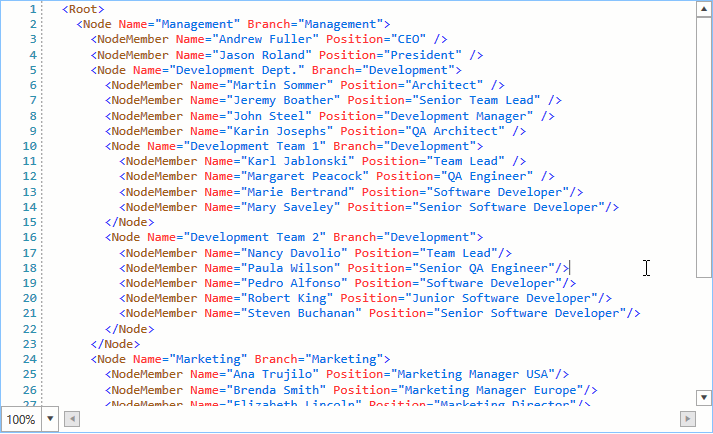

# Zooming

The RadSyntaxEditor control provides out of the box zooming functionality. You can zoom in the opened document by holding the **Ctrl** key and spinning the mouse wheel or by using the **ZoomComboBox** located in the bottom-left corner of the control.

#### __Figure 1: Zooming the RadSyntaxEditor__


## ScaleFactor

The zoom factor can also be controlled by setting the control's **ScaleFactor** property as demonstrated in **Example 1**. It can take values from **0.25** to **4** while values outside this range are coerced to the closest valid value.

__Example 1: Setting the scale factor__
```XAML
    
    <telerik:RadSyntaxEditor ScaleFactor="2" />
```

## Programmatic Zooming

You can also zoom the control programmatically by using the **ZoomIn**, **ZoomOut** and **ZoomTo** properties.

The ZoomIn and ZoomOut methods do not take any parameters. When invoked, they increase or decrease the **ScaleFactor** with the value set as the control's **ZoomStep**.

__Example 2: Zoom in and out__
```C#
    
    this.syntaxEditor.ZoomIn();
    this.syntaxEditor.ZoomOut();
```

The ZoomTo method on the other hand, accepts a single argument - the zoom level to scroll to. This argument is directly set as the control's ScaleFactor and can thus accept values **from 0.25 to 4**, inclusive.

__Example 3: Zoom to a particular zoom level__
```C#
    
    this.syntaxEditor.ZoomTo(2);
```

## Disallow Zooming

If you wish to disallow your users to zoom through the control's UI, you can set the **AllowScaling** property to **False**.

__Example 4: Disallow scaling__
```XAML
    
    <telerik:RadSyntaxEditor AllowScaling="False" />
```

## See Also

* [IntelliPrompts]()