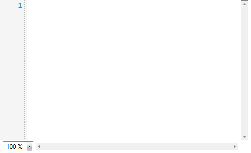
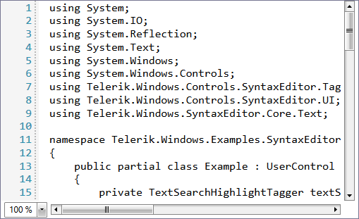
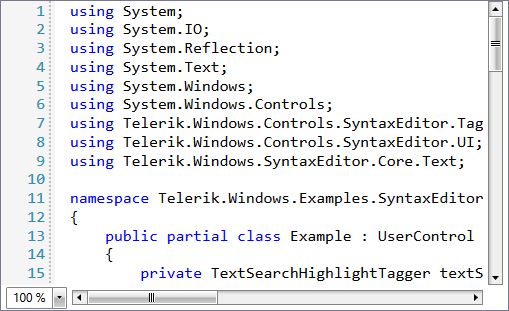

# Getting Started with {{ site.framework_name }} SyntaxEditor

This tutorial will walk you through the creation of a sample application that contains a __RadSyntaxEditor__ control.
			
## Adding Telerik Assemblies Using NuGet

To use __RadSyntaxEditor__ when working with NuGet packages, install the `Telerik.Windows.Controls.SyntaxEditor.for.Wpf.Xaml` package. The [package name may vary]() slightly based on the Telerik dlls set - [Xaml or NoXaml]()

Read more about NuGet installation in the [Installing UI for WPF from NuGet Package]() article.

>tip With the 2025 Q1 release, the Telerik UI for WPF has a new licensing mechanism. You can learn more about it [here]().

## Adding Assembly References Manually

If you are not using NuGet packages, you can add a reference to the following assemblies:

* __Telerik.Licensing.Runtime__
* __Telerik.Windows.Controls__
* __Telerik.Windows.Controls.Input__
* __Telerik.Windows.Controls.SyntaxEditor__
* __Telerik.Windows.SyntaxEditor.Core__

You can find the required assemblies for each control from the suite in the [Controls Dependencies]() help article.

## Defining RadSyntaxEditor

__Example 1__ demonstrates how you can define a RadSyntaxEditor in XAML.

__Example 1: Defining RadSyntaxEditor__
```XAML

    <telerik:RadSyntaxEditor x:Name="syntaxEditor" />
```

#### __Figure 1: Empty RadSyntaxEditor__


## Opening a File

To load a file in the RadSyntaxEditor you need to use its **Document** property.

__Example 2: Opening a File__
```C#

    public MainWindow()
    {
        InitializeComponent();

        using (StreamReader reader = new StreamReader("../../CS_File.txt"))
        {
            this.syntaxEditor.Document = new TextDocument(reader);
        }
    }
```

#### __Figure 2: RadSyntaxEditor with a loaded C# file__


## Enable Syntax Highlighting

Once you have loaded the code, you need to register an appropriate tagger to enable syntax highlighting for the particular language.

__Example 3: Enable C# code highlighting__
```C#

    var cSharptagger = new CSharpTagger(this.syntaxEditor);
    this.syntaxEditor.TaggersRegistry.RegisterTagger(cSharptagger);
```

#### __Figure 3: RadSyntaxEditor with C# code highlighting__


## Setting a Theme

The controls from our suite support different themes. You can see how to apply a theme different than the default one in the [Setting a Theme]() help article.

>important Changing the theme using implicit styles will affect all controls that have styles defined in the merged resource dictionaries. This is applicable only for the controls in the scope in which the resources are merged. 

To change the theme, you can follow the steps below:

* Choose between the themes and add reference to the corresponding theme assembly (ex: **Telerik.Windows.Themes.Windows8.dll**). You can see the different themes applied in the **Theming** examples from our [WPF Controls Examples](https://demos.telerik.com/wpf/)[Silverlight Controls Examples](https://demos.telerik.com/silverlight/#Slider/Theming) application.

* Merge the ResourceDictionaries with the namespace required for the controls that you are using from the theme assembly. For the RadSyntaxEditor, you will need to merge the following resources:

	* __Telerik.Windows.Controls__
	* __Telerik.Windows.Controls.Input__
	* __Telerik.Windows.Controls.SyntaxEditor__
	* __Telerik.Windows.SyntaxEditor.Core__

__Example 3__ demonstrates how to merge the ResourceDictionaries so that they are applied globally for the entire application.

__Example 3: Merge the ResourceDictionaries__  
```XAML
	<Application.Resources>
		<ResourceDictionary>
			<ResourceDictionary.MergedDictionaries>
				<ResourceDictionary Source="/Telerik.Windows.Themes.Windows8;component/Themes/System.Windows.xaml"/>
				<ResourceDictionary Source="/Telerik.Windows.Themes.Windows8;component/Themes/Telerik.Windows.Controls.xaml"/>
				<ResourceDictionary Source="/Telerik.Windows.Themes.Windows8;component/Themes/Telerik.Windows.Controls.Input.xaml"/>
				<ResourceDictionary Source="/Telerik.Windows.Themes.Windows8;component/Themes/Telerik.Windows.Controls.SyntaxEditor.xaml"/>
			</ResourceDictionary.MergedDictionaries>
		</ResourceDictionary>
	</Application.Resources>
```

>Alternatively, you can use the theme of the control via the [StyleManager](https://docs.telerik.com/devtools/wpf/styling-and-appearance/stylemanager/common-styling-apperance-setting-theme-wpf)[StyleManager](https://docs.telerik.com/devtools/silverlight/styling-and-appearance/stylemanager/common-styling-apperance-setting-theme).

__Figure 3__ shows a RadSyntaxEditor with the **Windows8** theme applied.

#### __Figure 3: RadSyntaxEditor with the Windows8 theme__



## Telerik UI for WPF Learning Resources

* [Telerik UI for WPF SyntaxEditor Component](https://www.telerik.com/products/wpf/syntaxeditor.aspx)
* [Getting Started with Telerik UI for WPF Components]()
* [Telerik UI for WPF Installation]()
* [Telerik UI for WPF and WinForms Integration]()
* [Telerik UI for WPF Visual Studio Templates]()
* [Setting a Theme with Telerik UI for WPF]()
* [Telerik UI for WPF Virtual Classroom (Training Courses for Registered Users)](https://learn.telerik.com/learn/course/external/view/elearning/16/telerik-ui-for-wpf) 
* [Telerik UI for WPF License Agreement](https://www.telerik.com/purchase/license-agreement/wpf-dlw-s)


## See Also 

* [Visual Structure]()
