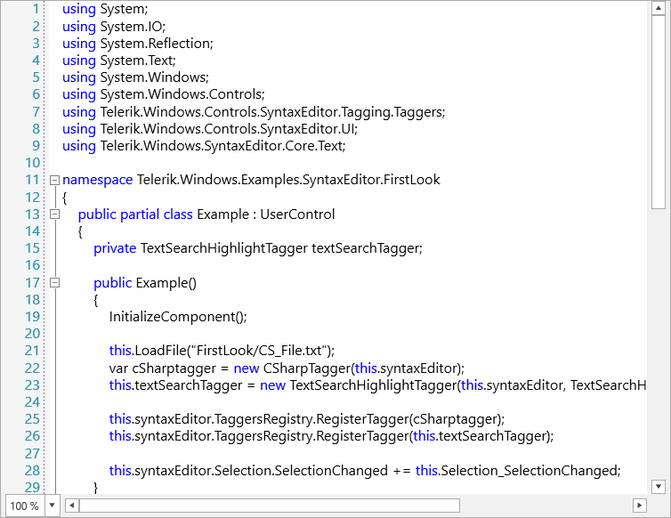

# {{ site.framework_name }} SyntaxEditor Overview

 **RadSyntaxEditor** is a useful text editor control which provides built-in syntax highlighting and code editing experience for popular languages. It allows users to create custom syntax highlighting of keywords and operators of their own language.





## Key Features

* **Syntax highlighting**: Provides syntax highlighting for procedural programming and markup languages. Also allows users to customize built-in languages or create highlighting for their own [custom language]().

* **Code outlining**: Displays code blocks in tree structure and allows users to expand and collapse the code blocks interactively for readability. RadSyntaxEditor automatically chooses where to create outlines for built-in languages. It also allows users to create outlining for their own syntax highlighting.

* **Undo and redo**: Includes support for undo and redo operations that erase the last change in a document and reinsert it.

* **IntelliPrompts**: RadSyntaxEditor can show IntelliPrompts for code completion and method overloading to speed up coding by reducing typos and other common mistakes.

* **Find and replace**: Users can replace the specified text with the replacement text as per the conditions specified. Includes options to replace the first occurrence or all occurrences of the search text.

* **Zooming**: Allows users to zoom in and out of the control up to 4 times the original font size.

* **Line numbers**: Displays the line number at the start of a line for the users to identify the current number.

* **Palettes**: The control comes with 4 different palettes from which you can choose from and allows for custom palettes to be created.

* **Keyboard Shortcuts**: RadSyntaxEditor supports the most widely-spread keyboard hotkeys which can also be found in other text editors.

>tip Get started with the control with its [Getting Started]() help article that shows how to use it in a basic scenario.

>Check out the online demos at [demos.telerik.com](https://demos.telerik.com/wpf/).


## Telerik UI for WPF Support and Learning Resources

* [Telerik UI for WPF SyntaxEditor Homepage](https://www.telerik.com/products/wpf/syntaxeditor.aspx)
* [Get Started with the Telerik UI for WPF SyntaxEditor]()
* [Telerik UI for WPF API Reference](https://docs.telerik.com/devtools/wpf/api/)
* [Getting Started with Telerik UI for WPF Components]()
* [Telerik UI for WPF Virtual Classroom (Training Courses for Registered Users)](https://learn.telerik.com/learn/course/external/view/elearning/16/telerik-ui-for-wpf) 
* [Telerik UI for WPF SyntaxEditor Forums](https://www.telerik.com/forums/wpf)
* [Telerik UI for WPF Knowledge Base](https://docs.telerik.com/devtools/wpf/knowledge-base)


## See Also

* [Getting Started]()
* [Visual Structure]()
