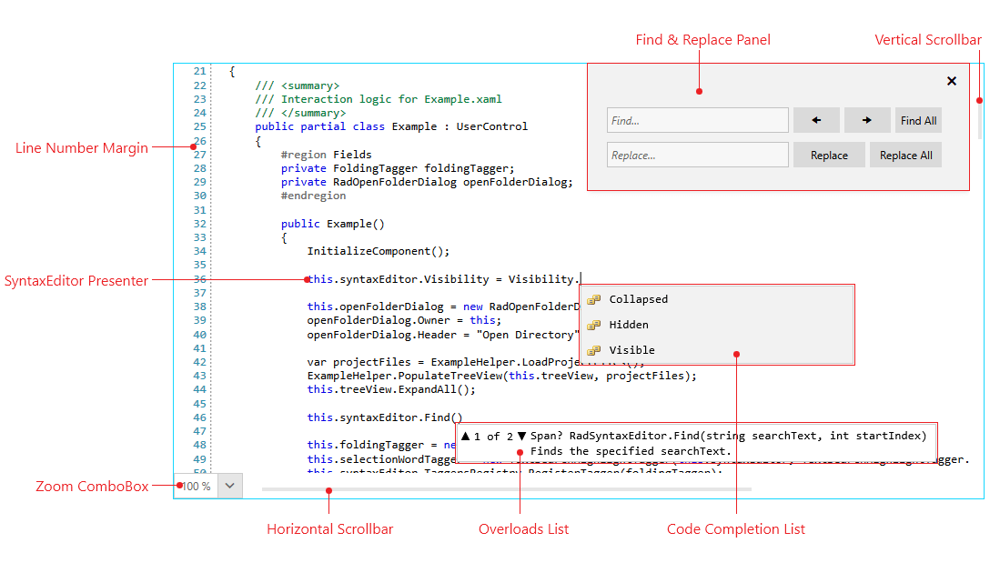

# Visual Structure

This section defines terms and concepts used in the scope of the RadSyntaxEditor control with which you have to get familiar before you continue to read its documentation. They can also be helpful when contacting our support service in order to describe your issue better.

* **Line Number Margin**: Displays a number for each line of the current document.
* **Find and Replace Panel**: The panel used for searching in the document as well as replacing occurrences of a given word. It can be opened by using the **Ctrl + F5** key combination. More information can be found in the [Find and Replace]() article.
* **Vertical Scrollbar**: Used to scroll the contents of the document vertically.
* **Code Completion List**: Displays a list of items for code completion which will be inserted at the position of the cursor. You can read more about this in the [IntelliPrompts]() article.
* **Overloads List**: Displays a list of possible overloads for a given method. Read more on the subject in the [IntelliPrompts]() article.
* **Horizontal Scrollbar**: Used to scroll the contents of the document horizontally.
* **Zoom ComboBox**: Can be used to change the scale factor of the document.
* **SyntaxEditor Presenter**: Displays the content of the loaded document.

## See Also

* [Getting Started]()
* [RadSyntaxEditor API Reference](https://docs.telerik.com/devtools/wpf/api/telerik.windows.controls.radsyntaxeditor)
