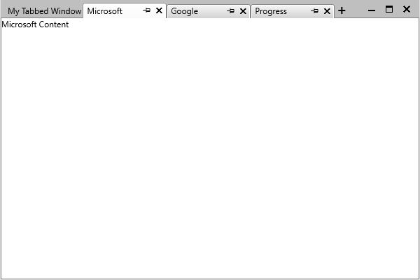

# Data Binding

This article demonstrates how to bind the RadTabbedWindow control to a collection of business objects.

For the purposes of this example the control is bound to a collection of **Tab** objects. Please note that the class inherits from **ViewModelBase** which is the Telerik implementation of the **INotifyPropertyChanged** interface.

__Example 1: The Tab class__

```C#
    public class Tab : ViewModelBase
    {
        private string header;
        private string content;

        public string Header
        {
            get { return this.header; }
            set
            {
                if (value != this.header)
                {
                    this.header = value;
                    this.OnPropertyChanged("Header");
                }
            }
        }

        public string Content
        {
            get { return this.content; }
            set
            {
                if (value != this.content)
                {
                    this.content = value;
                    this.OnPropertyChanged("Content");
                }
            }
        }
    }
```

The next step is to create an __ObservableCollection__ of Tab objects in your viewmodel.

__Example 2: Create an ObservableCollection in the viewmodel__

```C#    
	public class TabbedWindowViewModel : ViewModelBase
    {
        private ObservableCollection<Tab> tabs;

        public ObservableCollection<Tab> Tabs
        {
            get
            {
                if (this.tabs == null)
                {
                    this.tabs = new ObservableCollection<Tab>();
                    this.tabs.Add(new Tab() { Header = "Progress", Content = "Progress Content" });
                    this.tabs.Add(new Tab() { Header = "Microsoft", Content = "Microsoft Content" });
                    this.tabs.Add(new Tab() { Header = "Google", Content = "Google Content" });
                }

                return this.tabs;
            }
        }
    }
```

All that's left is to bind this collection to the RadTabbedWindow control. You also need to define the **DisplayMemberPath** and **ContentTemplate** properties so that the tabs appear as expected.

__Example 3: Bind the ItemsSource property__

```XAML
	<telerik:RadTabbedWindow x:Class="DataBinding.TabbedWindow"
                xmlns="http://schemas.microsoft.com/winfx/2006/xaml/presentation"
                xmlns:x="http://schemas.microsoft.com/winfx/2006/xaml"
                xmlns:local="clr-namespace:DataBinding"
                xmlns:telerik="http://schemas.telerik.com/2008/xaml/presentation" 
                DisplayMemberPath="Header"    
                ItemsSource="{Binding Tabs}">
        <telerik:RadTabbedWindow.DataContext>
            <local:TabbedWindowViewModel />
        </telerik:RadTabbedWindow.DataContext>
        <telerik:RadTabbedWindow.ContentTemplate>
            <DataTemplate>
                <TextBlock Text="{Binding Content}" />
            </DataTemplate>
        </telerik:RadTabbedWindow.ContentTemplate>
    </telerik:RadTabbedWindow>
```

>important As of **R2 2019 SP1** the control's **Items** property (populated when setting the control's **ItemsSource**) is of type **IList**. Prior to this version of the controls, it was of type **ObservableCollection<RadTabitem>**.

<!-- -->

>important Please note that you need to replace the **DataBinding** namespace with your namespace.

Upon running the application, your RadTabbedWindow will now be populated with tabs as shown on **Figure 1**.

__DataBound RadTabbedWindow__



## See Also

* [Key Properties]()
* [Events]()
* [Styles and Templates]()