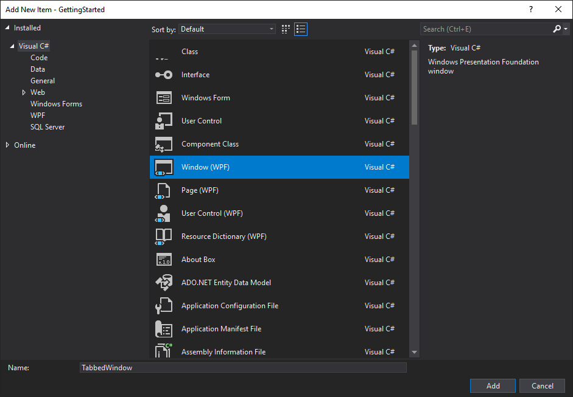
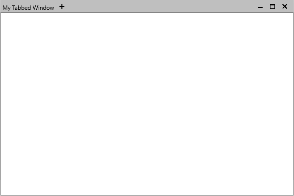
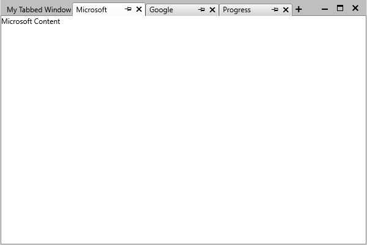
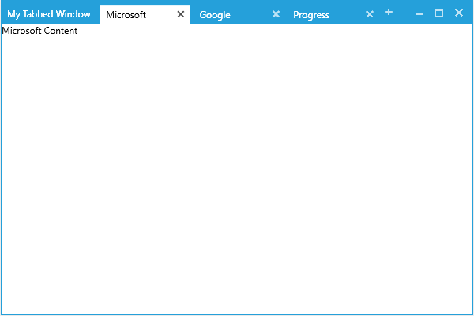

# Getting Started with {{ site.framework_name }} TabbedWindow

This tutorial will walk you through the creation of a sample application that contains a __RadTabbedWindow__ control. 

## Adding Telerik Assemblies Using NuGet

To use __RadTabbedWindow__ when working with NuGet packages, install the `Telerik.Windows.Controls.Navigation.for.Wpf.Xaml` package. The [package name may vary]() slightly based on the Telerik dlls set - [Xaml or NoXaml]()

Read more about NuGet installation in the [Installing UI for WPF from NuGet Package]() article.

>tip With the 2025 Q1 release, the Telerik UI for WPF has a new licensing mechanism. You can learn more about it [here]().

## Adding Assembly References Manually

If you are not using NuGet packages, you can add a reference to the following assemblies:

* __Telerik.Licensing.Runtime__
* __Telerik.Windows.Controls__
* __Telerik.Windows.Controls.Navigation__
* __Telerik.Windows.Controls.Data__

## Adding RadTabbedWindow to the Project

Start by creating a new WPF window using Visual Studio's item template.

__Add new WPF Window__

After this, replace the generated Window declaration with the following XAML code:

__Example 1: Defining a RadTabbedWindow in XAML__

<snippet id='radtabbedwindow-getting-started-block_1-xaml' />

>important Please note that you need to replace the **GettingStarted** namespace with your namespace.

Also in the code-behind file you should inherit the __RadTabbedWindow__ instead of the standard MS __Window__.

__Example 2: Inherit from RadTabbedWindow__

<snippet id='radtabbedwindow-getting-started-block_2-cs' />
<snippet id='radtabbedwindow-getting-started-block_3-vb' />

Finally, you can remove the **StartupUri** property from the **App.xaml** file and replace the code-behind with the following:

__Example 3: Open RadTabbedWindow on application startup__

<snippet id='radtabbedwindow-getting-started-block_4-cs' />
<snippet id='radtabbedwindow-getting-started-block_5-vb' />

If you run the application, you will see the RadTabbedWindow control illustrated in __Figure 2__. 

__Empty RadTabbedWindow__

>important If you're using the [implicit styles]() theming mechanism with the [NoXaml binaries](), note that the newly created window will not automatically receive the default style. In order for this to happen, you should add the following style after the merged dictionaries:

__Example 4: Adding the style for the new TabbedWindow__

<snippet id='radtabbedwindow-getting-started-block_6-xaml' />

## Add Tabs

You can add tabs to the window by directly defining them as its content.

__Example 5: Adding Tabs to RadTabbedWindow in XAML__

<snippet id='radtabbedwindow-getting-started-block_7-xaml' />

Upon running the application, your RadTabbedWindow should now be populated with tabs as shown on **Figure 3**.

__RadTabbedWindow with tabs__

Alternatively, you can set the **ItemsSource** property of the control or bind it to a collection in your viewmodel. You can find an example of how to do this in the [Data Binding]() article.

## Setting a Theme

The controls from our suite support different themes. You can see how to apply a theme different than the default one in the [Setting a Theme]() help article.

>important Changing the theme using implicit styles will affect all controls that have styles defined in the merged resource dictionaries. This is applicable only for the controls in the scope in which the resources are merged. 

To change the theme, you can follow the steps below:
* Choose between the themes and add reference to the corresponding theme assembly (ex: **Telerik.Windows.Themes.Windows8.dll**). You can see the different themes applied in the **Theming** examples from our [WPF Controls Examples](https://demos.telerik.com/wpf/) application.

* Merge the resource dictionaries with the namespace required for the controls that you are using from the theme assembly. For __RadTabbedWindow__, you will need to merge the following resource dictionaries:

	* __System.Windows.xaml__
	* __Telerik.Windows.Controls.xaml__
	* __Telerik.Windows.Controls.Navigation.xaml__

__Example 6__ demonstrates how to merge the resource dictionaries so that they are applied globally for the entire application.

__Example 6: Merge the ResourceDictionaries__  
<snippet id='radtabbedwindow-getting-started-block_8-xaml' />

__Figure 4__ shows __RadTabbedWindow__ with the **Windows8** theme applied.
	
__RadTabbedWindow with the Windows8 theme__


## Telerik UI for WPF Learning Resources

* [Telerik UI for WPF TabbedWindow Component](https://www.telerik.com/products/wpf/tabbedwindow.aspx)
* [Getting Started with Telerik UI for WPF Components]()
* [Telerik UI for WPF Installation]()
* [Telerik UI for WPF and WinForms Integration]()
* [Telerik UI for WPF Visual Studio Templates]()
* [Setting a Theme with Telerik UI for WPF]()
* [Telerik UI for WPF Virtual Classroom (Training Courses for Registered Users)](https://learn.telerik.com/learn/course/external/view/elearning/16/telerik-ui-for-wpf) 
* [Telerik UI for WPF License Agreement](https://www.telerik.com/purchase/license-agreement/wpf-dlw-s)


## See Also

* [Key Properties]()
* [Events]()
* [Styles and Templates]()