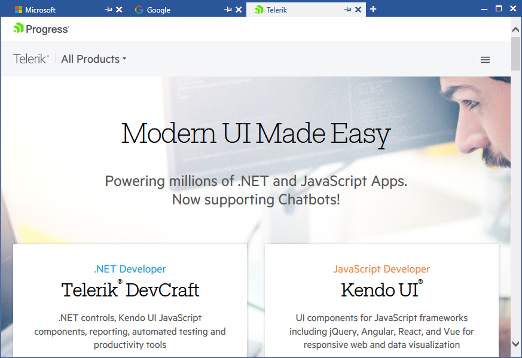

# {{ site.framework_name }} TabbedWindow Overview

The RadTabbedWindow enables you to create browser-like interface which hosts its tabs in the title bar. The control also allows you to pin the tabs or reorder them via drag drop. Last but not least, RadTabbedWindow's functionality and appearance can be easily customized through its rich API.





__RadTabbedWindow in the Office2016 theme__

## Key Features

* __Pin and Unpin Tabs__: You can pin the tabs of the control to the left and unpin them using the respective pin/unpin button.

* __DragDrop Support__: Users can reorder tabs in a single window, drag out tabs to create new windows, or drag drop tabs from one window to another.

* __Add New Tabs__: New tabs can be added to the window via the "+" button or in code-behind.

* __Data Binding__: You can bind the control's ItemsSource to any collection of objects and display the required information using the various templates it exposes.

* __Templates and Template Selectors__: The control allows for advanced modifications of the look and feel of its items.
	 
* __Styling and Appearance__: RadTabbedWindow comes with a variety of themes and properties that allow you to enhance the control's appearance.

* __Rich API__: The control's rich API enables you to easily customize its functionality.

* __Touch Support__: The RadTabbedWindow control also provides out-of-the-box touch support.

>tip Get started with the control with its [Getting Started]() help article that shows how to use it in a basic scenario.

> Don't forget to also check out the online demos of the control at [demos.telerik.com](https://demos.telerik.com/wpf/).


## Telerik UI for WPF Support and Learning Resources

* [Telerik UI for WPF TabbedWindow Homepage](https://www.telerik.com/products/wpf/tabbedwindow.aspx)
* [Get Started with the Telerik UI for WPF TabbedWindow]()
* [Telerik UI for WPF API Reference](https://docs.telerik.com/devtools/wpf/api/)
* [Getting Started with Telerik UI for WPF Components]()
* [Telerik UI for WPF Virtual Classroom (Training Courses for Registered Users)](https://learn.telerik.com/learn/course/external/view/elearning/16/telerik-ui-for-wpf) 
* [Telerik UI for WPF TabbedWindow Forums](https://www.telerik.com/forums/wpf)
* [Telerik UI for WPF Knowledge Base](https://docs.telerik.com/devtools/wpf/knowledge-base)


## See Also

* [Getting Started]()
* [Key Properties]()
* [Events]()
* [Styles and Templates]()
