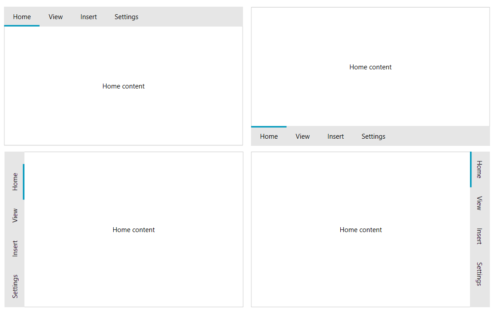
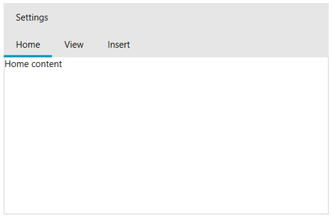
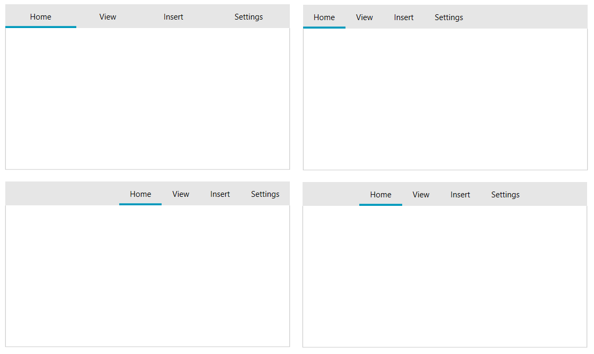

# Customizing Items Layout

RadTabControl allows you to customize the items placement and lines ordering.

To change the placement of the tabstrip area where the items are placed, set the __TabStripPlacement__ property of RadTabControl. The placement can be __Top__ (default), __Bottom__, __Left__ or __Right__.

#### __[C#] Example 1: Setting TabStripPlacement__
{{region radtabcontrol-appearance-customizing-items-layout-0}}
	<telerik:RadTabControl TabStripPlacement="Bottom">          
		<telerik:RadTabItem Header="Home" />
		<telerik:RadTabItem Header="View" />
		<telerik:RadTabItem Header="Insert" />
		<telerik:RadTabItem Header="Settings" />
	</telerik:RadTabControl>
{{endregion}}

#### Figure 1: All tabstrip placements

The tab items can be separated in two different lines (rows). To create a new line, set the __IsBreak__ property of the RadTabItem which should start the line. Read more about this feature in the [Create Multi-Line Tabs]() article.

#### __[C#] Example 2: Setting IsBreak__
{{region radtabcontrol-appearance-customizing-items-layout-1}}
	<telerik:RadTabControl>          
		<telerik:RadTabItem Header="Home" />
		<telerik:RadTabItem Header="View" />
		<telerik:RadTabItem Header="Insert" IsBreak="True" />
		<telerik:RadTabItem Header="Settings" />
	</telerik:RadTabControl>
{{endregion}}

#### Figure 2: Tab items on multiple rows

>tip The line with the selected tab will be moved on the bottom row.

To __align the tabs__ in the tabstrip area, set the __Align__ property of RadTabControl. The available alignments are __Left__ (default), __Right__, __Center__, __Justify__.

#### __[C#] Example 3: Setting alignments__
{{region radtabcontrol-appearance-customizing-items-layout-2}}
	<telerik:RadTabControl Align="Justify">          
		<telerik:RadTabItem Header="Home" />
		<telerik:RadTabItem Header="View" />
		<telerik:RadTabItem Header="Insert" />
		<telerik:RadTabItem Header="Settings" />
	</telerik:RadTabControl>
{{endregion}}

#### Figure 3: All tabstrip alignments

