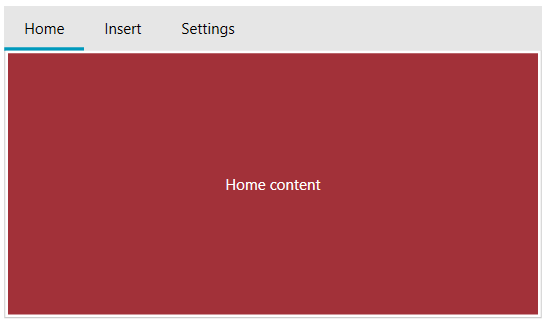

# Customizing Selected Tab Content

This article shows how to customize the content of the RadTabControl's tab items. 

The content of a tab is provided using the __Content__ property of RadTabItem. The content is shown when the corresponding tab gets selected. To customize the content's template use the __ContentTemplate__ property of RadTabControl. The property is useful in case the ItemsSource of the control is used (data binding scenario) and you need to reuse the UI instead of duplicate it in the Content property of each tab item.

The following example shows how to setup a basic model, populate RadTabControl with data and customize the content template of the tabs.

__Example 1: Defining tab model__
```C#
	public class TabInfo
    {
        public string Header { get; set; }
        public string Content { get; set; }
    }
```

__Example 2: Populating the control with data__
```C#
	public MyUserControl()
	{
		InitializeComponent();

		this.DataContext = new ObservableCollection<TabInfo>()
		{
		   new TabInfo() { Header = "Home", Content="Home content" },
		   new TabInfo() { Header = "Insert", Content="Insert content" },
		   new TabInfo() { Header = "Settings", Content="Settings content" }
		};
	}
```

__Example 3: Setting up the ContentTemplate__
```XAML
	<telerik:RadTabControl ItemsSource="{Binding}">
		<telerik:RadTabControl.ItemTemplate>
			<DataTemplate>
			  <TextBlock Text="{Binding Header}" />
			</DataTemplate>
		</telerik:RadTabControl.ItemTemplate>
		<telerik:RadTabControl.ContentTemplate>
			<DataTemplate>
				<Border Background="#A23139" Margin="2">
					<TextBlock Text="{Binding Content}" Foreground="White" 
							   VerticalAlignment="Center" TextAlignment="Center"/>
				</Border>
			</DataTemplate>
		</telerik:RadTabControl.ContentTemplate>
	</telerik:RadTabControl>
```



The ContentTemplate has a corresponding `DataTemplateSelector` alternative - __ContentTemplateSelector__ - that allows you to choose the DataTemplate based on a custom condition. Read how to implement a `DataTemplateSelector` in the corresponding [MSDN article](https://docs.microsoft.com/en-us/dotnet/api/system.windows.controls.datatemplateselector?view=netframework-4.5).
