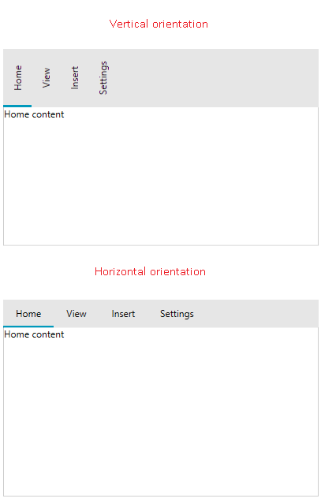
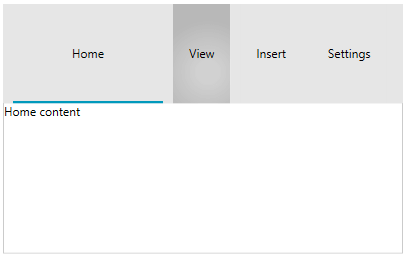
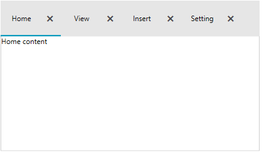
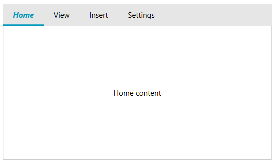
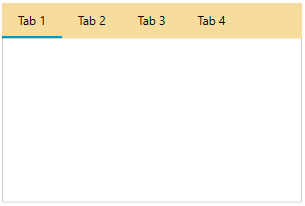

# Customizing Tab Items

This article shows how to customize the appearance of the RadTabControl's tab items.

## Tab Orientation

The orientation of the tab items can be switched using the __TabOrientation__ property of RadTabControl. The supported orientations are __Horizontal__ and __Vertical__. The tabs are oriented horizontally by default.

__Example 1: Setting tab orientation__
```XAML
	<telerik:RadTabControl TabOrientation="Vertical">
		<telerik:RadTabItem Header="Home" Content="Home content" />
		<telerik:RadTabItem Header="View" Content="View content"/>
		<telerik:RadTabItem Header="Insert" Content="Insert content"/>
		<telerik:RadTabItem Header="Settings" Content="Settings content" />
	</telerik:RadTabControl>
```



## Items Size

The size and spacing of the RadTabItem elements can be modified using the __Width__, __Height__, __Margin__ and __Padding__ properties inherited from the FrameworkElement base class.

__Example 2: Setting sizing and spacing of tab items__
```XAML
	<telerik:RadTabControl>
		<telerik:RadTabItem Header="Home" Content="Home content" Margin="10 0 0 0" Width="150" Height="100"/>
		<telerik:RadTabItem Header="View" Content="View content" Margin="10 0 0 0"/>
		<telerik:RadTabItem Header="Insert" Content="Insert content" Margin="10 0 0 0"/>
		<telerik:RadTabItem Header="Settings" Content="Settings content" Margin="10 0 0 0"/>
	</telerik:RadTabControl>
```

>The Height setting of the RadTabItem will stretch the entire tabstrip area.



## Item Container Style

The RadTabItem elements can be customized using a single Style object. The Style is applied using the __ItemContainerStyle__ property of RadTabControl.

__Example 3: Setting ItemContainerStyle__
```XAML
	<telerik:RadTabControl>
		<telerik:RadTabControl.ItemContainerStyle>
			<Style TargetType="telerik:RadTabItem">
				<Setter Property="Width" Value="100" />
				<Setter Property="Height" Value="60" />
				<Setter Property="CloseButtonVisibility" Value="Visible" />
			</Style>
		</telerik:RadTabControl.ItemContainerStyle>
		<telerik:RadTabItem Header="Home" Content="Home content" />
		<telerik:RadTabItem Header="View" Content="View content"/>
		<telerik:RadTabItem Header="Insert" Content="Insert content"/>
		<telerik:RadTabItem Header="Settings" Content="Settings content"/>
	</telerik:RadTabControl>
```



The control also provides style selector support via the __ItemContainerStyleSelector__ property of RadTabControl. Read how to implement a `StyleSelector` in the corresponding [MSDN article](https://docs.microsoft.com/en-us/dotnet/api/system.windows.controls.styleselector?view=netframework-4.5).

## Item Template

The template of the RadTabItems can be customized using the __ItemTemplate__ property of RadTabControl. The property is useful in case the ItemsSource of the control is used (data binding scenario).

The following example shows how to setup a basic model, populate RadTabControl with data and customize the template of the tabs.

__Example 4: Defining tab model__
```C#
	public class TabInfo
    {
        public string Header { get; set; }
        public string Content { get; set; }
    }
```

__Example 5: Populating the control with data__
```C#
	public MyUserControl()
	{
		InitializeComponent();

		this.DataContext = new ObservableCollection<TabInfo>()
		{
		   new TabInfo() { Header = "Home", Content="Home content" },
		   new TabInfo() { Header = "Insert", Content="Insert content" },
		   new TabInfo() { Header = "Settings", Content="Settings content" }
		};
	}
```

__Example 6: Setting up the ItemTemplate__
```XAML
	<telerik:RadTabControl ItemsSource="{Binding}">
		<telerik:RadTabControl.ItemTemplate>
			<DataTemplate>
			  <TextBlock Text="{Binding Header}" FontWeight="Bold" FontStyle="Italic" Foreground="#0099BC"/>
			</DataTemplate>
		</telerik:RadTabControl.ItemTemplate>
		<telerik:RadTabControl.ContentTemplate>
			<DataTemplate>
				<Border>
					<TextBlock Text="{Binding Content}" VerticalAlignment="Center" TextAlignment="Center"/>
				</Border>
			</DataTemplate>
		</telerik:RadTabControl.ContentTemplate>
	</telerik:RadTabControl>
```



The ItemTemplate is inherited by the __HeaderTemplate__ property of each RadTabItem. The HeaderTemplate property can be used as an alternative of the ItemTemplate.

__Example 7: Setting HeaderTemplate__
```XAML
	<Grid>
		<Grid.Resources>
			<DataTemplate x:Key="TabHeaderTemplate">
				<TextBlock Text="{Binding}" FontWeight="Bold" FontStyle="Italic" Foreground="#0099BC"/>
			</DataTemplate>    
		</Grid.Resources>
		<telerik:RadTabControl>
			<telerik:RadTabItem Header="Home" Content="Home content" HeaderTemplate="{StaticResource TabHeaderTemplate}" />       
			<telerik:RadTabItem Header="View" Content="View content"/>
			<telerik:RadTabItem Header="Insert" Content="Insert content"/>
			<telerik:RadTabItem Header="Settings" Content="Settings content"/>
		</telerik:RadTabControl>
	</Grid>
``` 

The ItemTemplate and HeaderTemplate have corresponding DataTemplateSelector alternatives - the __ItemTemplateSelector__ and __HeaderTemplateSelector__ properties - that allow you to choose the DataTemplate based on a custom condition. Read how to implement a `DataTemplateSelector` in the corresponding [MSDN article](https://docs.microsoft.com/en-us/dotnet/api/system.windows.controls.datatemplateselector?view=netframework-4.5).

>tip The template of the selected tab content can be customized using the [ContentTemplate]() property of RadTabControl.

## Tabstrip Background

To change the background of the area behind the tab items (the [tabstrip]()), set the __HeaderBackground__ property of RadTabControl.

__Example 8: Setting HeaderBackground__
```XAML
	<telerik:RadTabControl HeaderBackground="#F6DC9D" />
``` 


