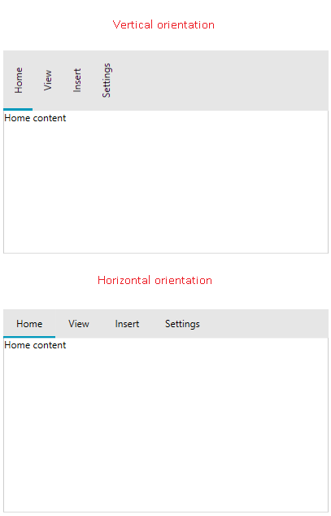
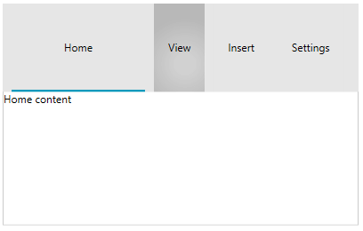
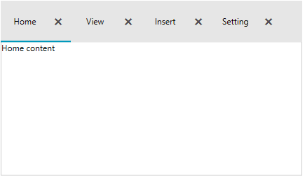
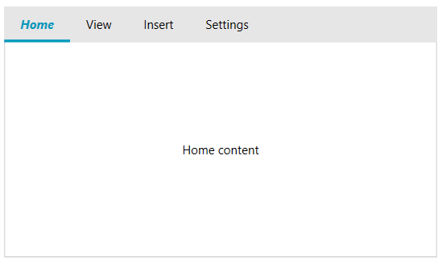
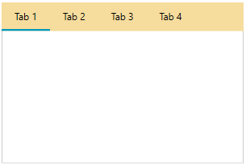

# Customizing Tab Items

This article shows how to customize the appearance of the RadTabControl's tab items.

## Tab Orientation

The orientation of the tab items can be switched using the __TabOrientation__ property of RadTabControl. The supported orientations are __Horizontal__ and __Vertical__. The tabs are oriented horizontally by default.

__Example 1: Setting tab orientation__
<snippet id='radtabcontrol-appearance-customizing-tabitems-block_1-xaml' />

## Items Size

The size and spacing of the RadTabItem elements can be modified using the __Width__, __Height__, __Margin__ and __Padding__ properties inherited from the FrameworkElement base class.

__Example 2: Setting sizing and spacing of tab items__
<snippet id='radtabcontrol-appearance-customizing-tabitems-block_2-xaml' />

>The Height setting of the RadTabItem will stretch the entire tabstrip area.

## Item Container Style

The RadTabItem elements can be customized using a single Style object. The Style is applied using the __ItemContainerStyle__ property of RadTabControl.

__Example 3: Setting ItemContainerStyle__
<snippet id='radtabcontrol-appearance-customizing-tabitems-block_3-xaml' />

The control also provides style selector support via the __ItemContainerStyleSelector__ property of RadTabControl. Read how to implement a `StyleSelector` in the corresponding [MSDN article](https://docs.microsoft.com/en-us/dotnet/api/system.windows.controls.styleselector?view=netframework-4.5).

## Item Template

The template of the RadTabItems can be customized using the __ItemTemplate__ property of RadTabControl. The property is useful in case the ItemsSource of the control is used (data binding scenario).

The following example shows how to setup a basic model, populate RadTabControl with data and customize the template of the tabs.

__Example 4: Defining tab model__
<snippet id='radtabcontrol-appearance-customizing-tabitems-block_4-cs' />

__Example 5: Populating the control with data__
<snippet id='radtabcontrol-appearance-customizing-tabitems-block_5-cs' />

__Example 6: Setting up the ItemTemplate__
<snippet id='radtabcontrol-appearance-customizing-tabitems-block_6-xaml' />

The ItemTemplate is inherited by the __HeaderTemplate__ property of each RadTabItem. The HeaderTemplate property can be used as an alternative of the ItemTemplate.

__Example 7: Setting HeaderTemplate__
<snippet id='radtabcontrol-appearance-customizing-tabitems-block_7-xaml' />

The ItemTemplate and HeaderTemplate have corresponding DataTemplateSelector alternatives - the __ItemTemplateSelector__ and __HeaderTemplateSelector__ properties - that allow you to choose the DataTemplate based on a custom condition. Read how to implement a `DataTemplateSelector` in the corresponding [MSDN article](https://docs.microsoft.com/en-us/dotnet/api/system.windows.controls.datatemplateselector?view=netframework-4.5).

>tip The template of the selected tab content can be customized using the [ContentTemplate]() property of RadTabControl.

## Tabstrip Background

To change the background of the area behind the tab items (the [tabstrip]()), set the __HeaderBackground__ property of RadTabControl.

__Example 8: Setting HeaderBackground__
<snippet id='radtabcontrol-appearance-customizing-tabitems-block_8-xaml' />

