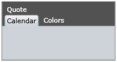
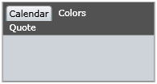

# Controlling Behavior

__RadTabControl__ is an advanced control that allows you to control its behavior in order to achieve maximum UX satisfaction.

In this chapter we will show you some of the ways you can use to customize the control behavior. 

## User Interaction

* Use the __ReorderTabRows__ property to control how the tab item rows are ordered in case of multiple lines. The default behavior is to keep the selected tab item always on the lowest row and move the other rows above.

 __ReorderTabRows__ set to __True__

 __ReorderTabRows__ set to __False__
 

>tipThe default value for the __ReorderTabRows__ property is __True__.

* Set the property __AllowDragReorder__ to allow/disallow the user to reorder the tab items of your control using [Drag & Drop](http://www.telerik.com/help/silverlight/dragdropmanager-overview.html)[Drag & Drop](http://www.telerik.com/help/wpf/dragdropmanager-overview.html).

* Set the property __IsEnabled__ to prevent the user from interacting with the whole tab control or with certain tab items. You can find this property in both __RadTabControl__ and __RadTabItem__.

* Set the __TabNavigation__ property to control how the tab navigation acts on the __RadTabControl__.

* Set the __IsTabStop__ property to include or not include the control in the tab navigation.

* __AllowDragOverTab__

* __IsTextSearchEnabled__

# See Also

 * [Keyboard Support]()

 * [Create Multi-line Tabs]()

 * [Enable and Disable Tabs]()
