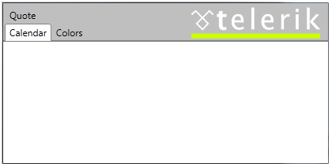

# Additional content


## Additional content

The __RadTabControl__ exposes an __AdditionalContent__ property of type object. This property can be used to visualize content (e.g. image, text, button...) next to the tabstrip. You can set this property like this:

#### __XAML__

```XAML
	        <telerik:RadTabControl>
	            <telerik:RadTabControl.AdditionalContent>
	                <StackPanel Orientation="Horizontal">
	                    <Image Source="c:/images/telerik.png" Margin="10 0" />
	                </StackPanel>
	            </telerik:RadTabControl.AdditionalContent>
	            <telerik:RadTabItem Header="Calendar" />
	            <telerik:RadTabItem Header="Colors" IsBreak="True" />
	            <telerik:RadTabItem Header="Quote" />
	        </telerik:RadTabControl>
	```


>In the ControlTemplate of the RadTabControl, the ContentPresenter which visualizes  the __AdditionalContent__ and the ItemsPresenter visualizing the RadTabItems' headers are placed in the same Grid cell, hence the __Height/Width__ of that cell depend on the highest/widest content in it.
		  

The final result looks like this:


## See Also
