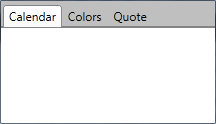
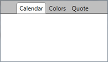
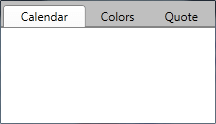

# Tabstrip Alignment

The RadTabControl exposes an __Align__ property of type __TabStripAlign__ enumeration. It controls the alignment of the control's tabstrip. You can choose between the following options:		

* `Left` (default)

* `Right`

* `Center`

* `Justify`&mdash;This mode scales all RadTabItems so that all the available space is filled.  

If there is not enough space available, the RadTabItems arrangement defaults to e behavior similar to the `Justify` alignment. Hence, parts of the items can be clipped. In such cases you can consider using [multi-line tabs]().		  

## See Also 
 * [Visual Structure]()
