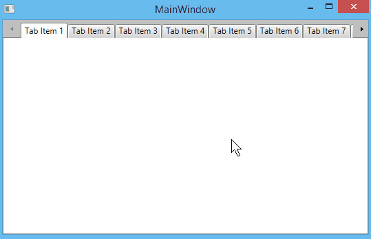
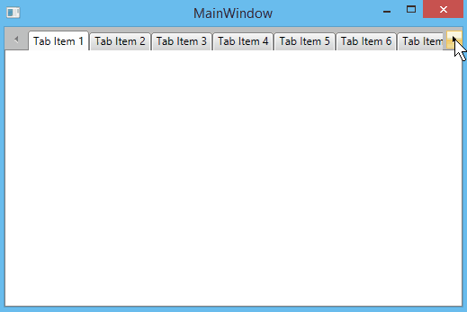

# ScrollMode

__RadTabControl__ exposes __ScrollMode__ property which allows you to control the scrolling of the tab items. When the width of the window does not allow all tabs to be displayed, two scrolling buttons appear to the left and to the right side of the tab items. You can choose one of the ScrollMode values in order to control how the tab items should be scrolled. To demonstrate the different type of scrolling we are going to use the code in Example 1.

>The default value is ScrollMode.Pixel.

#### __[XAML] Example 1: Setting the ScrollMode property__
{{region radtabcontrol-features-tabs-scrollmode_0}}
	<telerik:RadTabControl ScrollMode="Pixel">
		<telerik:RadTabItem Header="Tab Item 1"/>
		<telerik:RadTabItem Header="Tab Item 2"/>
		<telerik:RadTabItem Header="Tab Item 3"/>
		<telerik:RadTabItem Header="Tab Item 4"/>
		<telerik:RadTabItem Header="Tab Item 5"/>
		<telerik:RadTabItem Header="Tab Item 6"/>
		<telerik:RadTabItem Header="Tab Item 7"/>
		<telerik:RadTabItem Header="Tab Item 8"/>
		<telerik:RadTabItem Header="Tab Item 9"/>
	</telerik:RadTabControl>
{{endregion}}

* __Pixel__: When set, the tab items will be scrolled 16 pixels per button click.

	
	
* __Item__: When set, the tab items will be scrolled one item per button click.

	
	
* __Viewport__: When set, the tab items will be scrolled an amount equal to the available viewport width.

	
	
## See Also
 * [Keyboard Support]()
 * [Add and Remove Tabs]()