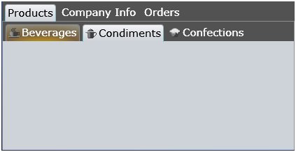

# {{ site.framework_name }} RadTabControl Key Features

Below you can see the structure of the standard __RadTabControl__, plus short description of the top-of-the line features.

This is a list with short descriptions of the top-of-the line features of Telerik's __RadTabControl__.
				

* __Tab Content__ - place any kind of controls inside your tab items and build complex and flexible tabbed user interfaces.

* __Templates__ – RadTabControl has built in templates support, which gives you the power to fully customize the look & feel of your tab control. Use Expression Blend to edit existing templates or create new ones.

* __Powerful DataBinding__ - __RadTabControl__ can be bound to various data source types, such as Objects, Collections, XML and WCF services. [Read more]()

* __Header Content__ – customize the header content of your __RadTabControl__ anyway you want. It is easy to put an image or other type of control inside your tab headers. [Read more]()

* __Multi-line Tabs__ – group your tab items in different rows, separating them by some specific criteria. Just use the __RadTabItem__’s property __IsBreak.__ Once set, all tab items which are after that tab will be placed on a new row. [Read more]()

* __Tab Orientation__ – change the orientation of the tab items by using just a single property. You can then position either horizontally or vertically.

* __Tab Strip Placement__ – change the position of the tab strip by choosing one of the four possible options: __Left__, __Top__, __Right__ and __Bottom__. [Read more]()

* __Styling and Appearance__ - Telerik SilverlightWPF TabControl can be fully customized using Expression Blend. There are also several pre-defined themes that can be used to style the tab control. Furthermore, Telerik unique style building mechanism allows you to change the skin’s color scheme with just a few clicks. 

* __UI Automation Support__ - as the Silverlight platform exposes a full accessibility tree through UIA (UI Automation), Telerik RadControls for Silverlight fully support UI Automation for UI elements access/manipulation, screen readers and other accessibility tools.
					

* __Enhanced Routed Events Framework__ - to help your code become even more elegant and concise, we implemented Enhanced Routed Events Framework for RadControls for SilverlightWPF.  This gives you more freedom when you design your applications, since you can write instance handlers as well as class handlers for the routed events of our controls.
					

* __Expression Blend support__ – all RadControls for SilverlightWPF can be easily customized using Expression Blend.
					

## See Also

 * [Overview]()

 * [Visual Structure]()

 * [Getting Started]()
