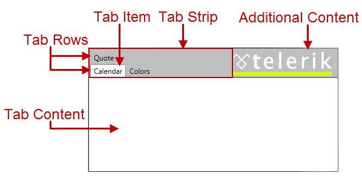

# Visual Structure

Below you can see the structure of the standard tab control.

The structure of a tab control is pretty simple; it consists of three main elements:

* __Tab Item__ – the tab control represents a container for multiple tab items. Each tab item is an instance of the __RadTabItem__ class. You can navigate between these tab pages using the tab strip placed at the top, bottom, left or right of the tab control; each tab has short text describing what kind of content it holds, like “Configuration”, “Font” , “Colors” etc. [Read more]()

* __Tab Rows__ – the tab items can be organized in rows, thus providing better user experience. Use the tab item’s property __IsBreak__ to start new row of tabs. [Read more]()

* __Content Area__ – each tab control has its own content area. This content area is only visible when the tab is selected. You can place any kind of controls inside your tab items, thus building complex and flexible tabbed user interfaces. [Read more]()

## See Also  
 * [Getting Started with RadTabControl]()
 * [Populating with Data]()
 * [Customizing Appearance]()
