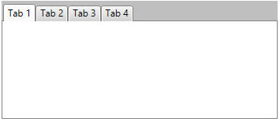
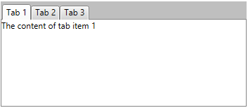
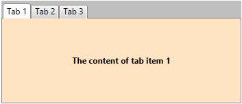
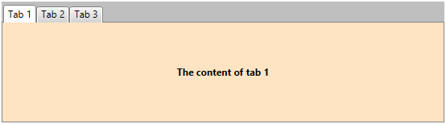
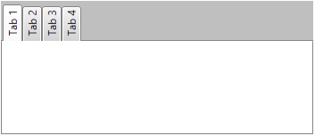

# Getting Started with {{ site.framework_name }} TabControl

This tutorial will walk you through the creation of a sample application that contains __RadTabControl__.

* [Adding Telerik Assemblies Using NuGet](#adding-telerik-assemblies-using-nuget)
* [Adding Assembly References Manually](#adding-assembly-references-manually)
* [Defining a RadTabControl](#defining-a-radtabcontrol)
* [Adding tabs](#adding-tabs)
* [Adding content in the tabs](#adding-content-in-the-tabs)
* [Data binding](#data-binding)
* [Setting the tabs orientation](#setting-the-tabs-orientation)
			
## Adding Telerik Assemblies Using NuGet

To use __RadTabControl__ when working with NuGet packages, install the `Telerik.Windows.Controls.Navigation.for.Wpf.Xaml` package. The [package name may vary]() slightly based on the Telerik dlls set - [Xaml or NoXaml]()

Read more about NuGet installation in the [Installing UI for WPF from NuGet Package]() article.

>tip With the 2025 Q1 release, the Telerik UI for WPF has a new licensing mechanism. You can learn more about it [here]().

## Adding Assembly References Manually

If you are not using NuGet packages, you can add a reference to the following assemblies:

* __Telerik.Licensing.Runtime__
* __Telerik.Windows.Controls__
* __Telerik.Windows.Controls.Navigation__
* __Telerik.Windows.Data__

You can find the required assemblies for each control from the suite in the [Controls Dependencies]()[Controls Dependencies]() help article.

## Defining a RadTabControl

You can add __RadTabControl__ manually in XAML as demonstrated in __Example 1__.

__Example 1: Adding RadTabControl in XAML__
```XAML
	<telerik:RadTabControl />
```

At this point, the control is empty and only its tab items panel and content container are displayed.

#### __Figure 1: An empty RadTabControl__


## Adding Tabs

__RadTabControl__ works with __RadTabItem__ elements, which are added in the __Items__ collection of the control. The [RadTabItem]() class exposes a __Header__ property that is used to define the content of its header. 

__Example 2: Adding RadTabItems in XAML__
```XAML
	<telerik:RadTabControl>
		<telerik:RadTabControl.Items>
			<telerik:RadTabItem Header="Tab 1" />
			<telerik:RadTabItem Header="Tab 2" />
			<telerik:RadTabItem Header="Tab 3" />
			<telerik:RadTabItem Header="Tab 4" />
		</telerik:RadTabControl.Items>
	</telerik:RadTabControl>
```

__Example 3: Adding RadTabItems in code__
```C#
	RadTabControl tabControl = new RadTabControl();
	tabControl.Items.Add(new RadTabItem() { Header = "Tab 1" });
	tabControl.Items.Add(new RadTabItem() { Header = "Tab 2" });
	tabControl.Items.Add(new RadTabItem() { Header = "Tab 3" });
	tabControl.Items.Add(new RadTabItem() { Header = "Tab 4" });
```
```VB.NET
	Dim tabControl As New RadTabControl()
	tabControl.Items.Add(New RadTabItem() With { _
		.Header = "Tab 1" _
	})
	tabControl.Items.Add(New RadTabItem() With { _
		.Header = "Tab 2" _
	})
	tabControl.Items.Add(New RadTabItem() With { _
		.Header = "Tab 3" _
	})
	tabControl.Items.Add(New RadTabItem() With { _
		.Header = "Tab 4" _
	})
```

#### __Figure 2: RadTabControl with several RadTabItems defined in its Items collection__


> The __Items__ collection of RadTabControl can contain any UIElement. However, if you do not wrap it manually into a RadTabItem control, the tab control will do it automatically. In this case, the UIElement will be set as a content of the tab item and its header will be empty.

<!-- -->

> You can read more about adding and removing tabs in the [Add and Remove Tabs]() help article.

## Adding Content in the Tabs

__RadTabItem__ is a HeaderedContentControl, which means that it can have a header and content. You can use the Header and Content properties to define what to display in the tab. The __Content__ property of RadTabItem is of type object and it can contain UIElements, strings, business objects or any other element that inherits the System.Object class.

__Example 4: Setting a string as the value of the RadTabItem's Content property__
```XAML
	<telerik:RadTabControl>
		<telerik:RadTabControl.Items>
			<telerik:RadTabItem Header="Tab 1" Content="The content of tab item 1"/>
			<telerik:RadTabItem Header="Tab 2" />
			<telerik:RadTabItem Header="Tab 3" />
		</telerik:RadTabControl.Items>
	</telerik:RadTabControl>
```

#### __Figure 3: RadTabItem with a string set as its content__


__Example 5: Setting a UIElement as the value of the RadTabItem's Content property__
```XAML
	<telerik:RadTabControl>
		<telerik:RadTabItem Header="Tab 1">
			<telerik:RadTabItem.Content>
				<Border Background="Bisque">
					<TextBlock Text="The content of tab item 1" 
							   FontWeight="Bold" 
							   VerticalAlignment="Center" 
							   TextAlignment="Center" />
				</Border>
			</telerik:RadTabItem.Content>
		</telerik:RadTabItem>
		<telerik:RadTabItem Header="Tab 2" />
		<telerik:RadTabItem Header="Tab 3" />
	</telerik:RadTabControl>
```

#### __Figure 4: RadTabItem with a UIElement set as its content__


## Data Binding

The RadTabControl component allows you to data bind it to a collection of business objects and define their visual appearance. You can do that through the __ItemsSource__ property of the control.

> You can learn more about data binding from the [Binding to Collection]() article.

The model from __Example 6__ will be used to demonstrate a simple data binding scenario.

__Example 6: Defining a model for the RadTabItems__
```C#
	public class TabItemModel
    {
        public string Header { get; set; }
        public string Content { get; set; }
    }
```
```VB.NET
	Public Class TabItemModel
		Public Property Header() As String
			Get
				Return m_Header
			End Get
			Set
				m_Header = Value
			End Set
		End Property
		Private m_Header As String
		Public Property Content() As String
			Get
				Return m_Content
			End Get
			Set
				m_Content = Value
			End Set
		End Property
		Private m_Content As String
	End Class
```

__Example 7__ and __Example 8__ show how you can populate a collection of business objects and bind it to the __ItemsSource__ of the tab control.

__Example 7: Populating a collection of business objects and pass it as the DataContext of a RadTabControl__
```C#
	var source = new ObservableCollection<TabItemModel>()
	{
		new TabItemModel() 
		{
			Header = "Tab 1",
			Content = "The content of tab 1",
		},
		new TabItemModel() 
		{
			Header = "Tab 2",
			Content = "The content of tab 2",
		},
		new TabItemModel() 
		{
			Header = "Tab 3",
			Content = "The content of tab 4",
		},
	};
	this.tabControl.DataContext = source;
```
```VB.NET
	Dim source = New ObservableCollection(Of TabItemModel)() From { _
		New TabItemModel() With { _
			.Header = "Tab 1", _
			.Content = "The content of tab 1" _
		}, _
		New TabItemModel() With { _
			.Header = "Tab 2", _
			.Content = "The content of tab 2" _
		}, _
		New TabItemModel() With { _
			.Header = "Tab 3", _
			.Content = "The content of tab 4" _
		} _
	}
	Me.tabControl.DataContext = source
```

__Example 8: Binding the ItemsSource of a RadTabControl and defining the RadTabItems appearance__
```XAML
	<telerik:RadTabControl x:Name="tabControl" ItemsSource="{Binding}">
		<telerik:RadTabControl.ItemTemplate>
			<DataTemplate>
				<TextBlock Text="{Binding Header}" />
			</DataTemplate>
		</telerik:RadTabControl.ItemTemplate>
		<telerik:RadTabControl.ContentTemplate>
			<DataTemplate>
				<Border Background="Bisque">
					<TextBlock Text="{Binding Content}" 
							   FontWeight="Bold" 
							   VerticalAlignment="Center" 
							   TextAlignment="Center" />
				</Border>
			</DataTemplate>
		</telerik:RadTabControl.ContentTemplate>            
	</telerik:RadTabControl>
```

#### __Figure 5: Data binding a RadTabControl__


## Setting the Tabs Orientation

RadTabControl allows you to control whether to display the tabs horizontally or vertically. You can do that through the __Orientation__ property of the tab control. Its default value is __Horizontal__ and therefore the items are positioned horizontally. Setting the property to __Vertical__ will rotate the headers of the tab items at 90 degrees.

__Example 9: Setting a UIElement as the value of the RadTabItem's Content property__
```XAML
    <telerik:RadTabControl TabOrientation="Vertical">		
		<telerik:RadTabItem Header="Tab 1" />
		<telerik:RadTabItem Header="Tab 2" />
		<telerik:RadTabItem Header="Tab 3" />
		<telerik:RadTabItem Header="Tab 4" />
	</telerik:RadTabControl>
```

#### __Figure 6: RadTabItem with a UIElement set as its content__


## Setting a Theme

The controls from our suite support different themes. You can see how to apply a theme different than the default one in the [Setting a Theme]() help article.

>important Changing the theme using implicit styles will affect all controls that have styles defined in the merged resource dictionaries. This is applicable only for the controls in the scope in which the resources are merged. 

To change the theme, you can follow the steps below:

* Choose between the themes and add reference to the corresponding theme assembly (ex: **Telerik.Windows.Themes.Windows8.dll**). You can see the different themes applied in the **Theming** examples from our [WPF Controls Examples](https://demos.telerik.com/wpf/)[Silverlight Controls Examples](https://demos.telerik.com/silverlight/#Slider/Theming) application.

* Merge the ResourceDictionaries with the namespace required for the controls that you are using from the theme assembly. For the RadTabControl, you will need to merge the following resources:

	* __Telerik.Windows.Controls__
	* __Telerik.Windows.Controls.Navigation__
	* __Telerik.Windows.Data__

__Example 10__ demonstrates how to merge the ResourceDictionaries so that they are applied globally for the entire application.

__Example 10: Merge the ResourceDictionaries__  
```XAML
	<Application.Resources>
		<ResourceDictionary>
			<ResourceDictionary.MergedDictionaries>
				<ResourceDictionary Source="/Telerik.Windows.Themes.Windows8;component/Themes/System.Windows.xaml"/>
				<ResourceDictionary Source="/Telerik.Windows.Themes.Windows8;component/Themes/Telerik.Windows.Controls.xaml"/>
				<ResourceDictionary Source="/Telerik.Windows.Themes.Windows8;component/Themes/Telerik.Windows.Controls.Navigation.xaml"/>
			</ResourceDictionary.MergedDictionaries>
		</ResourceDictionary>
	</Application.Resources>
```

>Alternatively, you can use the theme of the control via the [StyleManager](https://docs.telerik.com/devtools/wpf/styling-and-appearance/stylemanager/common-styling-apperance-setting-theme-wpf)[StyleManager](https://docs.telerik.com/devtools/silverlight/styling-and-appearance/stylemanager/common-styling-apperance-setting-theme).

__Figure 7__ shows a RadTabControl with the **Windows8** theme applied.

#### __Figure 7: RadTabControl with the Windows8 theme__



## Telerik UI for WPF Learning Resources

* [Telerik UI for WPF TabControl Component](https://www.telerik.com/products/wpf/tabcontrol.aspx)
* [Getting Started with Telerik UI for WPF Components]()
* [Telerik UI for WPF Installation]()
* [Telerik UI for WPF and WinForms Integration]()
* [Telerik UI for WPF Visual Studio Templates]()
* [Setting a Theme with Telerik UI for WPF]()
* [Telerik UI for WPF Virtual Classroom (Training Courses for Registered Users)](https://learn.telerik.com/learn/course/external/view/elearning/16/telerik-ui-for-wpf) 
* [Telerik UI for WPF License Agreement](https://www.telerik.com/purchase/license-agreement/wpf-dlw-s)


## See Also
 * [Visual structure]()
 * [Key features]()
 * [Populating with tabs]()
 * [Create multiline tTabs]()
 * [Tabstrip alignment]()
