# Getting Started

This tutorial will walk you through the creation of a __RadTabControl__.			

__RadTabControl__ is an advanced SilverlightWPF control providing full Blend support. From within the visual environment of Blend, you can easily perform various tasks such as edit control properties, add/remove tab items, modify themes, create and modify templates and more.			

For the purpose of this tutorial, you will need to create an empty SilverlightWPF Application project and open it in Blend.
			

>In order to use __RadTabControl__ in your projects you have to add references to the following assemblies:  
>	- __Telerik.Windows.Controls__  
>	- __Telerik.Windows.Controls.Navigation__  
>	- __Telerik.Windows.Data__  
> You can find more info [here](http://www.telerik.com/help/wpf/installation-installing-controls-dependencies-wpf.html).



>In order to use __RadTabControl__ in your projects you have to add references to the following assemblies:  
>	- __Telerik.Windows.Controls__  
>	- __Telerik.Windows.Controls.Navigation__  
> You can find more info [here](http://www.telerik.com/help/silverlight/installation-installing-controls-dependencies.html).


## Create RadTabControl with Expression Blend

* Open the 'Asset Library' in Expression Blend and start writing the name of the __RadTabControl__ in the search box.
	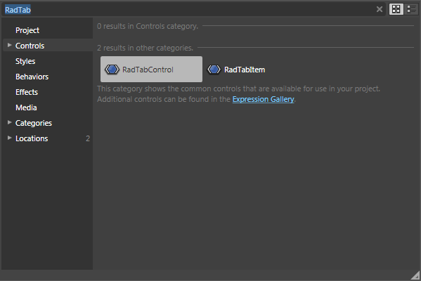

* Drag a __RadTabControl__ on the artboard. The __RadTabControl__ appears.
	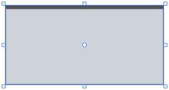

	#### __XAML__  
	{{region radtabcontrol-getting-started_0}}
		<telerik:RadTabControl/>
	{{endregion}}

	>tip You might wonder where this "telerik" in front of the tag __RadTabControl__ came from. Well, this is the name of the namespace you give when importing the appropriate assembly into the XAML file. `xmlns:telerik="http://schemas.telerik.com/2008/xaml/presentation"`

* So far there is an empty __RadTabControl__ containing no tabs.					

## Add New Tab Items

* Open Blend and [select]() the tab control to which you wish to add tab item(s).					

* After you have selected the control, navigate to 'Common Properties' located in the 'Properties' pane and click the ellipsis button next to __Items (Collection)__. The 'Object Collection Editor' dialog appears.
	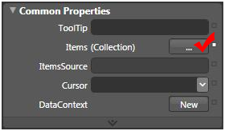

* The dialog is divided into two sections:						

	* The left one contains the list with the tab items which already belong to the selected tab control.
	* The right one you can view and edit the properties of the selected tab item. 	
	
	In order to add a new item click the 'Add another item' button located at the bottom under the items list. The 'Select Object' dialog appears.
	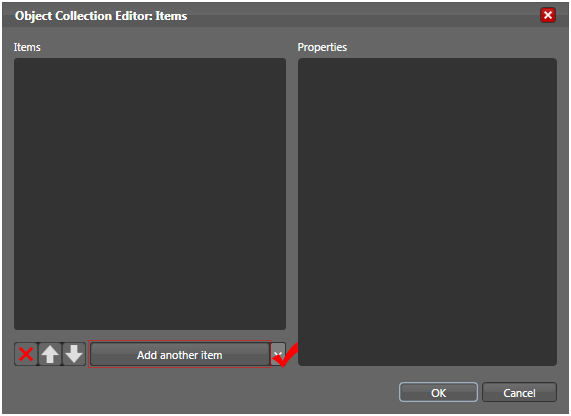

* Since Expression Blend does not know the exact type of the item we want to add, we have to select it from a list and confirm by clicking the 'OK' button. The type we are looking for is __RadTabItem__ and it is located in __Telerik.Windows.Controls__ namespace.
	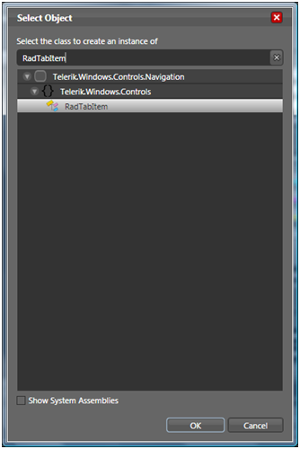

	>tip Sometimes you will have to browse through a huge list of available types. To speed up the process of finding the type you need, just start writing its name (__RadTabItem__) in the search box above. Once you start typing, the controls’ list will be filtered automatically, thus making the selection much easier.							

* When the 'Select Object' dialog is closed, you will see the newly created item added to the list of tab items in the __Object Collection Editor__. It will be selected by default, so you just have to edit its __Properties__ (such as __Header__, __Fonts__, __Colors__ etc.) in the properties pane, located on the right.
	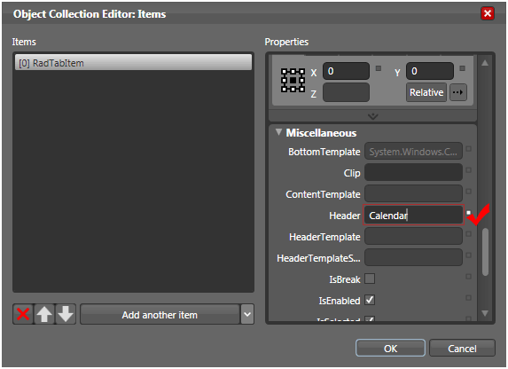

* Click __Add another item__ two more times to add two more tabs. Set their properties as follows:						

	* On the first new item, set the __Header__ property to "Colors" and check __IsBrake__ to brake the tabs on a new line.								
	* On the second new item, set the __Header__ property to "Quote". 
	
	The 'Object Collection Editor: Items' should now look like the following screen shot:
	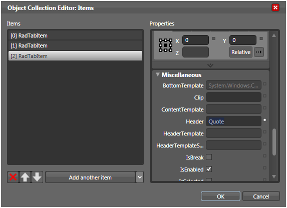

* Click 'OK' to confirm the changes and to close the dialog.					

* The __RadTabControl__ should look like the following screen shot:
	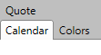

	#### __XAML__
	{{region radtabcontrol-getting-started_1}}
		<telerik:RadTabControl>
		   <telerik:RadTabItem Header="Calendar" />
		   <telerik:RadTabItem Header="Colors" IsBreak="True" />
		   <telerik:RadTabItem Header="Quote" />
		</telerik:RadTabControl>
	{{endregion}}

## Set Tab Orientation

__Orientation__ property controls whether to show the tabs horizontally or vertically. By default the tabs are shown horizontally. Find __Orientation__ property in the 'Properties' pane under 'Appearance' section and change its value to __Vertical__. The result should look like the screen shot below.

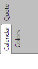

#### __XAML__
{{region radtabcontrol-getting-started_2}}
	<telerik:RadTabControl TabOrientation="Vertical">
	   <telerik:RadTabItem Header="Calendar" />
	   <telerik:RadTabItem Header="Colors"
									  IsBreak="True" />
	   <telerik:RadTabItem Header="Quote" />
	</telerik:RadTabControl>
{{endregion}}

Turn back the orientation to __Horizontal__ as this is the value used for the rest of this guide.				

>tip The default __TabOrientation__ is __Horizontal__.				

## Apply a Theme

* Add reference to __Telerik.Windows.Themes.Summer.dll__.					

* Switch the document view to __XAML View__ by choosing __View -> Active Document View -> XAML View__ (or just press __F11__).					

* Include new XML Namespace as follows:						

	#### __XAML__
	{{region radtabcontrol-getting-started_3}}
		xmlns:telerik="clr-namespace:Telerik.Windows.Controls;assembly=Telerik.Windows.Controls"
	{{endregion}}

* Find the declaration of the __RadTabControl__ and add the following attribute:

	#### __XAML__
	{{region radtabcontrol-getting-started_4}}
		telerik:StyleManager.Theme="Summer"
	{{endregion}}

* Switch back to __Design View__ (View -> Active Document View -> Design View).					

* You should see __RadTabControl__ with __Summer__ theme applied.
	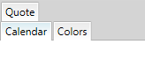

	#### __XAML__
	{{region radtabcontrol-getting-started_5}}
		<telerik:RadTabControl telerik:StyleManager.Theme="Summer">
		   <telerik:RadTabItem Header="Calendar" />
		   <telerik:RadTabItem Header="Colors" IsBreak="True" />
		   <telerik:RadTabItem Header="Quote" />
		</telerik:RadTabControl>
	{{endregion}}

* You can also apply other built-in themes or write your own. 

##  Set Tab Content

* Add reference to __Telerik.Windows.Controls.Input.dll__. This assembly is needed because it contains controls (__RadCalendar__ and __RadColorPicker__) that we are going to use in the next steps.					

* Double click on the __RadTabControl__ to change the selected content. You should see a border around the control. Find out more about selection in Blend [here]().
	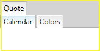

* Double click on the __Calendar__ tab to select it.					

* Drag a __RadCalendar__ control from the 'Asset Library' onto the surface of the __RadTabItem__.
	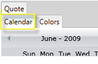

	#### __XAML__
	{{region radtabcontrol-getting-started_6}}
		<telerik:RadTabItem Header="Calendar">
		   <telerik:RadCalendar telerik:StyleManager.Theme="Summer"/>
		</telerik:RadTabItem>
	{{endregion}}

* Now double click on the __Colors__ tab until you get it selected						

	>You might notice that despite the fact that the new tab page "Colors" is selected the content area is still occupied from the content that belongs to the "Calendar" tab. To work around this issue and to see and edit the content area of the "Colors" tab, you have to make it the selected one: just set its index to the tab control’s property __SelectedIndex__ (located in the 'Miscellaneous' pane), which in our case is 1. Do not forget to restore the original value of the __SelectedIndex__ property, once you are ready.							

* Drag a __RadColorPicker__ control from the 'Asset Library' onto the surface of the __RadTabItem__.					

* Select the __Quote__ tab.					

* Double click on the Quote tab again to set its __Content__ property.						

	>The text you write in the "Quote" tab item will be placed as content of that tab item; it will not be set as header.

* Type "Quote Text" onto the surface of the tab.						

	#### __XAML__
	{{region radtabcontrol-getting-started_7}}
		<telerik:RadTabItem Header="Quote" Content="Quote Text"/>
	{{endregion}}

* Press ESC button to confirm and exit the selection.					

* Select again the __RadTabControl__. On the __Properties__ pane clear any values set for __Margin__ and enter 200 for __Width__ and 200 for __Height__.						

	#### __XAML__
	{{region radtabcontrol-getting-started_8}}
		<telerik:RadTabControl Margin="0,0,0,0" telerik:StyleManager.Theme="Summer" Width="400" Height="200">
			………………
		</telerik:RadTabControl>
	{{endregion}}

* Run the application (press F5). The tab control appears, containing two rows: the first two tabs appear in the first row and the third tab in a second row. This is because you checked the __IsBreak__ property for the second tab, creating a break before the third tab.
	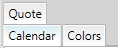

* By default the first tab (__Calendar__ in this case) is selected. You should see its content (__RadCalendar__).
	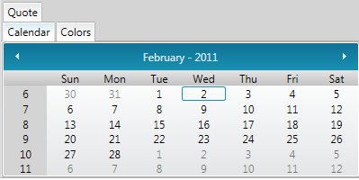

* Click on the "Quote tab". It moves down to the bottom row and displays its content. 
	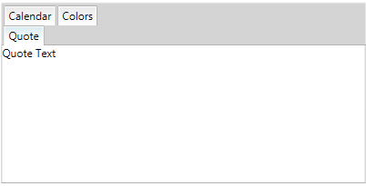

Here is how XAML finally looks like:

#### __XAML__
{{region radtabcontrol-getting-started_9}}
	<telerik:RadTabControl telerik:StyleManager.Theme="Summer" Width="400" Height="200">
	    <telerik:RadTabItem Header="Calendar">
	        <telerik:RadCalendar telerik:StyleManager.Theme="Summer"/>
	    </telerik:RadTabItem>
	    <telerik:RadTabItem Header="Colors" IsBreak="True">
	        <telerik:RadColorPicker Height="100" Width="100" />
	    </telerik:RadTabItem>
	    <telerik:RadTabItem Header="Quote" Content="Quote Text" />
	</telerik:RadTabControl>
{{endregion}}

# See Also
 * [Visual Structure]()
 * [Key Features]()
 * [Populating with Tabs]()