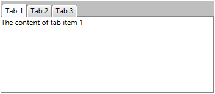

# Getting Started

This tutorial will walk you through the creation of a sample application that contains __RadTabControl__.

* [Assembly References](#assembly-references)
* [Defining a RadTabControl](#defining-a-radtabcontrol)
* [Adding Tabs](#adding-tabs)
* [Adding Content in the Tabs](#adding-content-in-the-tabs)
* [Data Binding](#data-binding)
* [Setting the Tabs Orientation](#setting-the-tabs-orientation)
			
## Assembly References

In order to use __RadTabControl__, you will need to add references to the following assemblies:
* __Telerik.Windows.Controls__
* __Telerik.Windows.Controls.Navigation__
* __Telerik.Windows.Controls.Data__

You can find the required assemblies for each control from the suite in the [Controls Dependencies]()[Controls Dependencies]() help article.

## Defining a RadTabControl

You can add __RadTabControl__ manually in XAML as demonstrated in __Example 1__.

#### __[XAML] Example 1: Adding RadTabControl in XAML__
{{region radtabcontrol-gettingstarted-01}}
	<telerik:RadTabControl />
{{endregion}}

At this point the control is empty and only its tab items panel and content container are displayed.

#### __Figure 1: Empty RadTabControl__

## Adding Tabs

__RadTabControl__ works with __RadTabItem__ elements, which are added in the __Items__ collection of the control. The [RadTabItem]() class exposes a __Header__ property that is used to define the content of its header. 

#### __[XAML] Example 2: Adding RadTabItems in XAML__
{{region radtabcontrol-gettingstarted-02}}
	<telerik:RadTabControl>
		<telerik:RadTabControl.Items>
			<telerik:RadTabItem Header="Tab 1" />
			<telerik:RadTabItem Header="Tab 2" />
			<telerik:RadTabItem Header="Tab 3" />
			<telerik:RadTabItem Header="Tab 4" />
		</telerik:RadTabControl.Items>
	</telerik:RadTabControl>
{{endregion}}

#### __[C#] Example 3: Adding RadTabItems in code__
{{region radtabcontrol-gettingstarted-03}}
	RadTabControl tabControl = new RadTabControl();
	tabControl.Items.Add(new RadTabItem() { Header = "Tab 1" });
	tabControl.Items.Add(new RadTabItem() { Header = "Tab 2" });
	tabControl.Items.Add(new RadTabItem() { Header = "Tab 3" });
	tabControl.Items.Add(new RadTabItem() { Header = "Tab 4" });
{{endregion}}

#### __[VB.NET] Example 3: Adding RadTabItems in code__
{{region radtabcontrol-gettingstarted-04}}
	Dim tabControl As New RadTabControl()
	tabControl.Items.Add(New RadTabItem() With { _
		.Header = "Tab 1" _
	})
	tabControl.Items.Add(New RadTabItem() With { _
		.Header = "Tab 2" _
	})
	tabControl.Items.Add(New RadTabItem() With { _
		.Header = "Tab 3" _
	})
	tabControl.Items.Add(New RadTabItem() With { _
		.Header = "Tab 4" _
	})
{{endregion}}

#### __Figure 2: RadTabControl with several RadTabItems defined in its Items collection__

> The __Items__ collection of RadTabControl can contain any UIElement. However, if you do not wrap it manually into a RadTabItem control, the tab control will do it automatically. In this case, the UIElement will be set as a content of the tab item and its header will be empty.

<!-- -->

> You can read more about adding and removing tabs in the [Add and Remove Tabs]() help article.

## Adding Content in the Tabs

__RadTabItem__ is a HeaderedContentControl, which means that it can have a header and content. You can use the Header and Content properties to define what to display in the tab. The __Content__ property of RadTabItem is of type object and it can contain UIElements, strings, business objects or any other element that inherits the System.Object class.

#### __[XAML] Example 4: Setting a string as the value of the RadTabItem's Content property__
{{region radtabcontrol-gettingstarted-05}}
	<telerik:RadTabControl>
		<telerik:RadTabControl.Items>
			<telerik:RadTabItem Header="Tab 1" Content="The content of tab item 1"/>
			<telerik:RadTabItem Header="Tab 2" />
			<telerik:RadTabItem Header="Tab 3" />
		</telerik:RadTabControl.Items>
	</telerik:RadTabControl>
{{endregion}}

#### __Figure 3: RadTabItem with a string set as its content__

#### __[XAML] Example 5: Setting an UIElement as the value of the RadTabItem's Content property__
{{region radtabcontrol-gettingstarted-06}}
	<telerik:RadTabControl>
		<telerik:RadTabItem Header="Tab 1">
			<telerik:RadTabItem.Content>
				<Border Background="Bisque">
					<TextBlock Text="The content of tab item 1" 
							   FontWeight="Bold" 
							   VerticalAlignment="Center" 
							   TextAlignment="Center" />
				</Border>
			</telerik:RadTabItem.Content>
		</telerik:RadTabItem>
		<telerik:RadTabItem Header="Tab 2" />
		<telerik:RadTabItem Header="Tab 3" />
	</telerik:RadTabControl>
{{endregion}}

#### __Figure 4: RadTabItem with an UIElement set as its content__

## Data Binding

The RadTabControl component allows you to data bind it to a collection of business objects and define their visual appearance. You can do that through the __ItemsSource__ property of the control.

> You can learn more about data binding from the [Binding To Collection]() article.

The model from __Example 6__ will be used to demonstrate a simple data binding scenario.

#### __[C#] Example 6: Defining a model for the RadTabItems__
{{region radtabcontrol-gettingstarted-07}}
	public class TabItemModel
    {
        public string Header { get; set; }
        public string Content { get; set; }
    }
{{endregion}}

#### __[VB.NET] Example 6: Defining a model for the RadTabItems__
{{region radtabcontrol-gettingstarted-08}}
	Public Class TabItemModel
		Public Property Header() As String
			Get
				Return m_Header
			End Get
			Set
				m_Header = Value
			End Set
		End Property
		Private m_Header As String
		Public Property Content() As String
			Get
				Return m_Content
			End Get
			Set
				m_Content = Value
			End Set
		End Property
		Private m_Content As String
	End Class
{{endregion}}

__Examples 7 and 8__ show how you can populate a collection of business objects and bind it to the __ItemsSource__ of the tab control.

#### __[C#] Example 7: Populating a collection of business objects and pass it as DataContext of RadTabControl__
{{region radtabcontrol-gettingstarted-09}}
	var source = new ObservableCollection<TabItemModel>()
	{
		new TabItemModel() 
		{
			Header = "Tab 1",
			Content = "The content of tab 1",
		},
		new TabItemModel() 
		{
			Header = "Tab 2",
			Content = "The content of tab 2",
		},
		new TabItemModel() 
		{
			Header = "Tab 3",
			Content = "The content of tab 4",
		},
	};
	this.tabControl.DataContext = source;
{{endregion}}

#### __[VB.NET] Example 7: Populating a collection of business objects and pass it as DataContext of RadTabControl__
{{region radtabcontrol-gettingstarted-10}}
	Dim source = New ObservableCollection(Of TabItemModel)() From { _
		New TabItemModel() With { _
			.Header = "Tab 1", _
			.Content = "The content of tab 1" _
		}, _
		New TabItemModel() With { _
			.Header = "Tab 2", _
			.Content = "The content of tab 2" _
		}, _
		New TabItemModel() With { _
			.Header = "Tab 3", _
			.Content = "The content of tab 4" _
		} _
	}
	Me.tabControl.DataContext = source
{{endregion}}

#### __[XAML] Example 8: Binding the ItemsSource of RadTabControl and defining the RadTabItems appearance__
{{region radtabcontrol-gettingstarted-11}}
	<telerik:RadTabControl x:Name="tabControl" ItemsSource="{Binding}">
		<telerik:RadTabControl.ItemTemplate>
			<DataTemplate>
				<TextBlock Text="{Binding Header}" />
			</DataTemplate>
		</telerik:RadTabControl.ItemTemplate>
		<telerik:RadTabControl.ContentTemplate>
			<DataTemplate>
				<Border Background="Bisque">
					<TextBlock Text="{Binding Content}" 
							   FontWeight="Bold" 
							   VerticalAlignment="Center" 
							   TextAlignment="Center" />
				</Border>
			</DataTemplate>
		</telerik:RadTabControl.ContentTemplate>            
	</telerik:RadTabControl>
{{endregion}}

#### __Figure 5: Data binding RadTabControl__

> You can see the [Templating]() section in the help documentation that describes the RadTabControl templates and how to change the components' appearance.

## Setting the Tabs Orientation

RadTabControl allows you to control whether to display the tabs horizontally or vertically. You can do that through the __Orientation__ property of the tab control. Its default value is __Horizontal__ and therefore the items are positioned horizontally. Setting the property to __Vertical__ will rotate the headers of the tab items at 90 degrees.

#### __[XAML] Example 9: Setting an UIElement as the value of the RadTabItem's Content property__
{{region radtabcontrol-gettingstarted-12}}
    <telerik:RadTabControl TabOrientation="Vertical">		
		<telerik:RadTabItem Header="Tab 1" />
		<telerik:RadTabItem Header="Tab 2" />
		<telerik:RadTabItem Header="Tab 3" />
		<telerik:RadTabItem Header="Tab 4" />
	</telerik:RadTabControl>
{{endregion}}

#### __Figure 6: RadTabItem with an UIElement set as its content__

# See Also
 * [Visual Structure]()
 * [Key Features]()
 * [Populating with Tabs]()
 * [Create Multiline Tabs]()
 * [Tabstrp Alignment]()