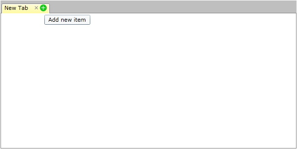

# How to Add Close and Create Buttons to the Tab Headers using MVVM approach

>important Since R2 2019 the RadTabItem supports built-in close and pin buttons. Read more about this in the [Pin and Close]() article.

The goal of this tutorial is to create a __RadTabControl__ with closable tab items using an MVVM approach.

It demonstrates how to close and create new items using *close* and *add* buttons placed in the tab header as shown on the snapshot bellow:


For the purpose of this example, you will need to create an empty  SilverlightWPF application project and open it in Visual Studio.
		

* The first step is to add references to the assemblies __Telerik.Windows.Controls__ and __Telerik.Windows.Controls.Navigation.__

* Then we need to define our __ViewModels__. We can start by creating a class to describe the __RadTabItems__ - __TabViewModel__ exposing a __Header__ property. As we're taking an MVVM approach to implement the Add and Close buttons functionality, we'll also have to set up Add and Close commands in the __TabViewModel__.
			

__Example 1: Create ViewModels__

```C#
    public class MainViewModel
    {
        public MainViewModel()
        {
            this.Tabs = new ObservableCollection<TabViewModel>();
            this.AddItem(null);
        }
        
        public ObservableCollection<TabViewModel> Tabs
        {
            get;
            private set;
        }
        
        public void AddItem(TabViewModel sender)
        {
            TabViewModel newTabItem = new TabViewModel(this);
            newTabItem.Header = "New Tab";
            newTabItem.IsSelected = true;
            if (sender != null)
            {
                int insertIndex = this.Tabs.IndexOf(sender) + 1;
                this.Tabs.Insert(insertIndex, newTabItem);
            }
            else
            {
                this.Tabs.Add(newTabItem);
            }
        }
        
        public void RemoveItem(TabViewModel tabItem)
        {
            this.Tabs.Remove(tabItem);
            tabItem.Dispose();
        }
    }
```
```VB.NET
    Public Class MainViewModel
        Public Sub New()
            Me.Tabs = New ObservableCollection(Of TabViewModel)()
            Me.AddItem(Nothing)
        End Sub
        
        Public Property Tabs() As ObservableCollection(Of TabViewModel)
            Get
                Return _tabs
            End Get
            Private Set(value As ObservableCollection(Of TabViewModel))
                _tabs = Value
            End Set
        End Property
        Private _tabs As ObservableCollection(Of TabViewModel)

        
        Public Sub AddItem(sender As TabViewModel)
            Dim newTabItem As New TabViewModel(Me)
            newTabItem.Header = "New Tab"
            newTabItem.IsSelected = True
            If sender IsNot Nothing Then
                Dim insertIndex As Integer = Me.Tabs.IndexOf(sender) + 1
                Me.Tabs.Insert(insertIndex, newTabItem)
            Else
                Me.Tabs.Add(newTabItem)
            End If
        End Sub
        
        Public Sub RemoveItem(tabItem As TabViewModel)
            Me.Tabs.Remove(tabItem)
            tabItem.Dispose()
        End Sub
    End Class
```

* After that we can go ahead and create a __MainViewModel__ to define the collection of *TabViewModel* items which we will use to populate the __RadTabControl.ItemsSource__. Please note that as the add/close logic will change the __RadTabControl.ItemsSource__ collection, it's best to implement the commands execution methods in this ViewModel as well:
			

__Example 2: Creating TabViewModel__

```C#
    public class TabViewModel : INotifyPropertyChanged, IDisposable
    {
        private bool isSelected;
        private readonly MainViewModel mainViewModel;

        public TabViewModel(MainViewModel mainViewModel)
        {
            this.mainViewModel = mainViewModel;
            this.mainViewModel.Tabs.CollectionChanged += this.Tabs_CollectionChanged;

            this.AddItemCommand = new DelegateCommand(
                delegate
                {
                    this.mainViewModel.AddItem(this);
                },
                delegate
                {
                    return this.mainViewModel.Tabs.Count < 5;
                });

            this.RemoveItemCommand = new DelegateCommand(
                delegate
                {
                    this.mainViewModel.RemoveItem(this);
                },
                delegate
                {
                    return this.mainViewModel.Tabs.Count > 1;
                });
        }

        public void Dispose()
        {
            this.mainViewModel.Tabs.CollectionChanged -= this.Tabs_CollectionChanged;
        }

        void Tabs_CollectionChanged(object sender, System.Collections.Specialized.NotifyCollectionChangedEventArgs e)
        {
            this.AddItemCommand.InvalidateCanExecute();
            this.RemoveItemCommand.InvalidateCanExecute();
        }

        public string Header
        {
            get;
            set;
        }

        public bool IsSelected
        {
            get
            {
                return this.isSelected;
            }
            set
            {
                if (this.isSelected != value)
                {
                    this.isSelected = value;
                    this.OnPropertyChanged("IsSelected");
                }
            }
        }

        public DelegateCommand AddItemCommand { get; set; }
        public DelegateCommand RemoveItemCommand { get; set; }

        #region INotifyPropertyChanged
        public event PropertyChangedEventHandler PropertyChanged;

        private void OnPropertyChanged(string propertyName)
        {
            if (this.PropertyChanged != null)
            {
                this.PropertyChanged(this, new PropertyChangedEventArgs(propertyName));
            }
        }
    }
```
```VB.NET
    Public Class TabViewModel
        Implements INotifyPropertyChanged
        Implements IDisposable
        Private _isSelected As Boolean
        Private ReadOnly mainViewModel As MainViewModel

        Public Sub New(mainViewModel As MainViewModel)
            Me.mainViewModel = mainViewModel
            Me.mainViewModel.Tabs.CollectionChanged += Me.Tabs_CollectionChanged

            Me.AddItemCommand = New DelegateCommand(Function() Do
            Me.mainViewModel.AddItem(Me)
            End Function, Function() Me.mainViewModel.Tabs.Count < 5)

            Me.RemoveItemCommand = New DelegateCommand(Function() Do
                Me.mainViewModel.RemoveItem(Me)
            End Function, Function() Me.mainViewModel.Tabs.Count > 1)
        End Sub

        Public Sub Dispose()
            Me.mainViewModel.Tabs.CollectionChanged -= Me.Tabs_CollectionChanged
        End Sub

        Private Sub Tabs_CollectionChanged(sender As Object, e As System.Collections.Specialized.NotifyCollectionChangedEventArgs)
            Me.AddItemCommand.InvalidateCanExecute()
            Me.RemoveItemCommand.InvalidateCanExecute()
        End Sub

        Public Property Header() As String
            Get
                Return _header
            End Get
            Set(value As String)
                _header = Value
            End Set
        End Property
        Private _header As String

        Public Property IsSelected() As Boolean
            Get
                Return Me._isSelected
            End Get
            Set(value As Boolean)
                If Me._isSelected <> value Then
                    Me._isSelected = value
                    Me.OnPropertyChanged("IsSelected")
                End If
            End Set
        End Property

        Public Property AddItemCommand() As DelegateCommand
            Get
                Return _addItemCommand
            End Get
            Set(value As DelegateCommand)
                _addItemCommand = Value
            End Set
        End Property
        Private _addItemCommand As DelegateCommand
        Public Property RemoveItemCommand() As DelegateCommand
            Get
                Return _removeItemCommand
            End Get
            Set(value As DelegateCommand)
                _removeItemCommand = Value
            End Set
        End Property
        Private _removeItemCommand As DelegateCommand

        Public Event PropertyChanged As PropertyChangedEventHandler

        Private Sub OnPropertyChanged(propertyName As String)
            RaiseEvent PropertyChanged(Me, New PropertyChangedEventArgs(propertyName))
        End Sub
    End Class
```


* Now that our ViewModels are all in place, we can proceed with the definition of our view. In order to take full advantage of the implemented commands we have to bind the Add/Close __Buttons Command__ properties to the appropriate __DelegateCommands__ definitions.
			

* Here is how the __Resources__ section of our view looks like:

__Example 3: Binding buttons Command property__

```XAML
      <Style x:Key="CloseButton"
             TargetType="{x:Type Button}">
        <Setter Property="Template">
          <Setter.Value>
            <ControlTemplate TargetType="Button">
              <ControlTemplate.Triggers>
                <Trigger Property="IsMouseOver"
                         Value="True">
                  <Trigger.EnterActions>
                    <BeginStoryboard x:Name="MouseOverBeginStoryboard">
                      <Storyboard>
                        <ObjectAnimationUsingKeyFrames Storyboard.TargetName="FocusEllipse"
                                                       Storyboard.TargetProperty="(UIElement.Visibility)">
                          <DiscreteObjectKeyFrame KeyTime="0">
                            <DiscreteObjectKeyFrame.Value>
                              <Visibility>Visible</Visibility>
                            </DiscreteObjectKeyFrame.Value>
                          </DiscreteObjectKeyFrame>
                        </ObjectAnimationUsingKeyFrames>
                        <ColorAnimation Duration="0"
                                        Storyboard.TargetName="FocusEllipse"
                                        Storyboard.TargetProperty="(Shape.Fill).(SolidColorBrush.Color)"
                                        To="LightGray" />
                      </Storyboard>
                    </BeginStoryboard>
                  </Trigger.EnterActions>
                  <Trigger.ExitActions>
                    <StopStoryboard BeginStoryboardName="MouseOverBeginStoryboard" />
                  </Trigger.ExitActions>
                </Trigger>
                <Trigger Property="IsPressed"
                         Value="True">
                  <Trigger.EnterActions>
                    <BeginStoryboard x:Name="IsPressedBeginStoryboard">
                      <Storyboard>
                        <ObjectAnimationUsingKeyFrames Storyboard.TargetName="FocusEllipse"
                                                       Storyboard.TargetProperty="(UIElement.Visibility)">
                          <DiscreteObjectKeyFrame KeyTime="0">
                            <DiscreteObjectKeyFrame.Value>
                              <Visibility>Visible</Visibility>
                            </DiscreteObjectKeyFrame.Value>
                          </DiscreteObjectKeyFrame>
                        </ObjectAnimationUsingKeyFrames>
                        <ColorAnimation Duration="0"
                                        Storyboard.TargetName="FocusEllipse"
                                        Storyboard.TargetProperty="(Shape.Fill).(SolidColorBrush.Color)"
                                        To="DarkGray" />
                      </Storyboard>
                    </BeginStoryboard>
                  </Trigger.EnterActions>
                  <Trigger.ExitActions>
                    <StopStoryboard BeginStoryboardName="IsPressedBeginStoryboard" />
                  </Trigger.ExitActions>
                </Trigger>
              </ControlTemplate.Triggers>
              <Grid Width="14"
                    Height="14"
                    Background="Transparent">
                <Ellipse x:Name="FocusEllipse"
                         Fill="#FFF13535"
                         Visibility="Collapsed" />
                <ContentPresenter x:Name="ContentPresenter"
                                  HorizontalAlignment="Center"
                                  VerticalAlignment="Center"
                                  Content="{TemplateBinding Content}" />
              </Grid>
            </ControlTemplate>
          </Setter.Value>
        </Setter>
      </Style>
      <DataTemplate x:Key="TabItemTemplate">
        <StackPanel VerticalAlignment="Center"
                    Orientation="Horizontal">
          <TextBlock Text="{Binding Header}" />
          <Button Margin="10,0,0,0"
                  Command="{Binding RemoveItemCommand}"
                  Style="{StaticResource CloseButton}"
                  ToolTipService.ToolTip="Remove item">
            <Button.Content>
              <Path Data="M0,0 L6,6 M6, 0 L0,6"
                    SnapsToDevicePixels="True"
                    Stroke="Black"
                    StrokeThickness="1" />
            </Button.Content>
          </Button>
          <Button Command="{Binding AddItemCommand}"
                  Style="{StaticResource CloseButton}"
                  ToolTipService.ToolTip="Add new item">
            <Button.Content>
              <Path Data="M4,0 L4,8 M0, 4 L8,4"
                    SnapsToDevicePixels="True"
                    Stroke="Black"
                    StrokeThickness="1" />
            </Button.Content>
          </Button>
        </StackPanel>
      </DataTemplate>
      <DataTemplate x:Key="ContentTemplate">
        <Grid />
      </DataTemplate>

      <Style TargetType="telerik:RadTabItem">
        <Setter Property="IsSelected"
                Value="{Binding IsSelected, Mode=TwoWay}" />
      </Style>
	
```

* And here is the __RadTabControl__ definition:			

__Example 4: Defining RadTabControl__

```XAML
    <telerik:RadTabControl x:Name="tabControl"
                         Width="600"
                         Height="300"
                         ContentTemplate="{StaticResource ContentTemplate}"
                         ItemTemplate="{StaticResource TabItemTemplate}"
                         ItemsSource="{Binding Tabs}"
                         OverflowMode="Wrap" />
```


>Please note that in the above sample we have defined custom styles for the __Button__ controls which you can remove or modify accordignly to your requirements.
	  

## See Also

 * [Customizing Appearance]()
