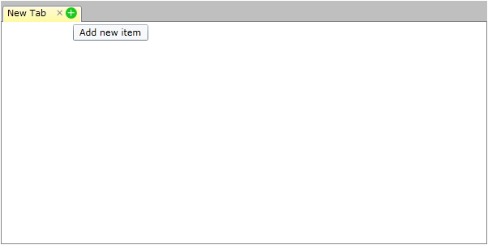

# How to Add Close and Create Buttons to the Tab Headers using MVVM approach

>important Since R2 2019 the RadTabItem supports built-in close and pin buttons. Read more about this in the [Pin and Close]() article.

The goal of this tutorial is to create a __RadTabControl__ with closable tab items using an MVVM approach.

It demonstrates how to close and create new items using *close* and *add* buttons placed in the tab header as shown on the snapshot bellow:

For the purpose of this example, you will need to create an empty  SilverlightWPF application project and open it in Visual Studio.
		

* The first step is to add references to the assemblies __Telerik.Windows.Controls__ and __Telerik.Windows.Controls.Navigation.__

* Then we need to define our __ViewModels__. We can start by creating a class to describe the __RadTabItems__ - __TabViewModel__ exposing a __Header__ property. As we're taking an MVVM approach to implement the Add and Close buttons functionality, we'll also have to set up Add and Close commands in the __TabViewModel__.
			

__Example 1: Create ViewModels__

<snippet id='radtabcontrol-howto-how-to-add-close-button-to-the-tab-headers-mvvm-block_1-cs' />
<snippet id='radtabcontrol-howto-how-to-add-close-button-to-the-tab-headers-mvvm-block_2-vb' />

* After that we can go ahead and create a __MainViewModel__ to define the collection of *TabViewModel* items which we will use to populate the __RadTabControl.ItemsSource__. Please note that as the add/close logic will change the __RadTabControl.ItemsSource__ collection, it's best to implement the commands execution methods in this ViewModel as well:
			

__Example 2: Creating TabViewModel__

<snippet id='radtabcontrol-howto-how-to-add-close-button-to-the-tab-headers-mvvm-block_3-cs' />
<snippet id='radtabcontrol-howto-how-to-add-close-button-to-the-tab-headers-mvvm-block_4-vb' />

* Now that our ViewModels are all in place, we can proceed with the definition of our view. In order to take full advantage of the implemented commands we have to bind the Add/Close __Buttons Command__ properties to the appropriate __DelegateCommands__ definitions.
			

* Here is how the __Resources__ section of our view looks like:

__Example 3: Binding buttons Command property__

<snippet id='radtabcontrol-howto-how-to-add-close-button-to-the-tab-headers-mvvm-block_5-xaml' />

* And here is the __RadTabControl__ definition:			

__Example 4: Defining RadTabControl__

<snippet id='radtabcontrol-howto-how-to-add-close-button-to-the-tab-headers-mvvm-block_6-xaml' />

>Please note that in the above sample we have defined custom styles for the __Button__ controls which you can remove or modify accordignly to your requirements.
	  

## See Also

 * [Customizing Appearance]()