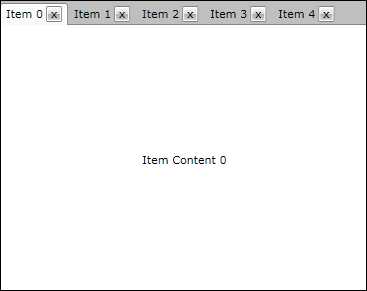

# How to Add Close Button to the Tab Headers

>important Since R2 2019 the RadTabItem supports built-in close and pin buttons. Read more about this in the [Pin and Close]() article.

The goal of this tutorial is to create a tab control with closable tab items. The tab items can be closed using close button placed in the tab header as shown on the snapshot bellow.


For the purpose of this example, you will need to create an empty SilverlightWPF Application project and open it in Visual Studio.
		

>If you copy and paste the source code directly from this XAML examples, don't forget to change __xmlns:example__ alias to import the namespace used in your project.
		  

* The first step is to add references to the assemblies __Telerik.Windows.Controls__ and __Telerik.Windows.Controls.Navigation.__

* In order to create closable tab control, we are going to make use of the routed events mechanism. That is why you will create a helper class named __RoutedEventHelper__. It will contain the declarations of both the close tab routed event and the attached property for enabling the routed event for the close button. Here is how this class looks like:

```C#
	public class RoutedEventHelper
	{
	    //Create the routed event:
	    public static readonly RoutedEvent CloseTabEvent = EventManager.RegisterRoutedEvent(
	        "CloseTab",
	        RoutingStrategy.Bubble,
	        typeof(RoutedEventHandler),
	        typeof(RoutedEventHelper));
	    //Add an attached property:
	    public static bool GetEnableRoutedClick(DependencyObject obj)
	    {
	        return (bool)obj.GetValue(EnableRoutedClickProperty);
	    }
	    public static void SetEnableRoutedClick(DependencyObject obj, bool value)
	    {
	        obj.SetValue(EnableRoutedClickProperty, value);
	    }
	    // Using a DependencyProperty as the backing store for EnableRoutedClick.
	    // This enables animation, styling, binding, etc...
	    public static readonly DependencyProperty EnableRoutedClickProperty = DependencyProperty.RegisterAttached(
	        "EnableRoutedClick",
	        typeof(bool),
	        typeof(RoutedEventHelper),
	        new System.Windows.PropertyMetadata(OnEnableRoutedClickChanged));
	    private static void OnEnableRoutedClickChanged(DependencyObject sender, DependencyPropertyChangedEventArgs e)
	    {
	        var newValue = (bool)e.NewValue;
	        var button = sender as Button;
	        if (button == null)
	            return;
	        if (newValue)
	            button.Click += new RoutedEventHandler(OnButtonClick);
	    }
	    static void OnButtonClick(object sender, RoutedEventArgs e)
	    {
	        var control = sender as Control;
	        if (control != null)
	        {
	            control.RaiseEvent(new RadRoutedEventArgs(RoutedEventHelper.CloseTabEvent, control));
	        }
	    }
	}
```
```VB.NET
	Public Class RoutedEventHelper
	    'Create the routed event:'
			Public Shared ReadOnly CloseTabEvent As RoutedEvent = EventManager.RegisterRoutedEvent("CloseTab", RoutingStrategy.Bubble, GetType(RoutedEventHandler), GetType(RoutedEventHelper))
	    'Add an atached property:'
	    Public Shared Function GetEnableRoutedClick(ByVal obj As DependencyObject) As Boolean
	        Return CBool(obj.GetValue(EnableRoutedClickProperty))
	    End Function
	    Public Shared Sub SetEnableRoutedClick(ByVal obj As DependencyObject, ByVal value As Boolean)
	        obj.SetValue(EnableRoutedClickProperty, value)
	    End Sub
	    ' Using a DependencyProperty as the backing store for EnableRoutedClick. This enables animation, styling, binding, etc...'
	    Public Shared ReadOnly EnableRoutedClickProperty As DependencyProperty = DependencyProperty.RegisterAttached("EnableRoutedClick", GetType(Boolean), GetType(RoutedEventHelper), New System.Windows.PropertyMetadata(New PropertyChangedCallback(AddressOf OnEnableRoutedClickChanged)))
	    Private Shared Sub OnEnableRoutedClickChanged(ByVal sender As DependencyObject, ByVal e As DependencyPropertyChangedEventArgs)
	        Dim newValue = CBool(e.NewValue)
	        Dim button = TryCast(sender, Button)
	        If button Is Nothing Then
	            Exit Sub
	        End If
	        If newValue Then
	            AddHandler button.Click, AddressOf OnButtonClick
	        End If
	    End Sub
	    Private Shared Sub OnButtonClick(ByVal sender As Object, ByVal e As RoutedEventArgs)
	        Dim control = TryCast(sender, Control)
	        If control IsNot Nothing Then
	            control.[RaiseEvent](New RadRoutedEventArgs(RoutedEventHelper.CloseTabEvent, control))
	        End If
	    End Sub
	End Class
```

As you can see, you have declared a new routed event called __CloseTabEvent__ of type __Telerik.Windows.RoutedEvent__. For its creation you have used the static method __DeclareRoutedEvent__ from the class __Telerik.Windows.EventManager__. This routed event will be raised when the close button of the tab control is clicked by the user.
		

Another thing that is worth mentioning is the declaration of the attached property __EnableRoutedClickProperty__. Using this property you can enable the raise of the close routed event for certain button control. See how this property is set from XAML in the next step.
		

* Change the XAML of MainPage.xaml to:

```XAML
	<UserControl.Resources>
	    <Style x:Key="ClosableStyle" TargetType="telerik:RadTabItem">
	        <Setter Property="HeaderTemplate">
	            <Setter.Value>
	              <DataTemplate>
	                        <Grid>
	                            <Grid.ColumnDefinitions>
	                                <ColumnDefinition Width="*" />
	                                <ColumnDefinition Width="Auto" />
	                            </Grid.ColumnDefinitions>
	                            <ContentControl Content="{Binding Title}" />
	                            <telerik:RadButton Grid.Column="1" 
	                                               Width="16"
	                                               Height="16"
	                                               Margin="3 0 0 0"
	                                               HorizontalAlignment="Center"
	                                               VerticalAlignment="Center"
	                                               Content="x"
	                                               example:RoutedEventHelper.EnableRoutedClick="True"
	                                               Padding="0" />
	                        </Grid>
	               </DataTemplate>
	            </Setter.Value>
	        </Setter>
	        <Setter Property="ContentTemplate">
	            <Setter.Value>
	                <DataTemplate>
	                    <Grid>
	                        <TextBlock Text="{Binding Content}" TextAlignment="Center" VerticalAlignment="Center"/>
	                    </Grid>
	                </DataTemplate>
	            </Setter.Value>
	        </Setter>
	    </Style>
	</UserControl.Resources>
	<Grid x:Name="LayoutRoot" Background="White">
	    <telerik:RadTabControl x:Name="tabControl" ItemContainerStyle="{StaticResource ClosableStyle}">
	    </telerik:RadTabControl>
	</Grid>
```


In the beginning of the XAML you have imported two namespaces - __example__ and __telerik__. The __example__ namespace imports all types from the current test project like __RoutedEventHelper__. The second namespace is __telerik__ and it imports all telerik navigation controls like __RadTabControl__ from the assembly __Telerik.Windows.Controls.Navigation.__

Later in the __UserControl.Resources__ section you declare a custom item container style, which defines the header and the content templates of the tab items. The header template contains a grid control with the close button on the right side and a content control located on the left side. The routing events for the close button are enabled using your new attached property __EnableRoutedClick__ which is set to True.
		

* The last step of this example scenario is to open MainPage.xaml.cs and to:

* Bind the tab control to an observable collection containing items of the custom type __TabItemModel__

* Register the __RadTabItem__ class handler for the routed event __CloseTabEvent__.

```C#
	public partial class MainPage : UserControl
	{
	    ObservableCollection<TabItemModel> tabItemsModel = new ObservableCollection<TabItemModel>();
	    public MainPage()
	    {
	        InitializeComponent();
	        this.CreateTabItems();
	        EventManager.RegisterClassHandler( typeof(RadTabItem), RoutedEventHelper.CloseTabEvent, new RoutedEventHandler(OnCloseClicked));
	    }
	    public void OnCloseClicked(object sender, RoutedEventArgs e)
	    {
	        var tabItem = sender as RadTabItem;
	        // Remove the item from the collection the control is bound to
	        tabItemsModel.Remove(tabItem.DataContext as TabItemModel);
	    }
	    private void CreateTabItems()
	    {
	        // Create items:
	        for (int num = 0; num < 5; num++)
	        {
	            tabItemsModel.Add(new TabItemModel()
	            {
	                Title = String.Format("Item {0}", num),
	                Content = String.Format("Item Content {0}", num)
	            });
	        }
	        // Attach the items:
	        tabControl.ItemsSource = tabItemsModel;
	    }
	}
	public class TabItemModel
	{
	    public String Title
	    {
	        get;
	        set;
	    }
	    public String Content
	    {
	        get;
	        set;
	    }
	}
```
```VB.NET
	Partial Public Class Page
	    Inherits UserControl
	    Private tabItemsModel As New ObservableCollection(Of TabItemModel)()
	    Public Sub New()
	        InitializeComponent()
	        Me.CreateTabItems()
	        EventManager.RegisterClassHandler(GetType(RadTabItem), RoutedEventHelper.CloseTabEvent, New RoutedEventHandler(AddressOf OnCloseClicked))
	    End Sub
	    Public Sub OnCloseClicked(ByVal sender As Object, ByVal e As RoutedEventArgs)
	        Dim tabItem = TryCast(sender, RadTabItem)
	        ' Remove the item from the collection the control is bound to
	        tabItemsModel.Remove(TryCast(tabItem.DataContext, TabItemModel))
	    End Sub
	    Private Sub CreateTabItems()
	        ' Create items:
	        For num As Integer = 0 To 4
	            Dim itemModel = New TabItemModel()
	            itemModel.Content = String.Format("Item Content {0}", num)
	            itemModel.Title = String.Format("Item {0}", num)
	            tabItemsModel.Add(itemModel)
	        Next
	        ' Attach the items:
	        tabControl.ItemsSource = tabItemsModel
	    End Sub
	End Class
	Public Class TabItemModel
	    Private _Title As [String]
	    Public Property Title() As [String]
	        Get
	            Return _Title
	        End Get
	        Set(ByVal value As [String])
	            _Title = value
	        End Set
	    End Property
	    Private _Content As [String]
	    Public Property Content() As [String]
	        Get
	            Return _Content
	        End Get
	        Set(ByVal value As [String])
	            _Content = value
	        End Set
	    End Property
	End Class
```

## See Also

 * [Customizing Appearance]()
