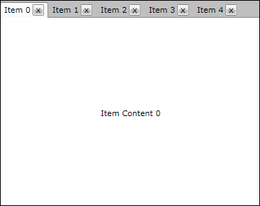

# How to Add Close Button to the Tab Headers

>important Since R2 2019 the RadTabItem supports built-in close and pin buttons. Read more about this in the [Pin and Close]() article.

The goal of this tutorial is to create a tab control with closable tab items. The tab items can be closed using close button placed in the tab header as shown on the snapshot bellow.

For the purpose of this example, you will need to create an empty SilverlightWPF Application project and open it in Visual Studio.
		

>If you copy and paste the source code directly from this XAML examples, don't forget to change __xmlns:example__ alias to import the namespace used in your project.
		  

* The first step is to add references to the assemblies __Telerik.Windows.Controls__ and __Telerik.Windows.Controls.Navigation.__

* In order to create closable tab control, we are going to make use of the routed events mechanism. That is why you will create a helper class named __RoutedEventHelper__. It will contain the declarations of both the close tab routed event and the attached property for enabling the routed event for the close button. Here is how this class looks like:

<snippet id='radtabcontrol-howto-how-to-add-close-button-to-the-tab-headers-block_1-cs' />
<snippet id='radtabcontrol-howto-how-to-add-close-button-to-the-tab-headers-block_2-vb' />

As you can see, you have declared a new routed event called __CloseTabEvent__ of type __Telerik.Windows.RoutedEvent__. For its creation you have used the static method __DeclareRoutedEvent__ from the class __Telerik.Windows.EventManager__. This routed event will be raised when the close button of the tab control is clicked by the user.
		

Another thing that is worth mentioning is the declaration of the attached property __EnableRoutedClickProperty__. Using this property you can enable the raise of the close routed event for certain button control. See how this property is set from XAML in the next step.
		

* Change the XAML of MainPage.xaml to:

<snippet id='radtabcontrol-howto-how-to-add-close-button-to-the-tab-headers-block_3-xaml' />

In the beginning of the XAML you have imported two namespaces - __example__ and __telerik__. The __example__ namespace imports all types from the current test project like __RoutedEventHelper__. The second namespace is __telerik__ and it imports all telerik navigation controls like __RadTabControl__ from the assembly __Telerik.Windows.Controls.Navigation.__

Later in the __UserControl.Resources__ section you declare a custom item container style, which defines the header and the content templates of the tab items. The header template contains a grid control with the close button on the right side and a content control located on the left side. The routing events for the close button are enabled using your new attached property __EnableRoutedClick__ which is set to True.
		

* The last step of this example scenario is to open MainPage.xaml.cs and to:

* Bind the tab control to an observable collection containing items of the custom type __TabItemModel__

* Register the __RadTabItem__ class handler for the routed event __CloseTabEvent__.

<snippet id='radtabcontrol-howto-how-to-add-close-button-to-the-tab-headers-block_4-cs' />
<snippet id='radtabcontrol-howto-how-to-add-close-button-to-the-tab-headers-block_5-vb' />

## See Also

 * [Customizing Appearance]()