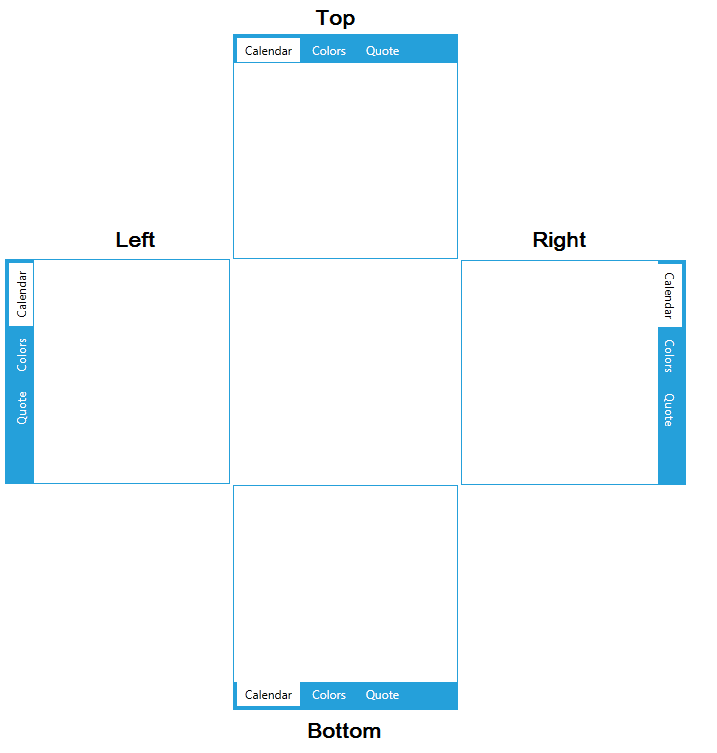
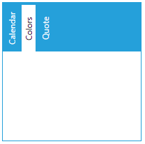

# How to Change the Position of the Tab Strip of RadTabControl

__RadTabControl__ expose few properties that can be used for controlling its [tab strip]() position. 
* __TabStripPlacement__ - gets or sets the position where the tab strip should appear. The default value is Top. The property is an enumeration of type __Telerik.Windows.Controls.Dock__. The enumeration contains the following values:  
	
	
	The property can be set in the following manners:
	
	```XAML
		<telerik:RadTabControl x:Name="radTabControl" TabStripPlacement="Bottom">
			<telerik:RadTabItem Header="Calendar"/>
			<telerik:RadTabItem Header="Colors"/>
			<telerik:RadTabItem Header="Quote"/>
		</telerik:RadTabControl>
	```
		
	```C#
		private void SetTabStripPlacement()
		{
			radTabControl.TabStripPlacement = Telerik.Windows.Controls.Dock.Bottom;
		}
	```
	```VB.NET
		Private Sub SetTabStripPlacement()
			radTabControl.TabStripPlacement = Telerik.Windows.Controls.Dock.Bottom
		End Sub
	```
	
	>The tab strip panel is wrapped in a __LayoutTransformControl__ which rotates it around the RadTabControl when the TabStripPlacement property is set. For example, when you set the __TabStripPlacement__ to __Left__ a __LayoutTransformation__ with angle of -90 is applied on the LayoutTransformControl and the tab strip is rotated with -90 degrees (counterclockwise). 
	
* __Align__	- gets or sets the alignment of the items in the tab strip. The property is an enumeration of type __Telerik.Windows.Controls.TabControl.TabStripAlign__. The enumeration contains the following values:
	* __Justify__ - positions (and resize if necessary) the tabs to fill the available space.
	* __Center__ - positions the tabs in the center of the tab strip.
	* __Left__ - positions the tabs in the left side of the tab strip. This is the default value.
	* __Right__ - positions the tabs in the left side of the tab strip.  
		
	>If the TabStripPlacement is set to Left or Right, the left align positions the tabs at the top/bottom of the tab strip.	

* __TabOrientation__ - gets or sets the orientation of the tab items. The property is an enumeration of type __System.Windows.Controls.Orientation__. Setting the property's value to Vertical will rotate the tabs content to 90 degrees (clockwise). The orientation is set to __Horizontal__.
	The following image demonstrates the TabOrientation set to Vertical without any other changes in the tab strip position applied:

			

## See Also
 * [How to Select Control in Expression Blend]()
 * [How to Add Close Button to the Tab Headers]()